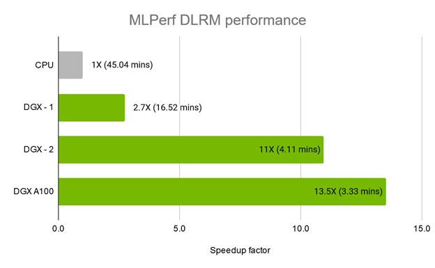
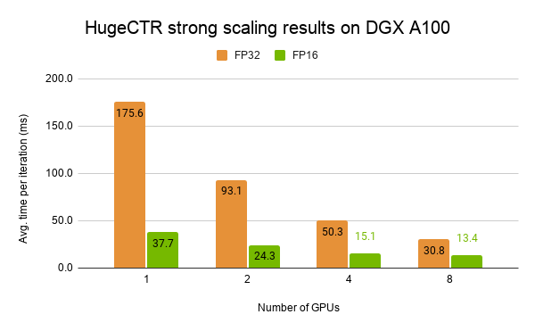

#  Merlin: HugeCTR #

HugeCTR, a component of [NVIDIA Merlin Open Beta](https://developer.nvidia.com/nvidia-merlin#getstarted), is a GPU-accelerated recommender framework. It was designed to distribute training across multiple GPUs and nodes and estimate Click-Through Rates (CTRs). HugeCTR supports model-parallel embedding tables and data-parallel neural networks and their variants such as [Wide and Deep Learning (WDL)](https://arxiv.org/abs/1606.07792), [Deep Cross Network (DCN)](https://arxiv.org/abs/1708.05123), [DeepFM](https://arxiv.org/abs/1703.04247), and [Deep Learning Recommendation Model (DLRM)](https://ai.facebook.com/blog/dlrm-an-advanced-open-source-deep-learning-recommendation-model/). For additional information, see [HugeCTR User Guide](docs/hugectr_user_guide.md).

Design Goals:
* Fast: HugeCTR is a speed-of-light CTR model framework.
* Dedicated: HugeCTR provides the essentials so that you can train your CTR model in an efficient manner.
* Easy: Regardless of whether you are a data scientist or machine learning practitioner, we've made it easy for anybody to use HugeCTR.

## Table of Contents
* [Performance](#performance)
* [Release Notes](#release-notes)
* [Getting Started](#getting-started-with-hugectr)
* [Support and Feedback](#support-and-feedback)

## Performance ##
We've tested HugeCTR's performance on the following systems:
* DGX-2 and DGX A100
* Versus TensorFlow (TF)

### Evaluating HugeCTR's Performance on the DGX-2 and DGX A100
We submitted the DLRM benchmark with HugeCTR version 2.2 to [MLPerf Training v0.7](https://mlperf.org/training-results-0-7). The dataset was [Criteo Terabyte Click Logs](https://labs.criteo.com/2013/12/download-terabyte-click-logs/), which contains 4 billion user and item interactions over 24 days. The target machines were DGX-2 with 16 V100 GPUs and DGX A100 with eight A100 GPUs. Fig. 1 summarizes the performance. For more details, see [this blog post](https://developer.nvidia.com/blog/accelerating-recommender-systems-training-with-nvidia-merlin-open-beta/).

<div align=center></div>
<div align=center>Fig. 1 MLPerf v0.7 DLRM training performance across different platforms.</div>

#### HugeCTR Strong Scaling Results on DGX A100
Fig. 2 shows the strong scaling result for both the full precision mode (FP32) and mixed-precision mode (FP16) on a single NVIDIA DGX A100. Bars represent the average iteration time in ms.
<div align=center></div>
<div align=center>Fig. 2 The strong scaling result of HugeCTR with a W&D model on a single DGX A100, the lower the better.</div>

### Evaluating HugeCTR's Performance on the TensorFlow
In the TensorFlow test case below, HugeCTR exhibits a speedup up to 114x compared to a CPU server that is running TensorFlow with only one V100 GPU and almost the same loss curve.

* Test environment:
  - CPU Server: Dual 20-core Intel(R) Xeon(R) CPU E5-2698 v4 @ 2.20GHz
  - TensorFlow version 2.0.0
  - V100 16GB: NVIDIA DGX1 servers

* Network:
  - `Wide Deep Learning`: Nx 1024-unit FC layers with ReLU and dropout, emb_dim: 16; Optimizer: Adam for both Linear and DNN models
  - `Deep Cross Network`: Nx 1024-unit FC layers with ReLU and dropout, emb_dim: 16, 6x cross layers; Optimizer: Adam for both Linear and DNN models

* Dataset:
  - The data is provided by [CriteoLabs](http://labs.criteo.com/2014/02/kaggle-display-advertising-challenge-dataset/). The original training set contains 45,840,617 examples. Each example contains a label (0 by default OR 1 if the ad was clicked) and 39 features in which 13 are integer and 26 are categorical.

* Preprocessing:
  - Common: Preprocessed by using the scripts available in tools/criteo_script.
  - HugeCTR: Converted to the HugeCTR data format with criteo2hugectr.
  - TF: Converted to the TFRecord format for the efficient training on Tensorflow.

<div align=center></div>
<div align=center>Fig. 3 WDL Performance and Loss Curve Comparison with TensorFlow Version 2.0</div>

<br></br>

<div align=center></div>
<div align=center>Fig. 4 DCN performance and Loss Curve Comparison with TensorFlow Version 2.0</div>


## Release Notes ##

### What's New in Version 2.3
We’ve implemented the following enhancements to improve usability and performance:
+ **Python Interface**: To enhance the interoperability with [NVTabular](https://github.com/NVIDIA/NVTabular) and other Python-based libraries, we're introducing a new Python interface for HugeCTR. If you are already using HugeCTR with JSON, the transition to Python will be seamless for you as you'll only have to locate the `hugectr.so` file and set the `PYTHONPATH` environment variable. You can still configure your model in your JSON config file, but the training options such as `batch_size` must be specified through `hugectr.solver_parser_helper()` in Python. For additional information regarding how to use the HugeCTR Python API and comprehend its API signature, see our [Jupyter Notebook tutorial](notebooks/python_interface.ipynb).

+ **HugeCTR Embedding with Tensorflow**: To help users easily integrate HugeCTR’s optimized embedding into their Tensorflow workflow, we now offer the HugeCTR embedding layer as a Tensorflow plugin. To better understand how to intall, use, and verify it, see our [Jupyter notebook tutorial](notebooks/embedding_plugin.ipynb). It also demonstrates how you can create a new Keras layer `EmbeddingLayer` based on the [`hugectr_tf_ops.py`](tools/embedding_plugin/python/hugectr_tf_ops.py) helper code that we provide.

+ **Model Oversubscription**: To enable a model with large embedding tables that exceeds the single GPU's memory limit, we added a new model prefetching feature, giving you the ability to load a subset of an embedding table into the GPU in a coarse grained, on-demand manner during the training stage. To use this feature, you need to split your dataset into multiple sub-datasets while extracting the unique key sets from them. This feature can only currently be used with a [`Norm`](docs/hugectr_user_guide.md#norm) dataset format and its corresponding file list. This feature will eventually support all embedding types and dataset formats. We revised our [`criteo2hugectr` tool](tools/criteo_script/criteo2hugectr.cpp) to support the key set extraction for the Criteo dataset. For additional information, see our [Python Jupyter Notebook](notebooks/python_interface.ipynb) to learn how to use this feature with the Criteo dataset. Please note that The Criteo dataset is a common use case, but model prefetching is not limited to only this dataset.

+ **Enhanced AUC Implementation**: To enhance the performance of our AUC computation on multi-node environments, we redesigned our AUC implementation to improve how the computational load gets distributed across nodes.

+ **Epoch-Based Training**: In addition to `max_iter`, a HugeCTR user can set `num_epochs` in the **Solver** clause of their JSON config file. This mode can only currently be used with `Norm` dataset formats and their corresponding file lists. All dataset formats will be supported in the future.

+ **Multi-Node Training Tutorial**: To better support multi-node training use cases, we added a new [a step-by-step tutorial](tutorial/multinode-training).

+ **Power Law Distribution Support with Data Generator**: Because of the increased need for generating a random dataset whose categorical features follows the power-law distribution, we revised our data generation tool to support this use case. For additional information, refer to the `--long-tail` description [here](docs/hugectr_user_guide.md#generating-synthetic-data-and-benchmarks).

+ **Multi-GPU Preprocessing Script for Criteo Samples**: Multiple GPUs can now be used when preparing the dataset for our [samples](samples). For additional information, see how [preprocess_nvt.py](tools/criteo_script/preprocess_nvt.py) is used to preprocess the Criteo dataset for DCN, DeepFM, and W&D samples.

### Known Issues
* Since the automatic plan file generator is not able to handle systems that contain one GPU, a user must manually create a JSON plan file with the following parameters and rename using the name listed in the HugeCTR configuration file: ` {"type": "all2all", "num_gpus": 1, "main_gpu": 0, "num_steps": 1, "num_chunks": 1, "plan": [[0, 0]], "chunks": [1]} `.
* If using a system that contains two GPUs with two NVLink connections, the auto plan file generator will print the following warning message: `RuntimeWarning: divide by zero encountered in true_divide`. This is an erroneous warning message and should be ignored.
* The current plan file generator doesn't support a system where the NVSwitch or a full peer-to-peer connection between all nodes is unavailable.
* Users need to set an `export CUDA_DEVICE_ORDER=PCI_BUS_ID` environment variable to ensure that the CUDA runtime and driver have a consistent GPU numbering.
* `LocalizedSlotSparseEmbeddingOneHot` only supports a single-node machine where all the GPUs are fully connected such as NVSwitch.
* HugeCTR version 2.2.1 crashes when running our DLRM sample on DGX2 due to a CUDA Graph issue. To run the sample on DGX2, disable the use of CUDA Graph with `"cuda_graph": false` even if it degrades the performance a bit. We are working on fixing this issue. This issue doesn't exist when using the DGX A100.
* The model prefetching feature is only available in Python. Currently, a user can only use this feature with the `DistributedSlotSparseEmbeddingHash` embedding and the `Norm` dataset format on single GPUs. This feature will eventually support all embedding types and dataset formats.
* The HugeCTR embedding TensorFlow plugin only works with single-node machines.
* The HugeCTR embedding TensorFlow plugin assumes that the input keys are in `int64` and its output is in `float`.
* When using our embedding plugin, please note that the `fprop_v3` function, which is available in `tools/embedding_plugin/python/hugectr_tf_ops.py`, only works with `DistributedSlotSparseEmbeddingHash`.

## Getting Started with HugeCTR ##
To get started, see the [HugeCTR User Guide](docs/hugectr_user_guide.md).

If you'd like to quickly train a model using the Python interface, follow these six steps:
1. Start a HugeCTR container from [NVIDIA NGC](https://ngc.nvidia.com/catalog/containers/nvidia:hugectr) by running the following command:
   ```
   docker run --runtime=nvidia --rm -it nvcr.io/nvidia/hugectr:v2.3
   ```

2. Inside the container, copy [the DCN JSON config file](samples/dcn/dcn.json) to your home directory or anywhere you want.

   This config file specifies the DCN model architecture and its optimizer. With any Python use case, the solver clause within the config file is not used at all.

3. Generate a synthetic dataset based on the config file by running the following command:
   ```
   data_generator ./dcn.json ./dataset_dir 434428 1
   ```

   The following set of files are created: ./file_list.txt, ./file_list_test.txt, and ./dataset_dir/*.

5. Write a simple Python code using the hugectr module as shown here:
   ```python
   # train.py
   import sys
   import hugectr
   from mpi4py import MPI

   def train(json_config_file):
     solver_config = hugectr.solver_parser_helper(batchsize = 16384,
                                                  batchsize_eval = 16384,
                                                  vvgpu = [[0,1,2,3,4,5,6,7]],
                                                  repeat_dataset = True)
     sess = hugectr.Session(solver_config, json_config_file)
     sess.start_data_reading()
     for i in range(10000):
       sess.train()
       if (i % 100 == 0):
         loss = sess.get_current_loss()
         print("[HUGECTR][INFO] iter: {}; loss: {}".format(i, loss))

   if __name__ == "__main__":
     json_config_file = sys.argv[1]
     train(json_config_file)

   ```

   **NOTE**: Update the vvgpu (the active GPUs), batchsize, and batchsize_eval parameters according to your GPU system.

6. Train the model by running the following command:
   ```
   python train.py dcn.json
   ```

## Support and Feedback ##
If you encounter any issues and/or have questions, please file an issue [here](https://github.com/NVIDIA/HugeCTR/issues) so that we can provide you with the necessary resolutions and answers. To further advance the Merlin/HugeCTR Roadmap, we encourage you to share all the details regarding your recommender system pipeline using this [survey](https://developer.nvidia.com/merlin-devzone-survey).
