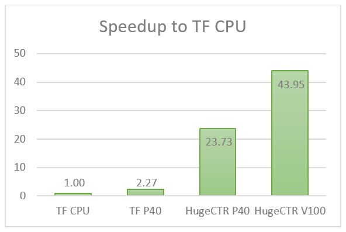
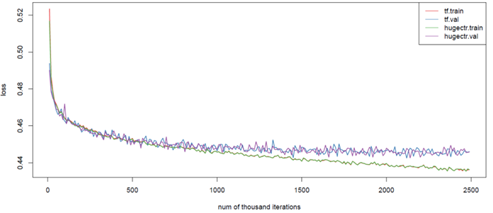

HUGECTR 2.0 USER GUIDE
===================================
## Introduction
HugeCTR is a high-efficiency GPU framework designed for Click-Through-Rate (CTR) estimation training, which targets both high performance and easy usage. Following sections list the performance comparison, supported features and usage information. 

HugeCTR version 2.0 is a major update, which aims to provide a reference design for framework designers and users who has requirements on high performance CTR training. 

Highlighted features in version 2.0:
* GPU Hashtable and dynamic insertion
* Multi-node training and very large embedding support
* Mixed-precision training

## Architecture and Supported Networks
To enable large embedding training, the embedding table in HugeCTR is model parallel and distributed across all the GPUs in a homogeneous cluster, which consists of multiple nodes and multiple GPUs. Meanwhile, the dense model is data parallel, which has one copy in each GPU (see Fig.1).

HugeCTR supports Embedding + MLP like Networks (see Fig. 2), in which Embedding has a three-stage workflow: table lookup, reducing the weights within a slot, concat the weights from different slots (see Fig.3). Operations and layers supported in HugeCTR are listed as follows:
* Multi-slot embedding: Sum / Mean
* Layers: Concat /  Fully Connected / Relu / BatchNorm / elu
* Optimizer: Adam/ Momentum SGD/ Nesterov
* Loss: CrossEngtropy/ BinaryCrossEntropy

<div align=center></div>
<div align=center>Fig.1 HugeCTR Architecture</div>

<div align=center></div>
<div align=center>Fig. 2 Embedding + MLP</div>

<div align=center></div>
<div align=center>Fig. 3 Embedding Mechanism</div>

## New Features in 2.0
### GPU hashtable and dynamic insertion
GPU Hashtable makes the data preprocessing easier and enables dynamic insertion in HugeCTR 2.0. The input training data are hash values (64bit long long type) instead of original indices. Thus embedding initialization is not required before training and if you start a training from scratch, only an initialized dense model is needed (using –model-init). A pair of <key,value> (random small weight) will be inserted during runtime only when a new key appears in the training data and hashtable cannot find it. 
### Multi-node training and enabling large embedding
Multi-node training is supported to enable very large embedding. Thus, an embedding table of arbitrary size can be trained in HugeCTR. In multi-node solution, sparse model or embedding is also distributed across the nodes, and dense model is in data parallel. In our implementation, HugeCTR leverages NCCL for high speed and scalable inner- and intra-node communication.
### Mixed precision training
Mixed-precision is an important feature in latest NVIDIA GPUs. On volta and Turing GPUs, fully connected layer can be configured to run on TensorCore with FP16. Please note that loss scaling will be applied to avoid arithmetic underflow (see Fig. 4).  Mixed-precision training can be enabled in cmake options (see README.md).

<div align=center></div>
<div align=center>Fig 4. Arithmetic Underflow</div>

## Usages
Two main usages:

Model initialization: generate a file with initialized weight according to the name in the config file.
```shell
$ huge_ctr –-model-init config.json
```
Training: load model and start training.
```shell
$ huge_ctr –-train config.json
```
To load a snapshot, you can just modify config.json (model_file, embedding_file in solver clause) according to the name of the snapshot. 

### Network Configurations
Config file is in json format and has four clauses: “solver, optimizer, data, layers” (see Fig. 5).

<div align=center></div>
<div align=center>Fig. 5 Sample config.json File</div>

### Solver
Solver clause contains the configuration to training resource and task, items include:
* `lr_policy`: only supports `fixed` now.
* `display`: intervals to print loss on screen.
* `gpu`: GPU indices used in a training process, which has two levels. For example: [[0,1],[2,3]] means that two node are used, and in the first node GPUs with index 0 and 1 are used and 2, 3 in the second node.
* `batchsize`: minibatch used in training.
* `snapshot`: intervals to save a checkpoint in file with the prefix of `snapshot_prefix`
* `eval_interval`: intervals of evaluation on test set.
* `eval_batches`: the number of batches will be used in loss calculation of evaluation. HugeCTR will print the average loss of the batches.
* `model_file`: file of dense model.
* `embedding_file`: file of sparse model. There’s no need to configure if you train from scratch (see “New Features in 2.0”). 

### Optimizer
The optimizer used in both dense and sparse models. Adam/MomentumSGD/Nesterov are supported in HugeCTR 2.0.
```json
"optimizer": {
  "type": "Adam",
  "adam_hparam": {
    "alpha": 0.005,
    "beta1": 0.9,
    "beta2": 0.999,
    "epsilon": 0.000001
  }
},
"optimizer": {
  "type": "MomentumSGD",
  "momentum_sgd_hparam": {
    "learning_rate": 0.005,
    "momentum_factor": 0.0
  }
},
"optimizer": {
  "type": "Nesterov",
  "nesterov_hparam": {
    "learning_rate": 0.005,
    "momentum_factor": 0.0
  }
}
```
### Data
Data set properties include file name of training and testing (evaluation) set, maximum elements (key) in a sample, and label dimensions (see fig. 5).
* For multi-node training, each of the nodes has a file list for training and an identical file list for evaluation. This mechanism can maximize the throughput of data reading. For example, if you have two nodes, you can configure like “source”: [“file_list1.txt”, “file_list2.txt”].
* "slot_num” is the number of slots used in this training set. All the weight vectors get out of a slot will be reduced into one vector after embedding lookup (see Fig.3).

### Layers
Many different kinds of layers are supported in clause `layer`, which includes dense model like: Concat /  Fully Connected / Relu / BatchNorm / elu, and sparse model SparseEmbeddingHash. `Embedding` should always be the first layer where `concat` should be the second.

Embedding:
* `vocabulary_size`: the maximum possible size of embedding.
* `load_factor`: as embedding is implemented with hashtable, `load_factor` is the ratio of loaded vocabulary to capacity of the hashtable.
* `embedding_vec_size`: the vector size of an embedding weight (value). Then the memory used in this hashtable will be vocabulary_size*embedding_vec_size/load_factor.
* `combiner`: 0 is sum and 1 is mean.

ELU: the type name is `ELU`, and a `elu_param` called `alpha` in it can be configured.

Fully Connected (`InnerProduct`): bias is supported in fully connected layer and `num_output` is the dimension of output.

BatchNorm:  `is_training` should always be true in HugeCTR training. “Factor” in this context means “moving average” computation factor and eps is a small value to avoid divide-by-zero error.
```json
{
  "name": "elu1",
  "type": "ELU",
  "bottom": "fc1",
  "top": "elu1",
  "elu_param": {
    "alpha": 1.0
  }
},
{
  "name": "bn1",
  "type": "BatchNorm",
  "bottom": "fc1",
  "top": "bn1",
  "bn_param": {
    "is_training": true,
    "factor": 0.999,
    "eps": 1e-5
  }
}
```
## Data Format
A data set in HugeCTR includes an ASCII format file list and a set of data files in binary format to maximize the performance of data loading and minimize the storage. Note that data file is the minimum reading granularity for a reading thread, so at least 10 files in each file list are required for best performance.
### File List
A file list starts with a number which indicates the number of files in the file list, then comes with the path of each data file.
```shell
$ cat simple_sparse_embedding_file_list.txt
10
./simple_sparse_embedding/simple_sparse_embedding0.data
./simple_sparse_embedding/simple_sparse_embedding1.data
./simple_sparse_embedding/simple_sparse_embedding2.data
./simple_sparse_embedding/simple_sparse_embedding3.data
./simple_sparse_embedding/simple_sparse_embedding4.data
./simple_sparse_embedding/simple_sparse_embedding5.data
./simple_sparse_embedding/simple_sparse_embedding6.data
./simple_sparse_embedding/simple_sparse_embedding7.data
./simple_sparse_embedding/simple_sparse_embedding8.data
./simple_sparse_embedding/simple_sparse_embedding9.data
```
### Data File
A data file (binary) contains a header and the following data (many samples).

Header field:
```c
typedef struct DataSetHeader_{
  long long number_of_records; //the number of samples in this data file
  long long label_dim; //dimension of label
  long long slot_num; //the number of slots in each sample 
  long long reserved; //reserved for future use
} DataSetHeader;
```
Data field:
```c
typedef struct Data_{
  int label[label_dim];
  Slot slots[slot_num];
} Data;

typedef struct Slot_{
  int nnz;
  T*  keys; //long long or uint
} Slot;
```
Data field often has a lot of samples. Each sample starts with the labels in integer type, followed by `nnz` (number of nonzero) and key in long long type (see Fig. 6).

<div align=center></div>
<div align=center>Fig. 6 Data Field</div>

### No Trained Parameters
Some of the layers will generate statistic result during training like Batch Norm. Such parameters are outputs of CTR training (called “no trained parameters”) and used in inference.

In HugeCTR such parameters will be written into a JSON format file along with weight during training.
```json
{
  "layers": [
    {
      "type": "BatchNorm",
      "mean": [-0.192325, 0.003050, -0.323447, -0.034817, -0.091861], 
      "var": [0.738942, 0.410794, 1.370279, 1.156337, 0.638146] 
    },
    {
      "type": "BatchNorm",
      "mean": [-0.759954, 0.251507, -0.648882, -0.176316, 0.515163],
      "var": [1.434012, 1.422724, 1.001451, 1.756962, 1.126412]
    },
    {
      "type": "BatchNorm",
      "mean": [0.851878, -0.837513, -0.694674, 0.791046, -0.849544],
      "var": [1.694500, 5.405566, 4.211646, 1.936811, 5.659098]
    }
  ]
}
```
## Performance
In this section, we test the scalability of HugeCTR and compare the performance and result with TensorFlow with V100 and P40 GPUs. It shows that we can achieve about 44x speedup to multi-threads TF on CPU server with only one V100 and have almost the same loss curve on both evaluation and training (see Fig. 9).

Test environment:
* CPU Server: two ways Intel(R) Xeon(R) CPU E5-2680 v2 @ 2.80GHz
* TensorFlow version 1.12.0
* V100: NVIDIA DGX1 servers
* P40

Network:
* FC MLP network (see Fig.2) and embedding.

### HugeCTR
The good scalability HugeCTR shows on multiple nodes is mainly because of the high efficient data exchange via NCCL and the three-stage processing pipeline. In this pipeline, we overlap the data reading from file, host to device data transaction (inter- and intra- node) and GPU training.  The following chart shows the scalability of HugeCTR with the configration of Batch Size=40960, Embedding Vector=64, Layers=12, MLP Output=1024, multi-hot=39 on DGX1 Servers.
<div align=center></div>
<div align=center>Fig. 7 Multi-GPU Performance of HugeCTR</div>

### TensorFlow
In the TensorFlow test case below, HugeCTR shows up to 44x speedup to a CPU server with TensorFlow with only one V100 GPU and almost the same loss curve.

Data set:
The data is provided by CriteoLabs [1]. The original training set contains 45,840,617 examples. Each example contains a label (1 if the ad was clicked, otherwise 0) and 39 features (13 integer features and 26 categorical features). The original test set doesn't contain labels, so it's not used. 

Network:
Embedding Vector=64, Layers=4, MLP Output=200, multi-hot=39, Optimizer=MomentumSGD，Loss = BinaryCrossEntropy. We use Batchsize = 40960 and BatchSize = 128 in the performance and loss curve test, respectively.

<div align=center></div>
<div align=center>Fig. 8 Performance Comparison with TensorFlow 1.12</div>


<div align=center></div>
<div align=center>Fig. 9 Loss curve HugeCTR vs Tensorflow</div>

### More
More performance and comparison will be released in our official account in wechat "英伟达NVIDIA企业解决方案".

## Reference

[1] CriteoLabs: http://labs.criteo.com/2014/02/kaggle-display-advertising-challenge-dataset/


