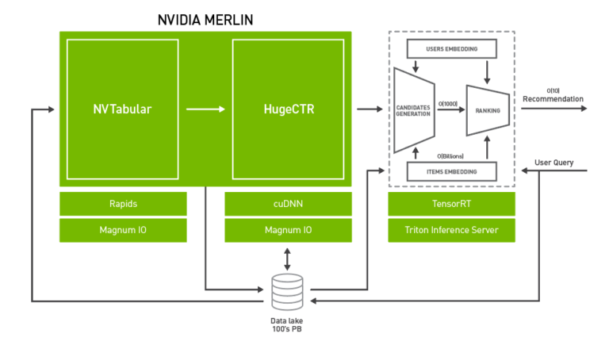
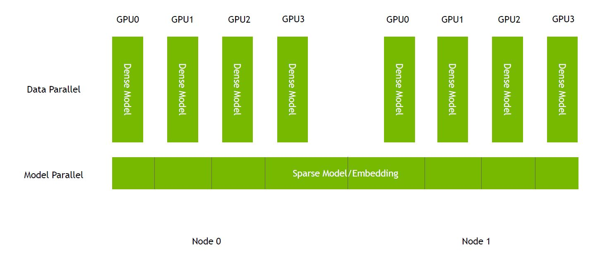
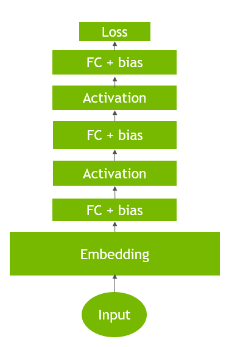
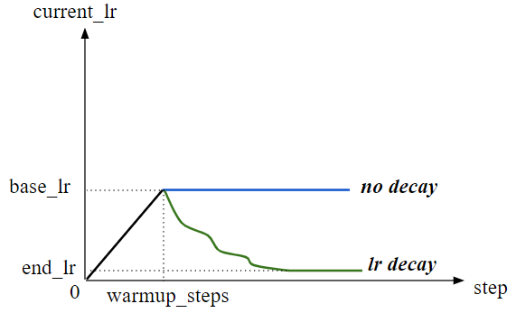

HugeCTR User Guide
==================

HugeCTR is a GPU-accelerated framework designed to distribute training across multiple GPUs and nodes and estimate click-through rates (CTRs). HugeCTR supports model-parallel embedding tables and data-parallel neural networks and their variants such as [Wide and Deep Learning (WDL)](https://arxiv.org/abs/1606.07792), [Deep Cross Network (DCN)](https://arxiv.org/abs/1708.05123), [DeepFM](https://arxiv.org/abs/1703.04247), and [Deep Learning Recommendation Model (DLRM)](https://ai.facebook.com/blog/dlrm-an-advanced-open-source-deep-learning-recommendation-model/). HugeCTR is a component of [NVIDIA Merlin Open Beta](https://developer.nvidia.com/nvidia-merlin#getstarted). NVIDIA Merlin is used for building large-scale recommender systems, which require massive datasets to train, particularly for deep learning based solutions.

<div align=center></div>
<div align=center>Fig. 1: Merlin Architecture</div>

<br></br>

To prevent data loading from becoming a major bottleneck during training, HugeCTR contains a dedicated data reader that is inherently asynchronous and multi-threaded. It will read a batched set of data records in which each record consists of high-dimensional, extremely sparse, or categorical features. Each record can also include dense numerical features, which can be fed directly to the fully connected layers. An embedding layer is used to compress the input-sparse features to lower-dimensional, dense-embedding vectors. There are three GPU-accelerated embedding stages:

* table lookup
* weight reduction within each slot
* weight concatenation across the slots

To enable large embedding training, the embedding table in HugeCTR is model parallel and distributed across all GPUs in a homogeneous cluster, which consists of multiple nodes. Each GPU has its own:

* feed-forward neural network (data parallelism) to estimate CTRs
* hash table to make the data preprocessing easier and enable dynamic insertion

Embedding initialization is not required before training takes place since the input training data are hash values (64bit long long type) instead of original indices. A pair of <key,value> (random small weight) will be inserted during runtime only when a new key appears in the training data and the hash table cannot find it.

<div align=center></div>
<div align=center>Fig. 2: HugeCTR Architecture</div>

<br></br>

<div align=center></div>
<div align=center>Fig. 3: Embedding Architecture</div>

<br></br>

<div align=center></div>
<div align=center>Fig. 4: Embedding Mechanism</div>

<br></br>

## Table of Contents

* [Installing and Building HugeCTR](#installing-and-building-hugectr)
* [Use Cases](#use-cases)
* [Core Features](#core-features)
* [Tools](#tools)

## Installing and Building HugeCTR ##
You can either install HugeCTR easily using the Merlin Docker image in NGC, or build HugeCTR from scratch using various build options if you're an advanced user.

### Compute Capability ###
We support the following compute capabilities:

| Compute Capability | GPU                  | [SM](#building-hugectr-from-scratch) |
|--------------------|----------------------|----|
| 6.0                | NVIDIA P100 (Pascal) | 60 |
| 7.0                | NVIDIA V100 (Volta)  | 70 |
| 7.5                | NVIDIA T4 (Turing)   | 75 |
| 8.0                | NVIDIA A100 (Ampere) | 80 |

### Software Stack ###
For more information about our software stack, see [Software Stack](../tools/dockerfiles/support_matrix.md).

### Installing HugeCTR Using NGC Containers
All NVIDIA Merlin components are available as open source projects. However, a more convenient way to make use of these components is by using our Merlin NGC containers. Containers allow you to package your software application, libraries, dependencies, and runtime compilers in a self-contained environment. When installing HugeCTR using NGC containers, the application environment remains portable, consistent, reproducible, and agnostic to the underlying host system software configuration.

HugeCTR is included in the Merlin Docker container, which is available in the [NVIDIA container repository](https://ngc.nvidia.com/catalog/containers/nvidia:hugectr).

You can pull and launch the container by running the following command:
```shell
$ docker run --gpus=all --rm -it --cap-add SYS_NICE nvcr.io/nvidia/merlin/merlin-training:0.6  # Start interaction mode
```  

### Building HugeCTR from Scratch
To build HugeCTR from scratch, please refer to [Build HugeCTR from source code](./hugectr_contributer_guide.md#build-hugectr-from-source-code). 

## Use Cases ##
With the release of HugeCTR version 3.1, training can no longer be performed using the command line and JSON configuration file. To complete model training, use the Python interface. For more information regarding how to use the HugeCTR Python API and comprehend its API signature, see [Python Interface](./python_interface.md).

## Core Features ##
In addition to single-node and full precision training, HugeCTR supports a variety of features including the following:

* [Model Parallel Training](#model-parallel-training)
* [Multi-node training](#multi-node-training)
* [Mixed precision training](#mixed-precision-training)
* [SGD optimizer and learning rate scheduling](#sgd-optimizer-and-learning-rate-scheduling)
* [Embedding training cache](#embedding-training-cache)
* [ONNX Converter](#onnx-converter)

**NOTE**: Multi-node training and mixed precision training can be used simultaneously.

### Model Parallel Training ###
HugeCTR natively supports both model parallel and data parallel training, making it possible to train very large models on GPUs. Features and categories of embeddings can be distributed across multiple GPUs and nodes. For example, if you have two nodes with 8xA100 80GB GPUs, you can train models that are as large as 1TB fully on GPU. By embedding training cache, you can train even larger models on the same nodes. 

To achieve the best performance on different embeddings, use various embedding layer implementations. Each of these implementations target different practical training cases such as:

* LocalizedSlotEmbeddingHash: The features in the same slot (feature field) will be stored in one GPU, which is why it's referred to as a “localized slot”, and different slots may be stored in different GPUs according to the index number of the slot. LocalizedSlotEmbedding is optimized for instances where each embedding is smaller than the memory size of the GPU. As local reduction for each slot is used in the LocalizedSlotEmbedding with no global reduction between GPUs, the overall data transaction in the LocalizedSlotEmbedding is much less than the DistributedSlotEmbedding. **Note**: Make sure that there aren't any duplicated keys in the input dataset.
* DistributedSlotEmbeddingHash: All the features, which are located in different feature fields / slots, are distributed to different GPUs according to the index number of the feature regardless of the slot index number. That means the features in the same slot may be stored in different GPUs, which is why it's referred to as a “distributed slot”. Since global reduction is required, the DistributedSlotEmbedding was developed for cases where the embeddings are larger than the memory size of the GPU. DistributedSlotEmbedding has much more memory trasactions between GPUs. **Note**: Make sure that there aren't any duplicated keys in the input dataset.
* LocalizedSlotEmbeddingOneHot: A specialized LocalizedSlotEmbedding that requires a one-hot data input. Each feature field must also be indexed from zero. For example, gender: 0,1; 1,2 wouldn't be considered correctly indexed.

### Multi-Node Training ###
Multi-node training makes it easy to train an embedding table of arbitrary size. In a multi-node solution, the sparse model, which is referred to as the embedding layer, is distributed across the nodes. Meanwhile, the dense model, such as DNN, is data parallel and contains a copy of the dense model in each GPU (see Fig. 2). With our implementation, HugeCTR leverages NCCL for high speed and scalable inter-node and intra-node communication.

To run with multiple nodes, HugeCTR should be built with OpenMPI. [GPUDirect RDMA](https://docs.nvidia.com/cuda/gpudirect-rdma/index.html) support is recommended for high performance. For more information, see our [DCN multi-node training sample](../samples/dcn/dcn_2node_8gpu.py).

### Mixed Precision Training ###
Mixed precision training is supported to help improve and reduce the memory throughput footprint. In this mode, TensorCores are used to boost performance for matrix multiplication-based layers, such as `FullyConnectedLayer` and `InteractionLayer`, on Volta, Turing, and Ampere architectures. For the other layers, including embeddings, the data type is changed to FP16 so that both memory bandwidth and capacity are saved. To enable mixed precision mode, specify the mixed_precision option in the configuration file. When [`mixed_precision`](https://arxiv.org/abs/1710.03740) is set, the full FP16 pipeline will be triggered. Loss scaling will be applied to avoid the arithmetic underflow (see Fig. 5). Mixed precision training can be enabled using the configuration file.

<div align=center></div>
<div align=center>Fig. 5: Arithmetic Underflow</div>

<br></br>

### SGD Optimizer and Learning Rate Scheduling ###
Learning rate scheduling allows users to configure its hyperparameters, which include the following:

* `learning_rate`: Base learning rate.
* `warmup_steps`: Number of initial steps used for warm-up.
* `decay_start`: Specifies when the learning rate decay starts.
* `decay_steps`: Decay period in step. 

Fig. 6 illustrates how these hyperparameters interact with the actual learning rate.

For more information, see [Python Interface Introduction](./python_interface.md).

<div align=center></div>
<div align=center>Fig. 6: Learning Rate Scheduling</div>

<br></br>

### Embedding Training Cache ###
Embedding Training Cache (Model Oversubscription) gives you the ability to train a large model up to terabytes. It's implemented by loading a subset of an embedding table, which exceeds the aggregated capacity of GPU memory, into the GPU in a coarse-grained, on-demand manner during the training stage. To use this feature, you need to split your dataset into multiple sub-datasets while extracting the unique key sets from them (see Fig. 7).

This feature currently supports both single-node and multi-node training. It supports all embedding types and can be used with [Norm](./python_interface.md#norm) and [Raw](./python_interface.md#raw) dataset formats. We revised our [`criteo2hugectr` tool](../tools/criteo_script/criteo2hugectr.cpp) to support the key set extraction for the Criteo dataset. For more information, see our [Python Jupyter Notebook](../notebooks/hugectr_criteo.ipynb) to learn how to use this feature with the Criteo dataset. 

**NOTE**: The Criteo dataset is a common use case, but model prefetching is not limited to this dataset.

<div align=center></div>
<div align=center>Fig. 7: Preprocessing of dataset for model oversubscription</div>

### ONNX Converter ###
ONNX Converter is a python package `hugectr2onnx` that can convert HugeCTR models to ONNX format. It can improve the compatibility of HugeCTR with other deep learning frameworks given that Open Neural Network Exchange (ONNX) serves as an open-source format for AI models.

After training with HugeCTR Python APIs, you can get the files for dense model, sparse model(s) and graph configuration JSON, which are required as inputs by the method `hugectr2onnx.converter.convert`. Each HugeCTR layer will correspond to one or several ONNX operators, and the trained model weights will be loaded as initializers in the ONNX graph. Besides, users can choose to convert the sparse embedding layers or not with the flag `convert_embedding`. For more details about this feature, please refer to [ONNX Converter](../onnx_converter). There is also a notebook [hugectr2onnx_demo.ipynb](../notebooks/hugectr2onnx_demo.ipynb) that demonstrates the usage.

### Hierarchical Parameter Server ###
HugeCTR Hierarchical Parameter Server implemented a hierarchical storage mechanism between local SSDs and CPU memory, which breaks the convention that the embedding table must be stored in local CPU memory. The distributed `Redis cluster` is introduced as a CPU cache to store larger embedding tables and interact with the GPU embedding cache directly. The `local RocksDB` serves as a query engine to back up the complete embedding table on the local SSDs in order to assist the Redis cluster to perform missing embedding keys look up. You can try to play with [hugectr_wdl_prediction.ipynb](../notebooks/hugectr_wdl_prediction.ipynb) to get more usage. You can also find more details from [Distributed Deployment](https://github.com/triton-inference-server/hugectr_backend/blob/main/docs/architecture.md#distributed-deployment-hierarchical-hugectr-parameter-server)

## Tools ##
We currently support the following tools:
* [Data Generator](#generating-synthetic-data-and-benchmarks): A configurable data generator with Python interface that can be used to generate a synthetic dataset for benchmarking and research purposes.
* [Preprocessing Script](#downloading-and-preprocessing-datasets): A set of scripts to convert the original Criteo dataset into HugeCTR using supported dataset formats such as Norm and RAW. It's used in all of our samples to prepare the data and train various recommender models.

### Generating Synthetic Data and Benchmarks
The [Norm](./python_interface.md#norm) (with Header) and [Raw](./python_interface.md#raw) (without Header) datasets can be generated with [hugectr.tools.DataGenerator](./python_interface.md#datagenerator). For categorical features, you can configure the probability distribution to be uniform or power-law within [hugectr.tools.DataGeneratorParam](./python_interface.md#datageneratorparams-class). The default distribution is power law with alpha = 1.2.

- Generate the `Norm` dataset for DCN and start training the HugeCTR model: <br>
```bash
python3 ../tools/data_generator/dcn_norm_generate_train.py
```

- Generate the `Norm` dataset for WDL and start training the HugeCTR model: <br>
```bash
python3 ../tools/data_generator/wdl_norm_generate_train.py
```

- Generate the `Raw` dataset for DLRM and start training the HugeCTR model: <br>
```bash
python3 ../tools/data_generator/dlrm_raw_generate_train.py
```

- Generate the `Parquet` dataset for DCN and start training the HugeCTR model: <br>
```bash
python3 ../tools/data_generator/dcn_parquet_generate_train.py
```

### Downloading and Preprocessing Datasets
Download the Criteo 1TB Click Logs dataset using `HugeCTR/tools/preprocess.sh` and preprocess it to train the DCN. The `file_list.txt`, `file_list_test.txt`, and preprocessed data files are available within the `criteo_data` directory. For more information, see our [samples](../samples).

For example:
```bash
$ cd tools # assume that the downloaded dataset is here
$ bash preprocess.sh 1 criteo_data pandas 1 0
```
