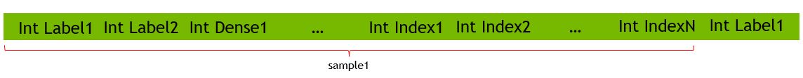

HUGECTR 2.2 USER GUIDE
===================================
<div align=center></div>
<div align=center>Fig. 1. Merlin Architecture</div>

## Introduction ##
As the training component of NVIDIA Merlin (Fig. 1), HugeCTR is a recommender specific framework which is capable of distributed training across multiple GPUs and nodes for Click-Through-Rate (CTR) estimation.
Its key missions are high-performance and easy-use.
The rest of this documentation is organized as follows.
We first introduce the new features added in the version 2.2.
Then we describe HugeCTR architecture and what kinds of model it can support, whilst illustrating how to use it.
In the final section, we compare its performance quantitatively with Tensorflow CPU/GPU.

Highlighted features of HugeCTR
* GPU Hashtable and dynamic insertion
* Multi-GPU and Multi-node training with large scale embedding support
* Mixed-precision training
* Support of four crocial networks and their variants: Wide and Deep Learning (WDL)[1], Deep Cross Network (DCN)[2], DeepFM [3] and DLRM[6].

## Newly Added Features in Version 2.2 ##
HugeCTR version 2.2 adds a lot of features to enhance its usability and performance.
HugeCTR is not only a high-performance refereence design for framework designers but also a self contained training framework.
+ **Algorithm Search** : HugeCTR runs an exhaustive [algorithm](https://docs.nvidia.com/cuda/cublas/index.html#cublasgemmalgo_t) search for each fully connected layer to find the best performant one.

+ **AUC** : An user can choose to use AUC as an evaluation metric in addition to AverageLoss. It is also possible to stop training when AUC reaches a speicifed threshold.

+ **Batch Shuffle in Training Data Set** : Training data batch shuffling is supported.

+ **Different Batch Sizes for Training and Evaluation** : An user can speicify the different batch sizes for training and evalation. It can be useful to tune overal performance.

+ **Full FP16 pipeline** : In order to data and compute throughputs, We added the full FP16 pipeline.

+ **Fused Fully Connected Layer** : In FP16 mode, you can choose to use a specilized fully connected layer fused with ReLU activation function.

+ **Evaluation Data Caching on Device** : For GPUs with large memory capacity like A100, a user can choose to cache data batches for small evaluation data sets.

+ **Interaction Layer** : We added Intearction layer used for popular models such as DLRM.

+ **Optimized Data Reader for Raw Data Format** : RAW data format is supported to simplify the one hot data reading and achieve better performance.

+ **Deep Learning Recommendation Model (DLRM)** : We eanbled and optimized the training of DLRM. Please find more details in [samples/dlrm](samples/dlrm/README.md).

+ **Learning Rate Scheduling** : [Different learning rate scheduling](#sgd-optimizer-learning-rate-scheduling) is supported. <br>

+ **Weight Initialization Methods** : For each trainable layer, a use can choose which method ,e.g., XavierUnifrom, Zero, etc is used for its weight initialization.

+ **Ampere Support** : We tested and optimized HugeCTR for Ampere Architecture.

## Architecture and Supported Networks
To enable large embedding training, the embedding table in HugeCTR is model parallel and distributed across all GPUs in a homogeneous cluster, which consists of multiple nodes and multiple GPUs. Meanwhile, the dense model such as DNN is data parallel, which has one copy in each GPU (see Fig. 2).

HugeCTR supports flexible and various CTR networks with Embeddings e.g. WDL, DCN, DeepFM, in which Embedding has a three-stage workflow: table lookup, reducing the weights within a slot, concat the weights from different slots (see Fig. 4). Operations and layers supported in HugeCTR are listed as follows:
* Multi-slot embedding: Sum / Mean
* Layers: Fully Connected / Fused Fully Connected (FP16 only) / ReLU / ELU / Dropout / Split / Reshape / Concat / BatchNorm / Multiply / FmOrder2 / MultCross / ReduceSum / Interaction
* Optimizer: Adam/ Momentum SGD/ Nesterov
* Loss: CrossEngtropy/ BinaryCrossEntropy

<div align=center></div>
<div align=center>Fig. 2. HugeCTR Architecture</div>

<div align=center></div>
<div align=center>Fig. 3. Embedding Architecture</div>

<div align=center></div>
<div align=center>Fig. 4. Embedding Mechanism</div>

## Highlighted Features
### GPU hashtable and dynamic insertion
GPU Hashtable makes the data preprocessing easier and enables dynamic insertion in HugeCTR 2.x. The input training data are hash values (64bit long long type) instead of original indices. Thus embedding initialization is not required before training. A pair of <key,value> (random small weight) will be inserted during runtime only when a new key appears in the training data and hashtable cannot find it. 
### Multi-node training and enabling large embedding
Multi-node training is supported to enable very large embedding. Thus, an embedding table of arbitrary size can be trained in HugeCTR. In multi-node solution, sparse model or embedding is also distributed across the nodes, and dense model is in data parallel. In our implementation, HugeCTR leverages NCCL and gossip[4] for high speed and scalable inner- and intra-node communication.
### Mixed precision training
In HugeCTR, to improve compute/memory throughputs with the memory footprint reduced, mixed precision training is supported.
In this mode, for matrix multiplication based layers such as `FullyConnectedLayer` and `InteractionLayer`, on Volta, Turing and Ampare architectures, TensorCores are used to boost performance. For the other layers including embeddings, the data type is changed to FP16, so that both memory bandwidth and capacity are saved.
Please note that loss scaling will be applied to avoid arithmetic underflow (see Fig. 5).  Mixed-precision training can be enabled in JSON config file (see below).
<div align=center></div>
<div align=center>Fig. 5. Arithmetic Underflow</div>

Currently, the layers and optimizers below support FP16:

* Add
* Concat
* Dropout
* FullyConnected
* FusedFullyConnected (FP16 only)
* Interaction
* ReLU
* Reshape
* Slice
* Adam
* MomentumSGD
* Nesterov
* SGD

## Usages
Training with one-shot instruction:
```shell
$ huge_ctr --train <config>.json
```
To load a snapshot, you can just modify config.json (`dense_model_file`, `sparse_model_file` in solver clause) according to the name of the snapshot. 

To run with multiple node: HugeCTR should be built with OpenMPI (GPUDirect support is recommended for high performance), then the configure file and model files should be located in "Network File System" and be visible to each of the processes. A sample of running in two nodes:
```shell
$ mpirun -N2 ./huge_ctr --train config.json
```
## Network Configurations
Please refer to [**sample configure file**](../samples/dlrm/dlrm_fp16_64k.json)

### Solver
Solver clause contains the configuration to training resource and task, items include:
* `lr_policy`: only supports `fixed` now.
* `display`: intervals to print loss on screen.
* `gpu`: GPU indices used in a training process, which has two levels. For example: [[0,1],[1,2]] indicates that two node are used; in the first node, GPU 0 and GPU 1 are used while GPU 1 and 2 are used for the second node.
It is also possible to specify noncontinuous GPU indices, e.g., [0, 2, 4, 7]
* `batchsize`: minibatch used in training.
* `batchsize_eval`: minibatch used in evaluation.
* `snapshot`: intervals to save a checkpoint in file with the prefix of `snapshot_prefix`
* `eval_interval`: intervals of evaluation on test set.
* `eval_batches`: the number of batches will be used in loss calculation of evaluation. HugeCTR will print the average loss of the batches.
* `dense model_file`: (optional: no need to config if train from scratch) file of dense model.
* `sparse_model_file`: (optional: no need to config if train from scratch)file of sparse models. From v2.1 multi-embeddings are supported in one model. Each embedding will have one model file.
* `mixed_precision`: (optional) enabling mixed precision training with the scaler specified here. Only 128/256/512/1024 are supported.
* `eval_metrics`: (optional) The list of enabled evaluation metrics. You can choose to use both `AUC` and `AverageLoss` or one of them. For AUC, you can also set its threshold, e.g., ["AUC:0.8025"] so that the training terminates if it reaches the value. The default is AUC without the threshold.
* `"input_key_type`: based on your dataset, you can choose the data type of each input key. The default is I32.
```json
 "solver": {
    "lr_policy": "fixed",
    "display": 1000,
    "max_iter": 300000,
    "gpu": [0],
    "batchsize": 512,
    "batchsize_eval": 256,
    "snapshot": 10000000,
    "snapshot_prefix": "./",
    "eval_interval": 1000,
    "eval_batches": 60,
    "mixed_precision": 256,
    "eval_metrics": ["AUC:0.8025"],
    "dense model_file": "./dense_model.bin",
    "sparse_model_file": ["./sparse_model1.bin","./sparse_model2.bin"]
  }
```

#### Different batch size in training and evaluation ####
Different batch size can be set in training and evaluation respectively.
```
"batchsize": 512,
"batchsize_eval": 256,
```

#### Full FP16 pipeline ####
When `mixed_precission` is set, full fp16 pipeline will be triggered. [7]

### Optimizer
The optimizer used in both dense and sparse models. In addition to Adam/MomentumSGD/Nesterov, We add SGD in version 2.2. Note that different optimizers can be supported in dense model and each embeddings. To enable specific optimizers in embeddings, please just put the optimizer clause into the embedding layer. Otherwise, the embedding layer will use the same optimizer as dense model. `global_update` can be specified in optimizer. By default optimizer will only update the hot columns of embedding in each iterations, but if you assign `true`, our optimizer will update all the columns.
Note that `global_update` will not have as good speed as not using it.
```json
"optimizer": {
  "type": "Adam",
  "global_update": true,
  "adam_hparam": {
    "learning_rate": 0.001,
    "beta1": 0.9,
    "beta2": 0.999,
    "epsilon": 0.0000001
  }
}
"optimizer": {
  "type": "MomentumSGD",
  "global_update": false,
  "momentum_sgd_hparam": {
    "learning_rate": 0.01,
    "momentum_factor": 0.0
  }
}
"optimizer": {
  "type": "Nesterov",
  "global_update": true,
  "nesterov_hparam": {
    "learning_rate": 0.01,
    "momentum_factor": 0.0
  }
}
```
### SGD optimizer & Learning rate scheduling
HugeCTR supports the learning rate scheduling and allows users to configure its hyperparmeters.
You can set the base learning rate (`learning_rate`) and the number of initial steps used for warm-up (`warmup_steps`).
When the learning rate decay starts (`decay_start`) and the decay period in step (`decay_steps`) are also set.
Fig. 6 illustartes how these hyperparameters interact with the actual learning rate.
```json
"optimizer": {
  "type": "SGD",
  "global_update": false,
  "sgd_hparam": {
    "learning_rate": 24.0,
    "warmup_steps": 8000,
    "decay_start": 48000,
    "decay_steps": 24000
  }
}
```
<div align=center></div>
<div align=center>Fig. 6. Learning rate scheduling</div>

### Layers
Many different kinds of layers are supported in clause `layer`, which are categorized into data, dense layers, and sparse layers (embeddings).

Data:
Data set of `Norm` format is consistent with previours version. The properties include file name of training and testing (evaluation) set, maximum elements (key) in a sample, and label dimensions (see fig. 7).
* From v2.1, `Data` will be one of the layer in the layers list. So that the name of dense input and sparse input can be reference in the following layers. 
* All the nodes will share the same file list in training.
* `dense` and `sparse` should be configured (dense_dim should be 0 if no dense feature involved), where `dense` refers to the dense input and `sparse` refers to the `sparse` input. `sparse` should be an array here, since we support multiple `embedding` and each one requires a `sparse` input.
* The `type` of sparse input should be consistent with the following Embeddings.
* `slot_num` is the number of slots used in this training set. All the weight vectors get out of a slot will be reduced into one vector after embedding lookup (see Fig. 5).
* The sum of `slot_num` in each sparse input should be consistent with the slot number defined in the header of training file.  
```json
    {
      "name": "data",
      "type": "Data",
      "source": "./file_list.txt",
      "eval_source": "./file_list_test.txt",
      "check": "Sum",
      "label": {
        "top": "label",
        "label_dim": 1
      },
      "dense": {
        "top": "dense",
        "dense_dim": 13
      },
      "sparse": [
        {
          "top": "data1",
          "type": "DistributedSlot",
          "max_feature_num_per_sample": 30,
          "slot_num": 26
        }
      ]
    }
```
* Caching evaluation data on device: To cache evaluation data on device, set can be specified to restrict the memory will be used.  `cache_eval_data`.
* Addtional item "max_nnz":1 can be specified to restrict the memory will be used. 
```
"cache_eval_data": true,
```
Data layer with `RAW` format input is introduced in v2.2. Several addtional item are configurable as below:
* `num_samples` should be specified because `RAW` format file doesn't have header like `Norm` format. It's the same to `eval_num_samples`.
* `check`: RAW support `None` check.
* `slot_size_array`: an array of table vocablulary size.
```json
     {
	 "name": "data",
	  "type": "Data",
	  "format": "Raw",
	  "num_samples": 4195155968,
	  "slot_size_array": [39884406,    39043,    17289,     7420,    20263,    3,  7120,     1543,  63, 38532951,  2953546,   403346, 10,     2208,    11938,      155,        4,      976, 14, 39979771, 25641295, 39664984,   585935,    12972,  108,  36],
	  "source": "/etc/workspace/dataset/train_data.bin",
	  "eval_num_samples": 89137319,
	  "eval_source": "/etc/workspace/dataset/test_data.bin",
	  "check": "None",
	  "cache_eval_data": true,
	  "label": {
              "top": "label",
              "label_dim": 1
	  },
	  "dense": {
              "top": "dense",
              "dense_dim": 13
	  },
	  "sparse": [
              {
		  "top": "data1",
		  "type": "LocalizedSlot",
		  "max_feature_num_per_sample": 26,
                  "max_nnz": 1,
		  "slot_num": 26
              }
	  ]
    },


```
Embedding:
* An embedding table can be segmented into multiple slots (or feature fields), which spans multiple GPUs and multiple nodes.
* `type`: two types of embedding are supported: `LocalizedSlotSparseEmbeddingHash`, `DistributedSlotSparseEmbeddingHash`.
  * `LocalizedSlotSparseEmbeddingHash`: each individual slot will be located in each GPU in turn, and not shared. This type of embedding has the best scalability.
    * `plan_file`: a plan file should be specified when use `LocalizedSlotSparseEmbeddingHash`. To generate a plan file please refer to the [**README**](../samples/dcn/README.md) in dcn sample.
  * `DistributedSlotSparseEmbeddingHash`: Each GPU will has a portion of a slot. This type of embedding is useful when there exists the load imbalance among slots and potentially has OOM issue.
  * In single GPU training, for your convenience please use `DistributedSlotSparseEmbeddingHash`.
  * `LocalizedSlotSparseEmbeddingOneHot`: Optimized version of `LocalizedSlotSparseEmbeddingHash` but only support single node training with p2p connections between ech pair of GPUs and one hot input.
* `max_vocabulary_size_per_gpu`: the maximum possible size of embedding for one gpu.
* `embedding_vec_size`: The size of each embedding vector.
* `combiner`: 0 is sum and 1 is mean.
* `optimizer`: (optional) from v2.1, HugeCTR supports different optimizers in dense and sparse models. You can specify your optimizer of this Embedding here. If not specified, HugeCTR will reuse the optimizer of dense model here.
```json
    {
      "name": "sparse_embedding1",
      "type": "LocalizedSlotSparseEmbeddingHash",
      "bottom": "data1",
      "top": "sparse_embedding1",
      "plan_file": "all2all_plan_bi_1.json",
      "sparse_embedding_hparam": {
        "max_vocabulary_size_per_gpu": 1737710,
        "embedding_vec_size": 16,
        "combiner": 0
      },
      "optimizer": {
        "type": "Adam",
        "learning_rate": true,
        "adam_hparam": {
          "learning_rate": 0.001,
          "beta1": 0.9,
          "beta2": 0.999,
          "epsilon": 0.0000001
        }
      }
    }

```
Reshape: the first layer after embedding should be `Reshape` to reshape the tensor from 3D to 2D. Reshape is the only layer accept both 3D and 2D input and the output must be 2D.
`leading_dim` in `Reshape` is the leading dimension of the output.

Concat: you can `Concat` at most **five** tensors into one and list the name in `bottom` array. Note that the second dimension (usually batch size) should be the same.

Slice: opposite to concat, we support `Slice` layer to copy specific `ranges` of input tensor to named output tensors. In the example below, we duplicate input tensor with `Slice` (0 is inclusive, 429 is exclusive). 

```json

    {
      "name": "reshape1",
      "type": "Reshape",
      "bottom": "sparse_embedding1",
      "top": "reshape1",
      "leading_dim": 416
    }
    {
      "name": "concat1",
      "type": "Concat",
      "bottom": ["reshape1","dense"],
      "top": "concat1"
    }
    {
      "name": "slice1",
      "type": "Slice",
      "bottom": "concat1",
      "ranges": [[0,429], [0,429]],
      "top": ["slice11", "slice12"]
    }


```

The Others
* ELU: the type name is `ELU`, and a `elu_param` called `alpha` in it can be configured.
* Fully Connected (`InnerProduct`): bias is supported in fully connected layer and `num_output` is the dimension of output.
* Fused fully connected layer(`FusedInnerProduct`): Fused bias adding and relu activation into a single layer.
* Loss: different from the other layers, you can specify which `regularization` will you use. This is optional. By default no regularization will be used.
* For more details please refer to [**parser.cu**](../HugeCTR/src/parser.cpp)
```json
{
  "name": "elu1",
  "type": "ELU",
  "bottom": "fc1",
  "top": "elu1",
  "elu_param": {
    "alpha": 1.0
  }
}
{
  "name": "fc8",
  "type": "InnerProduct",
  "bottom": "concat2",
  "top": "fc8",
  "fc_param": {
    "num_output": 1
  }
}
{
  "name": "fc2",
  "type": "FusedInnerProduct",
  "bottom": "fc1",
  "top": "fc2",
  "fc_param": {
    "num_output": 256
  }
}
{
  "name": "loss",
  "type": "BinaryCrossEntropyLoss",
  "bottom": ["fc8","label"],
  "regularizer": "L2",
  "top": "loss"
}

```
* Interaction layer: 
```json
{
  "name": "interaction1",
  "type": "Interaction",
  "bottom": ["fc3", "sparse_embedding1"],
  "top": "interaction1"
}
```

## Data Format
A data set in HugeCTR includes an ASCII format file list and a set of data files in binary format to maximize the performance of data loading and minimize the storage. Note that data file is the minimum reading granularity for a reading thread, so at least 10 files in each file list are required for best performance.
### File List
A file list starts with a number which indicates the number of files in the file list, then comes with the path of each data file.
```shell
$ cat simple_sparse_embedding_file_list.txt
10
./simple_sparse_embedding/simple_sparse_embedding0.data
./simple_sparse_embedding/simple_sparse_embedding1.data
./simple_sparse_embedding/simple_sparse_embedding2.data
./simple_sparse_embedding/simple_sparse_embedding3.data
./simple_sparse_embedding/simple_sparse_embedding4.data
./simple_sparse_embedding/simple_sparse_embedding5.data
./simple_sparse_embedding/simple_sparse_embedding6.data
./simple_sparse_embedding/simple_sparse_embedding7.data
./simple_sparse_embedding/simple_sparse_embedding8.data
./simple_sparse_embedding/simple_sparse_embedding9.data
```
### Data File
A data file (binary) contains a header and the following data (many samples).

Header field:
```c
typedef struct DataSetHeader_ {
  long long error_check;        // 0: no error check; 1: check_num
  long long number_of_records;  // the number of samples in this data file
  long long label_dim;          // dimension of label
  long long dense_dim;          // dimension of dense feature
  long long slot_num;           // slot_num for each embedding
  long long reserved[3];        // reserved for future use
} DataSetHeader;

```

Data Definition (each sample):
```c
typedef struct Data_{
  int length;                   // bytes in this sample (optional: only in check_sum mode )
  float label[label_dim];       
  float dense[dense_dim];
  Slot slots[slot_num];          
  char checkbits;                // checkbit for this sample (optional: only in checksum mode)
} Data;

typedef struct Slot_{
  int nnz;
  unsigned int*  keys; // changeable to `long long` with `"input_key_type"` in `solver` object of JSON config file.
} Slot;
```

Data field often has a lot of samples. Each sample starts with the labels in integer type, followed by `nnz` (number of nonzero) and key in long long (or unsigned int) type (see Fig. 7).

<div align=center></div>
<div align=center>Fig. 7 Data Field</div>

### Raw format
To use raw format, you need to specify the number of train samples and the number of evaluation samples and the slot size of the embedding in `"data"` clause.
<div align=center></div>
<div align=center>Fig. 8 Raw data format </div>

```json
"format": "Raw",
"num_samples": 4195155968,
"slot_size_array": [39884406,    39043,    17289,     7420,    20263,    3,  7120,     1543,  63, 38532951,  2953546,   403346, 10,     2208,    11938,      155,        4,      976, 14, 39979771, 25641295, 39664984,   585935,    12972,  108,  36],
"eval_num_samples": 89137319,
```
A proxy in C struct for a sample:
```c
typedef struct Data_{
  int label[label_dim];       
  int dense[dense_dim];
  int category[sparse_dim];
} Data;
```

### No Trained Parameters
Some of the layers will generate statistic result during training like Batch Norm. Such parameters are outputs of CTR training (called “no trained parameters”) and used in inference.

In HugeCTR such parameters will be written into a JSON format file along with weight during training.
```json
{
  "layers": [
    {
      "type": "BatchNorm",
      "mean": [-0.192325, 0.003050, -0.323447, -0.034817, -0.091861], 
      "var": [0.738942, 0.410794, 1.370279, 1.156337, 0.638146] 
    },
    {
      "type": "BatchNorm",
      "mean": [-0.759954, 0.251507, -0.648882, -0.176316, 0.515163],
      "var": [1.434012, 1.422724, 1.001451, 1.756962, 1.126412]
    },
    {
      "type": "BatchNorm",
      "mean": [0.851878, -0.837513, -0.694674, 0.791046, -0.849544],
      "var": [1.694500, 5.405566, 4.211646, 1.936811, 5.659098]
    }
  ]
}
```
## Performance
In this section, we test the scalability of HugeCTR and compare its performance and result with TensorFlow on NVIDIA V100 GPUs. In summary, we can achieve about 114x speedup over multi-thread Tensorflow CPU with only one V100 and generate almost the same loss curves for both evaluation and training (see Fig. 10 and Fig. 11).

Test environment:
* CPU Server: Dual 20-core Intel(R) Xeon(R) CPU E5-2698 v4 @ 2.20GHz
* TensorFlow version 2.0.0
* V100 16GB: NVIDIA DGX1 servers

Network:
* `Wide Deep Learning`: Nx 1024-unit FC layers with ReLU and dropout, emb_dim: 16; Optimizer: Adam for both Linear and DNN models
* `Deep Cross Network`: Nx 1024-unit FC layers with ReLU and dropout, emb_dim: 16, 6x cross layers; Optimizer: Adam for both Linear and DNN models

Data set:
The data is provided by CriteoLabs [5]. The original training set contains 45,840,617 examples. Each example contains a label (1 if the ad was clicked, otherwise 0) and 39 features (13 integer features and 26 categorical features). 

Preprocessing:
* Common: preprocessed by using the scripts available in tools/criteo_script
* HugeCTR: converted to HugeCTR data format with criteo2hugectr
* TF: converted to TFRecord format for the efficient training on Tensorflow

### HugeCTR
The good scalability of HugeCTR as the number of active GPUs is increased, is mainly because of the high efficient data exchange and the three-stage processing pipeline. In this pipeline, we overlap the data reading from file, host to device data transaction (inter- and intra- node) and GPU training.  The following chart shows the scalability of HugeCTR with the configration of Batch Size=16384, Layers=7 on DGX1 Servers.
<div align=center></div>
<div align=center>Fig. 9 Multi-GPU Performance of HugeCTR</div>

### TensorFlow
In the TensorFlow test case below, HugeCTR shows up to 114x speedup to a CPU server with TensorFlow with only one V100 GPU and almost the same loss curve.


<div align=center></div>
<div align=center>Fig. 10 WDL performance and loss curve comparsion with TensorFlow v2.0 </div>


<div align=center></div>
<div align=center>Fig. 11 WDL performance and loss curve comparsion with TensorFlow v2.0</div>

## Known Issues

* The auto plan file generator doesn't support to generate plan file for 1 GPU system. In this case, user need to manually create the json plan file with the following content:
` {"type": "all2all", "num_gpus": 1, "main_gpu": 0, "num_steps": 1, "num_chunks": 1, "plan": [[0, 0]], "chunks": [1]} ` and rename the json plan file to the name listed in the HugeCTR configuration file.
* For 2 GPU system, if there are 2 NVLinks between GPUs, then the auto plan file generator will print some warnings `RuntimeWarning: divide by zero encountered in true_divide`. This will not affact the generated json plan file.
* The current plan file generator doesn't suppprt the system that is only partially connected by NVLink. That is the system which has NVLink but exists 2 GPUs where data cannot travel through NVLink between them.
    + Systems such as DGX-1 where some GPU pairs don't have direct NVLink between them are supported because all the GPUs can reach each other by NVLink directly(through NVLink between them) or indirectly(through NVLink from other GPUs).
* If a system is not a fully-connected NVLink system which is a system where all GPU pairs has the same number of NVLink between them, then the maximum supported NVLinks between any two GPU is 2.
* User need to set environment variable: `export CUDA_DEVICE_ORDER=PCI_BUS_ID` to ensure that CUDA runtime and driver have consistent ordering of GPUs.
* `LocalizedSlotSparseEmbeddingOneHot` only support single nodes training with p2p connections between each pair of involved GPUs.

## Reference
[1] Wide and Deep Learning: https://arxiv.org/abs/1606.07792

[2] Deep Cross Network: https://arxiv.org/abs/1708.05123

[3] DeepFM: https://arxiv.org/abs/1703.04247 

[4] Gossip: https://github.com/Funatiq/gossip

[5] CriteoLabs: http://labs.criteo.com/2014/02/kaggle-display-advertising-challenge-dataset/

[6] DLRM: https://ai.facebook.com/blog/dlrm-an-advanced-open-source-deep-learning-recommendation-model/

[7] Mixed Precision Training: https://arxiv.org/abs/1710.03740


