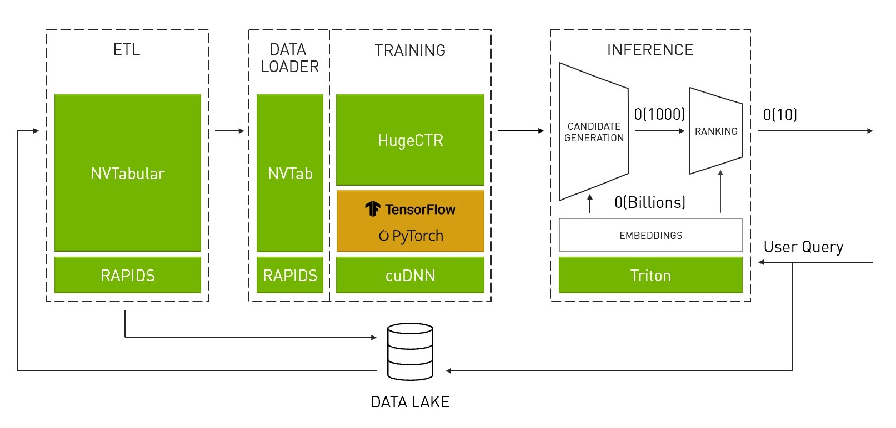

HugeCTR User Guide
===================================

HugeCTR, a component of [**NVIDIA Merlin Open Beta**](https://developer.nvidia.com/nvidia-merlin#getstarted), is a GPU-accelerated framework. It was designed to distribute training across multiple GPUs and nodes and estimate Click-Through Rates (CTRs). HugeCTR supports model-parallel embedding tables and data-parallel neural networks and their variants such as [Wide and Deep Learning (WDL)](https://arxiv.org/abs/1606.07792), [Deep Cross Network (DCN)](https://arxiv.org/abs/1708.05123), [DeepFM](https://arxiv.org/abs/1703.04247), and [Deep Learning Recommendation Model (DLRM)](https://ai.facebook.com/blog/dlrm-an-advanced-open-source-deep-learning-recommendation-model/).

<div align=center></div>
<div align=center>Fig. 1. Merlin Architecture</div>

To prevent data loading from becoming a major bottleneck during training, HugeCTR contains a dedicated data reader that is inherently asynchronous and multi-threaded. It will read a batched set of data records in which each record consists of high-dimensional, extremely sparse (or categorical) features. Each record can also include dense numerical features, which can be fed directly to the fully connected layers. An embedding layer is used to compress the input-sparse features to lower-dimensional, dense-embedding vectors. There are three GPU-accelerated embedding stages:
* table lookup
* weight reduction within each slot
* weight concatenation across the slots

To enable large embedding training, the embedding table in HugeCTR is model parallel and distributed across all GPUs in a homogeneous cluster, which consists of multiple nodes. Each GPU has its own:
* feed-forward neural network (data parallelism) to estimate CTRs
* hash table to make the data preprocessing easier and enable dynamic insertion

Embedding initialization is not required before training since the input training data are hash values (64bit long long type) instead of original indices. A pair of <key,value> (random small weight) will be inserted during runtime only when a new key appears in the training data and the hash table cannot find it.

<div align=center></div>
<div align=center>Fig. 2. HugeCTR Architecture</div>

<br></br>

<div align=center></div>
<div align=center>Fig. 3. Embedding Architecture</div>

<br></br>

<div align=center></div>
<div align=center>Fig. 4. Embedding Mechanism</div>

<br></br>


## Table of Contents
* [Getting Started](#getting-started)
* [Use Cases](#use-cases)

## Getting Started ##
We made it easy to get started with HugeCTR. All you have to do is complete these three steps:
1. [Download the HugeCTR repository and the third-party modules](#download-the-hugectr-repository-and-the-third-party-modules).
2. [Build HugeCTR](#build-hugectr).
3. [Train models using the appropriate file types](#train-models-using-the-appropriate-file-types).

### Key Prerequisites
* cuBLAS version 10.1
* Compute Capability version >= 6.0 (P100)
* CMake version 3.17.0
* cuDNN version 7.5
* NCCL version 2.0
* RMM version 0.16
* CUDF version 0.16
* Clang-Format version 3.8
* GCC version 7.4.0
* ortools version 7.6.7691

If running multi-node training, the following prerequisites apply:
* OpenMPI version 4.0
* UCX library version 1.6
* HWLOC library version 2.1.0
* mpi4py

### Supported Compute Capabilities
| Compute Capability  | GPU                  |
|---------------------|----------------------|
| 6.0                 | NVIDIA P100 (Pascal) |
| 7.0                 | NVIDIA V100 (Volta)  |
| 7.5                 | NVIDIA T4 (Turing)   |
| 8.0                 | NVIDIA A100 (Ampere) |

**NOTE:** For the details on Compute Capabilities, see [the Compute Capabilities section](http://docs.nvidia.com/cuda/cuda-c-programming-guide/index.html#compute-capabilities) in the CUDA C Programming Guide.

### Download the HugeCTR Repository and the Third-Party Modules ###
You can download the HugeCTR repository and the third-party modules that it relies on by running the following commands:
```
git clone https://github.com/NVIDIA/HugeCTR.git
cd HugeCTR
git submodule update --init --recursive
```

### Build HugeCTR ###
You can build HugeCTR using any one of these options:
* [Docker image](build-hugectr-with-the-docker-image)
* [Compute Capability](build-hugectr-with-a-specific-compute-capability)
* [Debug](build-with-debug)
* [Validation Mode](build-with-validation-mode)
* [Multi-Nodes](build-with-multi-nodes)
* [NCCL All2All](build-with-NCCL-All2All)

**NOTE**: The compute capability, debug, validation mode, multi-node, and NCCL All2All build options can be used simultaneously.

#### Build HugeCTR with the Docker Image ####
The quickest and easiest way to build HugeCTR is by using the docker image. All NVIDIA Merlin components are available as open-source projects. However, a more convenient way to make use of these components is by using Merlin NGC containers. Containers allow you to package your software application, libraries, dependencies, runtime compilers in a self-contained environment. With this build option, the application environment remains both portable, consistent, reproducible, and agnostic to the underlying host system software configuration.

Make sure that you've installed the NVIDIA Docker. HugeCTR's docker images is available in the NVIDIA container repository on https://ngc.nvidia.com/catalog/containers/nvidia:hugectr.

You can pull and launch the container by running the following command:
```
docker run --runtime=nvidia --rm -it -u $(id -u):$(id -g) nvcr.io/nvidia/hugectr:v2.3 bash
```

##### Build the HugeCTR Development Environment with the Docker Image
To build a docker image of the development environment from the corresponding Docker file, run the following command, which will install the libraries and tools required to use HugeCTR:
```
$ docker build -t hugectr:devel -f ./tools/dockerfiles/dev.Dockerfile .
```

You can run in interaction mode (mount the home directory of repo into container for easy development) using the following command:
```
$ docker run --runtime=nvidia --rm -it -u $(id -u):$(id -g) -v $(pwd):/hugectr -w /hugectr hugectr:devel bash
```

**NOTE**: If you are running on a docker version 19+, change --runtime=nvidia to --gpus all.

##### Build the HugeCTR Production Environment with the Docker Image
To build a docker image of the production environment, run the following commands:
```
$ docker build --build-arg SM="70;75;80" \
               --build-arg NCCL_A2A=on \
               -t hugectr:build \
               -f ./tools/dockerfiles/build.Dockerfile .
```

In addition to resolving dependencies, the Docker image will build and install HugeCTR in the **/usr/local/hugectr** directory. Note that SM (the target GPU architecture list) and NCCL_A2A (use NCCL ALL-to-ALL or not) are specified by default. Feel free to customize these defaults based on your environment.

**NOTE**: This image contains the executable files that should only be used for production use cases.

#### Build HugeCTR with a Specific Compute Capability ####
To build HugeCTR with a specific compute capability, run the following commands:
```
$ mkdir -p build
$ cd build
$ cmake -DCMAKE_BUILD_TYPE=Release -DSM=70 .. # Target is NVIDIA V100
$ make -j
```
Compute capability can be specified by using -DSM=[Compute Compatibilities], which is 70 by default when using the NVIDIA V100 GPU. It is also possible to set multiple compute capabilities. For example:
* DSM=70 for NVIDIA V100
* DSM="70;75" for both NVIDIA V100 and NVIDIA T4

#### Build with Debug ####
To build HugeCTR with Debug, run the following commands:
```
$ mkdir -p build
$ cd build
$ cmake -DCMAKE_BUILD_TYPE=Debug -DSM=70 .. # Target is NVIDIA V100
$ make -j
```
When using Debug to build, HugeCTR will print more verbose logs and execute GPU tasks in a synchronous manner.

#### Build with Validation Mode ####
To build HugeCTR in validation mode, run the following commands:
```
$ mkdir -p build
$ cd build
$ cmake -DVAL_MODE=ON ..
$ make -j
```

Validation mode is designed for framework validation. In this mode, loss of training will be shown as the average of eval_batches results. Only one thread and chunk will be used in the Data Reader. Performance will be lower when in validation mode.

#### Build with Multi-Nodes ####
To build HugeCTR with multi-nodes, run the following commands and mpirun:
```
$ mkdir -p build
$ cd build
$ cmake -DENABLE_MULTINODES=ON ..
$ make -j
```
For additional information, see [samples/dcn2nodes](../samples/dcn2nodes).

#### Build with NCCL All2All ####
The default collection communication library used in LocalizedSlotSparseEmbedding is Gossip. NCCL all2all is also supported in HugeCTR. To build HugeCTR with NCCL All2All, please turn on the NCCL_A2A switch in cmake and run the following commands:
```
$ mkdir -p build
$ cd build
$ cmake -DNCCL_A2A=ON ..
$ make -j
```

### Train Models Using the Appropriate File Types ###
Go to [Samples](../samples) to learn about our various sample models and how to train them using HugeCTR.

#### Types of Training
We support two types of training:
* Multi-node
* Mixed precision

**NOTE**: Multi-node training and mixed precision training can be used simultaneously.

##### Multi-Node Training
Multi-node training makes it easy to train an embedding table of arbitrary size. In a multi-node solution, the sparse model, also referred to as the embedding layer, is also distributed across the nodes. Meanwhile, the dense model, such as DNN, is data parallel and contains a copy of the dense model in each GPU (see Fig. 2). In our implementation, HugeCTR leverages NCCL and [gossip](https://github.com/Funatiq/gossip) for high speed and scalable inter- and intra-node communication.

##### Mixed Precision Training
Mixed precision training is supported to help improve and reduce the memory throughput footprint. In this mode, TensorCores are used to boost performance for matrix multiplication-based layers, such as `FullyConnectedLayer` and `InteractionLayer`, on Volta, Turing, and Ampere architectures. For the other layers, including embeddings, the data type is changed to FP16 so that both memory bandwidth and capacity are saved. To enable mixed precision mode, specify the mixed_precision option in the JSON config file. When [`mixed_precission`](https://arxiv.org/abs/1710.03740) is set, the full FP16 pipeline will be triggered. Please note that loss scaling will be applied to avoid the arithmetic underflow (see Fig. 5). Mixed precision training can be enabled in the JSON config file as noted below.

<div align=center></div>
<div align=center>Fig. 5. Arithmetic Underflow</div>


#### File Types
Three types of files are used in HugeCTR training, which include:
* configuration
* model
* dataset

##### Configuration File
The configuration file should be formatted using the JSON format. Here are some examples of how the configuration file should be formatted:
* [simple_sparse_embedding_fp32.json](../test/utest/simple_sparse_embedding_fp32.json)
* [dlrm_fp16_64k.json](../samples/dlrm/dlrm_fp16_64k.json)

There are three main JSON clauses in a configuration file:
* solver: Specifies various details such as active GPU list, batchsize, and model_file.
* optimizer: Specifies the type of optimizer and its hyperparameters.
* layers: Specifies training/evaluation data (and their paths), embeddings, and dense layers. Note that embeddings must precede the dense layers.

**NOTE**: They can be specified in any order.

###### Solver
The solver clause contains the configuration for training resource and task items, which include the following parameters:
* `lr_policy`: Only currently supports `fixed`.
* `display`: Intervals to print loss on the screen.
* `gpu`: GPU indices used in the training process, which has two levels. For example: [[0,1],[1,2]] indicates that two nodes are used in the first node. GPUs 0 and 1 are used while GPUs 1 and 2 are used for the second node. It is also possible to specify non-continuous GPU indices such as [0, 2, 4, 7].
* `batchsize`: Minibatch used in training.
* `batchsize_eval`: Minibatch used in evaluation.
* `snapshot`: Intervals to save a checkpoint in the file with the prefix of `snapshot_prefix`.
* `eval_interval`: Evaluation intervals for a test set.
* `eval_batches`: Number of batches that will be used in the loss calculation of the evaluation. HugeCTR will print the average loss of the batches.
* `dense model_file`: File used for existing dense models. This file isn't needed for training that is being performed from scratch.
* `sparse_model_file`: File used for sparse models. If using HugeCTR version 2.1, please note that multi-embeddings only support one model. Therefore, each embedding will have one model file. This file isn't required for training that is being performed from scratch.
* `mixed_precision`: Enables mixed precision training with the scaler specified here. Only 128,256, 512, and 1024 scalers are supported.
* `enable_tf32_compute`: If you want to accelerate FP32 matrix multiplications inside FullyConnectedLayer and InteractionLayer, set this value to `true`. Its default value is `false`.
* `eval_metrics`: List of enabled evaluation metrics. You can use either `AUC` or `AverageLoss`, or both of them. For AUC, you can set its threshold, such as ["AUC:0.8025"], so that the training terminates when it reaches that threshold. By default, the threshold is unset.
* `"input_key_type`: If your dataset format is `Norm`, you can choose the data type of each input key. The default is I32. For a `Parquet` dataset format to be generated by NVTabular, only I64 is allowed while I32 must be specified in order to use the `Raw` dataset format.

For example:
```json
 "solver": {
    "lr_policy": "fixed",
    "display": 1000,
    "max_iter": 300000,
    "gpu": [0],
    "batchsize": 512,
    "batchsize_eval": 256,
    "snapshot": 10000000,
    "snapshot_prefix": "./",
    "eval_interval": 1000,
    "eval_batches": 60,
    "mixed_precision": 256,
    "eval_metrics": ["AUC:0.8025"],
    "dense model_file": "./dense_model.bin",
    "sparse_model_file": ["./sparse_model1.bin","./sparse_model2.bin"]
  }
```

**NOTE**: Different batch sizes can be set in training and evaluation respectively. For example:
```
"batchsize": 512,
"batchsize_eval": 256,
```

###### Optimizer
Optimizers are used in both dense and sparse models. We support the following optimizers: Adam, MomentumSGD, Nesterov, and SGD. All four optimizers support FP16. Note that different optimizers can be supported in the dense and embedding parts of the model. To enable specific optimizers in embeddings, please just add the optimizer clause to the embedding layer. Otherwise, the embedding layer will use the same optimizer as the dense part.

The embedding update supports three algorithms specified with `update_type`:
* `Local` (default value): The optimizer will only update the hot columns of an embedding in each iteration.
* `Global`: The optimizer will update all the columns. The embedding update type takes longer than the other embedding update types.
* `LazyGlobal`: The optimizer will only update the hot columns of an embedding, which appears in the current batch, in each iteration.

For example:
```json
"optimizer": {
  "type": "Adam",
  "update_type": "Global",
  "adam_hparam": {
    "learning_rate": 0.001,
    "beta1": 0.9,
    "beta2": 0.999,
    "epsilon": 0.0000001
  }
}
"optimizer": {
  "type": "MomentumSGD",
  "update_type": "Local",
  "momentum_sgd_hparam": {
    "learning_rate": 0.01,
    "momentum_factor": 0.0
  }
}
"optimizer": {
  "type": "Nesterov",
  "update_type": "Global",
  "nesterov_hparam": {
    "learning_rate": 0.01,
    "momentum_factor": 0.0
  }
}
```

###### SGD Optimizer and Learning Rate Scheduling
HugeCTR supports learning rate scheduling and allows users to configure its hyperparameters. You can set the base learning rate (`learning_rate`), number of initial steps used for warm-up (`warmup_steps`), when the learning rate decay starts (`decay_start`), and the decay period in step (`decay_steps`). Fig. 6 illustrates how these hyperparameters interact with the actual learning rate.

For example:
```json
"optimizer": {
  "type": "SGD",
  "update_type": "Local",
  "sgd_hparam": {
    "learning_rate": 24.0,
    "warmup_steps": 8000,
    "decay_start": 48000,
    "decay_steps": 24000
  }
}
```
<div align=center></div>
<div align=center>Fig. 6. Learning Rate Scheduling</div>


##### Layers
We support the various layers in the clause `layer`, which are categorized into data, sparse (embeddings), and dense layers.

###### Data
`Data` is considered the first layer in a JSON config file. The sparse (embedding) and dense layers can access its inputs with their specified names. For more details, please refer to [Dataset File](#dataset-file) section.

###### Sparse
`Sparse` layers (embeddings) can be segmented into multiple slots or feature fields, which spans multiple GPUs and multiple nodes. There are two types of embeddings that we support:
* `LocalizedSlotSparseEmbeddingHash`: Each individual slot is located in each GPU, and not shared. This type of embedding has the best scalability. The `plan_file`, which specifies how GPUs are conneced and communicate with one another, should be specified when using this type of embedding. To generate a plan file, please refer to the [**README**](../samples/dcn/README.md) in the DCN sample. We also support `LocalizedSlotSparseEmbeddingOneHot`, which is an optimized version of `LocalizedSlotSparseEmbeddingHash`, but only supports single-node training with p2p connections between each pair of GPUs and the one-hot input.
* `DistributedSlotSparseEmbeddingHash`: Each GPU will have a portion of a slot. This type of embedding is useful when there's an existing load imbalance among slots and OOM issues. This embedding should be used for single GPU training.

The following parameters can be set for both embeddings:
* `max_vocabulary_size_per_gpu`: Maximum possible size of the embedding for one GPU.
* `embedding_vec_size`: Size of each embedding vector.
* `combiner`: 0 is sum and 1 is mean.
* `optimizer`: (optional) HugeCTR supports different optimizers in dense and sparse models. If not specified, HugeCTR will reuse the optimizer specified for the the dense model.

For example:
```json
    {
      "name": "sparse_embedding1",
      "type": "LocalizedSlotSparseEmbeddingHash",
      "bottom": "data1",
      "top": "sparse_embedding1",
      "plan_file": "all2all_plan_bi_1.json",
      "sparse_embedding_hparam": {
        "max_vocabulary_size_per_gpu": 1737710,
        "embedding_vec_size": 16,
        "combiner": 0
      },
      "optimizer": {
        "type": "Adam",
        "learning_rate": true,
        "adam_hparam": {
          "learning_rate": 0.001,
          "beta1": 0.9,
          "beta2": 0.999,
          "epsilon": 0.0000001
        }
      }
    }

```

###### Dense
`Dense` layers consist of a data parallel dense model. There are three types of dense layers:
* **Trainable**: These layers consist of trainable parameters (or weights), which include the Multi-Cross, FM Order-2, and  Multiply layers as well as:
  - **Fully Connected** (`InnerProduct`): Bias is supported in fully connected layers and `num_output` is the dimension of the output.
  - **Fused Fully Connected** (`FusedInnerProduct`): Fused bias adding and RELU activation into a single layer.
  <br></br>
* **Non-trainable**: These layers don't have any trainable parameters but are used to transform input values and/or shapes such as ELU and RELU as well as:
  - **Reshape**: The first layer that appears after the embedding layer to reshape the tensor from 3D to 2D. Reshape is the only layer that accepts both 3D and 2D input and the output must be 2D. `leading_dim` in `Reshape` is the leading dimension of the output.
  - **Concat**: You can `Concat` at most five tensors into one and list the name in the `bottom` array. Note that the second dimension, which is usually batch size, should be the same.
  - **Slice**: Copies specific `ranges` of input tensor to named output tensors. In the example below, we duplicate input tensor with `Slice`. 0 is inclusive and 429 is exclusive.

   For example:
   ```json

      {
        "name": "reshape1",
        "type": "Reshape",
        "bottom": "sparse_embedding1",
        "top": "reshape1",
        "leading_dim": 416
      }
      {
        "name": "concat1",
        "type": "Concat",
        "bottom": ["reshape1","dense"],
        "top": "concat1"
      }
      {
        "name": "slice1",
        "type": "Slice",
        "bottom": "concat1",
        "ranges": [[0,429], [0,429]],
        "top": ["slice11", "slice12"]
      }

   ```

* **Loss**: Computes the current loss value based on the model outputs and the true labels based on the given inputs. You can specify which `regularization` is used to train your model here. By default, no regularization will be used.

  For example:
  ```json
  {
   "name": "elu1",
   "type": "ELU",
   "bottom": "fc1",
   "top": "elu1",
   "elu_param": {
     "alpha": 1.0
   }
  }
  {
   "name": "fc8",
   "type": "InnerProduct",
   "bottom": "concat2",
   "top": "fc8",
   "fc_param": {
     "num_output": 1
   }
  }
  {
   "name": "fc2",
   "type": "FusedInnerProduct",
   "bottom": "fc1",
   "top": "fc2",
   "fc_param": {
     "num_output": 256
   }
  }
  {
   "name": "loss",
   "type": "BinaryCrossEntropyLoss",
   "bottom": ["fc8","label"],
   "regularizer": "L2",
   "top": "loss"
  }

  ```

#### Model File
The Model file is formatted using binary. The purpose of the model file is to initialize model weights and identify where the trained weight is stored. With the Model file, it is assumed that the weights are stored in the same order as the layers in the configuration file that are currently in use.

We provide a tutorial regarding [how to dump a model to TensorFlow](../tutorial/dump_to_tf/readMe.md).

#### Dataset File
Dataset files can be formatted using any one of these formats:
* Norm
* Raw
* Paraquet

<div align=center></div>
<div align=center>Fig. 7 (a) Norm (b) Raw (c) Parquet Dataset Formats</div>

<br>

For additional information about how to use these dataset formats with your JSON config file, see [this section](#data-format).

##### Norm
To maximize the data loading performance and minimize the storage, the Norm format consists of a collection of binary data files and an ASCII formatted file list. The model file should specify the file name of the training and testing (evaluation) set, maximum elements (key) in a sample, and the label dimensions as shown in Fig. 7 (a).

###### Data Files
A data file is the minimum reading granularity for a reading thread, so at least 10 files in each file list are required to achieve the best performance. A data file consists of a header and actual tabular data.

Header Definition:
```c
typedef struct DataSetHeader_ {
  long long error_check;        // 0: no error check; 1: check_num
  long long number_of_records;  // the number of samples in this data file
  long long label_dim;          // dimension of label
  long long dense_dim;          // dimension of dense feature
  long long slot_num;           // slot_num for each embedding
  long long reserved[3];        // reserved for future use
} DataSetHeader;

```

Data Definition (each sample):
```c
typedef struct Data_{
  int length;                   // bytes in this sample (optional: only in check_sum mode )
  float label[label_dim];       
  float dense[dense_dim];
  Slot slots[slot_num];          
  char checkbits;                // checkbit for this sample (optional: only in checksum mode)
} Data;

typedef struct Slot_{
  int nnz;
  unsigned int*  keys; // changeable to `long long` with `"input_key_type"` in `solver` object of JSON config file.
} Slot;
```

The Data field often has a lot of samples. Each sample starts with the sample length formatted as integer, followed by the float labels, dense features, and the set of sparse feature slots. Each slot starts with `slot<n>_nnz` (number of nonzero), followed by the input key using the long long (or unsigned int) format as shown in Fig. 7 (a).

The input keys for categorical are distributed to the slots with no overlap allowed. For example: `slot[0] = {0,10,32,45}, slot[1] = {1,2,5,67}`. If there is any overlap, it will cause an undefined behavior. For example, given `slot[0] = {0,10,32,45}, slot[1] = {1,10,5,67}`, the table looking up the `10` key will produce different results based on how the slots are assigned to the GPUs.

###### File List
The first line of a file list should be the number of data files in the dataset with the paths to those files listed below as shown here:
```shell
$ cat simple_sparse_embedding_file_list.txt
10
./simple_sparse_embedding/simple_sparse_embedding0.data
./simple_sparse_embedding/simple_sparse_embedding1.data
./simple_sparse_embedding/simple_sparse_embedding2.data
./simple_sparse_embedding/simple_sparse_embedding3.data
./simple_sparse_embedding/simple_sparse_embedding4.data
./simple_sparse_embedding/simple_sparse_embedding5.data
./simple_sparse_embedding/simple_sparse_embedding6.data
./simple_sparse_embedding/simple_sparse_embedding7.data
./simple_sparse_embedding/simple_sparse_embedding8.data
./simple_sparse_embedding/simple_sparse_embedding9.data
```

Please note the following:
* All the nodes will share the same file list in training.
* `format`: If you don't specifiy this field, its default value `Norm` is assumed. For the other formats, refer to [Raw](#raw) and [Parquet](#parquet)
* `check`: For `Norm` foramt, if you specify `Sum`, **CheckSum** is used to detect if there is any error in your dataset.
* `dense` and `sparse` should be configured in which dense_dim is set to 0 if no dense feature is involved.
* `dense` refers to the dense input. 
* `sparse` refers to the `sparse` input.
  - `sparse` should be an array here since we support multiple `embedding` and each one requires a `sparse` input.
  - A sparse input `type`, e.g., `DistributedSlot`, must be as the same as that of the corresponding embedding layer, e.g., `DistributedSlotSparseEmbeddingHash`.
  - `slot_num`: Number of slots used in this training set. All the weight vectors that get out of a slot will be reduced into one vector after the embedding lookup (see Fig. 4). The sum of `slot_num` in each sparse input should be consistent with the slot number defined in the header of the training file.

For example:
```json
    {
      "name": "data",
      "type": "Data",
      "source": "./file_list.txt",
      "eval_source": "./file_list_test.txt",
      "check": "Sum",
      "label": {
        "top": "label",
        "label_dim": 1
      },
      "dense": {
        "top": "dense",
        "dense_dim": 13
      },
      "sparse": [
        {
          "top": "data1",
          "type": "DistributedSlot",
          "max_feature_num_per_sample": 30,
          "slot_num": 26
        }
      ]
    }
```


##### Raw
The Raw format is different from the Norm format in that the training data appears in one binary file using int32. Fig. 7 (b) shows the structure of a Raw dataset sample.

**NOTE:** Only one-hot data is accepted with this format.

The following should be set in the configuration JSON file:
* Number of train samples
* Number of evaluation samples
* Slot size of the embedding in the `"data"` clause
* Dense
* Category
* Label dimension

For example:
```json
"format": "Raw",
"num_samples": 4195155968,
"slot_size_array": [39884406,    39043,    17289,     7420,    20263,    3,  7120,     1543,  63, 38532951,  2953546,   403346, 10,     2208,    11938,      155,        4,      976, 14, 39979771, 25641295, 39664984,   585935,    12972,  108,  36],
"eval_num_samples": 89137319,
```
A proxy in C struct for a sample:
```c
typedef struct Data_{
  int label[label_dim];       
  int dense[dense_dim];
  int category[sparse_dim];
} Data;
```

When using the Raw format, a user must preprocess their own dataset to generate the continuous keys for each slot, and specify the list of the slot sizes with the `slot_size_array` option. Therefore, when referencing the JSON config snippet above, we assume that slot 0 has the continuous keyset `{0, 1, 2 ... 39884405}` while slot 1 has its keyset on a different space `{0, 1, 2 ... 39043}`.

##### Parquet
Parquet is a column-oriented, open source, and free data format. It is available to any project in the Apache Hadoop ecosystem. To reduce file size, it supports compression and encoding. Fig. 7 (c) shows an example Parquet dataset. For additional information, see [its official documentation](https://parquet.apache.org/documentation/latest/).

Please note the following:
* Nested column types are not currently supported in the Parquet data loader.
* Any missing values in a column are not allowed.
* Like the Norm format, the label and dense feature columns should use the float format.
* The Slot feature columns should use the Int64 format.
* The data columns within the Parquet file can be arranged in any order.
* To obtain the required information from all the rows in each parquet file and column index mapping for each label, dense (numerical), and slot (categorical) feature, a separate `_metadata.json` file is required.

For example:
```
{
"file_stats": [{"file_name": "file1.parquet", "num_rows": 6528076}, {"file_name": "file2.parquet", "num_rows": 6528076}],
"cats": [{"col_name": "C11", "index": 24}, {"col_name": "C24", "index": 37}, {"col_name": "C17", "index": 30}, {"col_name": "C7", "index": 20}, {"col_name": "C6", "index": 19}],
"conts": [{"col_name": "I5", "index": 5}, {"col_name": "I13", "index": 13}, {"col_name": "I2", "index": 2}, {"col_name": "I10", "index": 10}],
"labels": [{"col_name": "label", "index": 0}]
}
```

```json
  "layers": [
        {
       "name": "data",
        "type": "Data",
        "format": "Parquet",
        "slot_size_array": [220817330, 126535808, 3014529, 400781, 11, 2209, 11869, 148, 4, 977, 15, 38713, 283898298, 39644599, 181767044, 584616, 12883, 109, 37, 17177, 7425, 20266, 4, 7085, 1535, 64],
        "source": "_file_list.txt",
        "eval_source": "_file_list.txt",
        "check": "None",
        "label": {
                "top": "label",
                "label_dim": 1
        },
        "dense": {
                "top": "dense",
                "dense_dim": 13
        },
        "sparse": [
                {
            "top": "data1",
            "type": "LocalizedSlot",
            "max_feature_num_per_sample": 30,
            "max_nnz": 1,
            "slot_num": 26
                }
        ]
      },

```

Similar to the Raw format, you must preprocess your own dataset to generate the continuous keys for each slot, and specify the list of the slot sizes with the `slot_size_array` option. Therefore, in the JSON config snippet noted above, we assume that slot 0 has the continuous keyset `{0, 1, 2 ... 220817329}` and slot 1 has its keyset on a different space `{0, 1, 2 ... 126535807}`.

The following parameters are also configurable:
* `format`: `Raw` or `Parquet`.
* `num_samples`: With the Parquet format, this parameter doesn’t need to be specified.
* `check`: Raw and Parquet formata don’t use this parameter, so use the `None` value, or disregard this parameter altogether.
* `slot_size_array`: An array of table vocabulary size.
* `float_label_dense`: **This is valid only for the `Raw` format.** If its value is set to `true`, the label and dense features for each sample are interpreted as `float` values. Otherwise, they are read as `int` values while the dense features are preprocessed with `log(dense[i] + 1.f)`. The default value is `false`.
* `cache_eval_data`: To cache evaluation data on device, use this option by specifying how may evaluation batches should be cached.
* `max_nnz`: f you just want to use the one-hot encoding, set this parameter to 1.

For example:
```json
     {
	 "name": "data",
	  "type": "Data",
	  "format": "Raw",
	  "num_samples": 4195155968,
	  "slot_size_array": [39884406,    39043,    17289,     7420,    20263,    3,  7120,     1543,  63, 38532951,  2953546,   403346, 10,     2208,    11938,      155,        4,      976, 14, 39979771, 25641295, 39664984,   585935,    12972,  108,  36],
	  "source": "/etc/workspace/dataset/train_data.bin",
	  "eval_num_samples": 89137319,
	  "eval_source": "/etc/workspace/dataset/test_data.bin",
	  "check": "None",
	  "cache_eval_data": 5441,
	  "label": {
              "top": "label",
              "label_dim": 1
	  },
	  "dense": {
              "top": "dense",
              "dense_dim": 13
	  },
	  "sparse": [
              {
		  "top": "data1",
		  "type": "LocalizedSlot",
		  "max_feature_num_per_sample": 26,
                  "max_nnz": 1,
		  "slot_num": 26
              }
	  ]
    },
```

##### Non-Trainable Parameters
Some of the layers, such as Batch Norm, will generate statistical results during training. As a result, these layers are referred to as non-trainable parameters because they are outputs of CTR training and used in inference. During training, these non-trainable parameters will be placed into a JSON file along with weights.

For example:
```json
{
  "layers": [
    {
      "type": "BatchNorm",
      "mean": [-0.192325, 0.003050, -0.323447, -0.034817, -0.091861],
      "var": [0.738942, 0.410794, 1.370279, 1.156337, 0.638146]
    },
    {
      "type": "BatchNorm",
      "mean": [-0.759954, 0.251507, -0.648882, -0.176316, 0.515163],
      "var": [1.434012, 1.422724, 1.001451, 1.756962, 1.126412]
    },
    {
      "type": "BatchNorm",
      "mean": [0.851878, -0.837513, -0.694674, 0.791046, -0.849544],
      "var": [1.694500, 5.405566, 4.211646, 1.936811, 5.659098]
    }
  ]
}
```

## Use Cases ##

### Training with One-Hot Data
Run the following command:
```shell
$ huge_ctr --train <config>.json
```

To load a particular snapshot, modify the `dense_model_file` and `sparse_model_file` files within the solver clause for that snapshot.

To run with multiple nodes, HugeCTR should be built with OpenMPI. GPUDirect support is recommended for high performance. Additionally, the configuration file and model files should be located in the Network File System and be visible to each of the processes. Here's an example of how your command should be set up when running in two nodes:
```shell
$ mpirun -N2 ./huge_ctr --train config.json
```

### Generating Synthetic Data and Benchmarks
To quickly benchmark and gather research, you can generate a synthetic dataset as shown below. Without any additional modification to the JSON file. The [Norm](#norm) (with Header) and [Raw](#raw) (without Header) datasets can be generated with `data_generator`. For categorical features, you can configure the probability distribution to be uniform or power-law.

The default distribution is uniform.
- Using the `Norm` format, run the following command: <br>
```bash
$ ./data_generator your_config.json data_folder vocabulary_size max_nnz (--files <number_of_files>) (--samples <num_samples_per_file>) (--long-tail <long|short|medium>)
$ ./huge_ctr --train your_config.json
```
- Using the `Raw` format, run the following command: <br>
```bash
$ ./data_generator your_config.json (--long-tail <long|medium|short>)
$ ./huge_ctr --train your_config.json
```

Set the following parameters:
+ `data_folder`: Directory where the generated dataset is stored.
+ `vocabulary_size`: Total vocabulary size of your target dataset, which cannot exceed the `max_vocabulary_size_per_gpu` multiplied by the number of active GPUs.
+ `max_nnz`: You can use this parameter to simulate one-hot or multi-hot encodings. If you just want to use the one-hot encoding, set this parameter to 1. Otherwise, [1, max_nnz] values will be generated for each slot. Please note that `max_nnz * slot_num` must be less than `max_feature_num_per_sample` in the data layer of the JSON config file that is being used.
+ `--files`: Number of data files that will be generated (optional). The default value is `128`.
+ `--samples`: Number of samples per file (optional). The default value is `40960`.
+ `--long-tail`: If you want to generate data with power-law distribution for categorical features, you can use this option. You choose from these options, which characterize the properties of the tail such as `long`, `medium` and `short`. The scaling exponent will be 1, 3, and 5 respectively.

### Downloading and Preprocessing Datasets
Download the Kaggle Display Advertising Challenge Dataset using $HugeCTR/tools/criteo_script/ and preprocess it to rain the DCN.

For example:
```
cd ../../tools/criteo_script/ # assume that the downloaded dataset is here
bash preprocess.sh dcn 1 0
```

Alternatively, you can generate a synthetic dataset:
```
cd /hugectr/build
mkdir dataset_dir
bin/data_generator ../samples/dcn/dcn.json ./dataset_dir 434428 1
```
