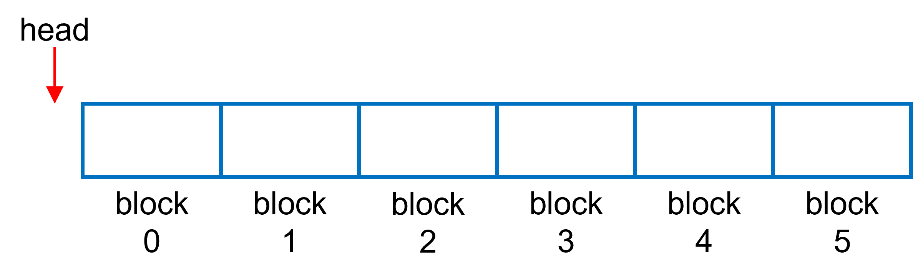

# Host Memory Cache in MOS
This document introduces the Host Memory Cache (HMEM-Cache) component of the Model Oversubscrition (MOS) feature in HugeCTR, which is designed to train a model with huge embedding tables which can not fit into the GPU or even the host memory. The description covers its principle, functionality, performance, and examples of usage.

## Table of Content
* [1 Assumption and Principle](#1-assumption-and-principle)
  * [1.1 Assumption](#11-assumption)
  * [1.2 Design of HMEM-Cache](#12-design-of-hmem-cache)
  * [1.3 Configuration](#13-configuration)
  * [1.4 How It Works](#14-how-it-works)
* [2 Performance](#2-performance)
  * [2.1 Test Condition](#21-test-condition)
    * [2.1.1 Hardware Spec](#211-hardware-spec)
    * [2.1.2 Logic of Test Code](#212-logic-of-test-code)
  * [2.2 Result and Discussion](#22-result-and-discussion)
* [3 Discussion](#3-discussion)
  * [3.1 Drawback](#31-drawback)

## 1 Assumption and Principle
### 1.1 Assumption
The HMEM-Cache is designed based on the following assumptions:
* The categorical features in the dataset follow the power-law distribution and exhibit the long-tail phenomenon, so a small number of popular keys (hot keys) will be frequently accessed.
* The most recently accessed pass in MOS may contain more hot keys than a previous pass as the hot keys keep changing in actual cases.
### 1.2 Design of HMEM-Cache
The HMEM-Cache is a dedicated MOS-aware buffering mechanism, which is not a general-purpose software cache and can't be generalized to other scenarios.

The design depends on the distinguishing characteristic of MOS: *embeddings are transferred between host and device in granularity of **pass*** (see [here](./hugectr_user_guide.md#embedding-training-cache) for information of pass). So the caching granularity in HMEM-Cache is the embedding table corresponding to a pass, marked as blocks in Fig. 1. The `head` marker is used to indicate the lastest cached pass.

<div align=center></div>
<div align=center>Fig. 1: Blocks in the HMEM-Cache</div>

### 1.3 Configuration
The HMEM-Cache requires three parameters for configuration:
* `num_blocks`: the maximum number of passes to be cached, `num_blocks=6` in Fig. 1.
* `target_hit_rate`: a user-specified hit rate between 0 and 1. If the actual hit rate is greater than this value, no eviction/insertion will happen.
* `max_num_evict`: The maximum number of eviction. If the number of eviction/insertion operations reaches this value, the HMEM-Cache will be freezed even though the `target_hit_rate` is not satisfied.

An API is provided in the python interface for this configuration:
```bash
hc_cnfg = hugectr.CreateHMemCache(num_blocks, target_hit_rate, max_num_evict)
```
Which returns a configuration object `hc_cnfg` for the HMEM-Cache according to the custom argument values.

For example, `CreateHMemCache(6, 0.6, 3)` describes that:
  * The HMEM-Cache will cache up to 6 passes.
  * No cache update happens if the hit rate is greater than 60%.
  * The cache would freeze itself after 3 eviction/insertion operations.

### 1.4 How It Works
We will use an example in this section to illustrate how HMEM-Cache works in a real case. The configuration of this example is `CreateHMemCache(6, 0.8, 3)`.

<div align=center></div>
<div align=center>Fig. 2: Demo of how HMEM-Cache works</div>

The process shown in Fig. 2 can be divided into three phases:
* **Phase 1: Cache insertion**
This stage starts from the initialization and lives when there are empty blocks in the HMEM-Cache.
When a query operation happens for a new pass, the corresponding embedding table and its optimizer states (if any) will be loaded from the SSD and inserted into the empty block.
This stage finishes when all blocks of the HMEM-Cache are occupied, marked by `is_full=true` in Fig. 2.
* **Phase 2: Cache updating**
The stage starts from the end of Phase 1 (`is_full=true`), and stops when `num_evict==max_num_evict`.
Suppose the query operation of a pass doesn't reach the `target_hit_rate` (80% in this example). In that case, the HMEM-Cache will evict the oldest block first, then load the embedding table for this new pass from both the HMEM-Cache (hit portion) and the SSD (missed portion) and insert this new pass into the available block. After one eviction/insertion operation, `num_evict` increases by 1.
* **Phase 3: Cache freezing**
If all blocks are occupied (`is_full==true`) and the number of eviction/inseration operations reaches `max_num_evict` (`num_evict == max_num_evict`), the cache will freeze itself without any updating in the later queries.

## 2 Performance
The section gives the performance of HMEM-Cache in real cases. In this test, the query happens by providing a key list to the PS, and the corresponding embedding table will be loaded into a buffer of the host memory. The write operation works in a reverse way of the query.

We also provide the performance data of the `HMEM-PS` and the `SSD-PS` (deprecated from v3.3 release) for comparsion. The `HMEM-PS` can be configured by `hugectr.TrainPSType_t.Staged` in the `ps_types` entry ([here](./python_interface.md#createmos-method)).
### 2.1 Test Condition
#### 2.1.1 Hardware Spec
This test is performed on an NVIDIA DGX-2 node. For more hardware specifications, please check [DGX-2 User Guide](https://docs.nvidia.com/dgx/pdf/dgx2-user-guide.pdf).
#### 2.1.2 Logic of Test Code
We used the first three days' data of the [Criteo Terabyte Click Logs dataset](https://labs.criteo.com/2013/12/download-terabyte-click-logs/) in this test, and the raw dataset is divided into ten passes. The number of unique keys and corresponding embedding table sizes are shown in Tab. 1. Here we chose an embedding vector size be 128; hence the total embedding table size is 53.90 GB.

The cache configuration in this test is `CreateHMemCache(2, 0.4, 0)`.

<div align=center>Tab. 1: Num of unique keys and embedding table size of each pass</div>

| Pass ID             |    0     |    1     |    2     |    3     |    4     |    5     |    6     |    7     |    8     |    9     |
| ------------------- | :------: | :------: | :------: | :------: | :------: | :------: | :------: | :------: | :------: | :------: |
| Num. unique keys    | 24199179 | 26015075 | 27387817 | 23672542 | 26053910 | 27697628 | 24727672 | 25643779 | 26374086 | 26580983 |
| Embedding size (GB) |  11.54   |  12.40   |  13.06   |  11.29   |  12.42   |  13.21   |  11.79   |  12.23   |  12.58   |  12.67   |

In this test, all passes are looped over by two iterations. We first load the embedding table of the i-th pass from the PS and then write the embedding table of (i-1)-th pass back to the PS. There are total twenty reading and nineteen writing operations (no writing happens after the 0-th reading).
### 2.2 Result and Discussion
The effective bandwidth (embedding size / reading or writing time) of reading and writing along with the hit rate are shown in Fig. 3 and Fig. 4, respectively.

The bandwidth of the `HMEM-PS` and `SSD-PS` (unoptimized) form the roofline and baseline in results, and the bandwidth of `HMEM-Cache` falls into the region between these two lines as expected.

This embedding table of the first two passes will be cached in the HMEM-Cache, and the cache will be freezed after pass 1 because the `max_num_evict=0` in this test. For passes expect no. 0 and 1, both the bandwidth and hit rate fluctuate around a constant (6000 for the bandwidth and 45% for the hit rate). The hit rate of the 10-th and 11-th reading/writing is 100% because the embedding tables of the 0-th and 1-th pass are cached in the host memory, so the bandwidths for these two accesses approach to its HMEM-PS counterpart.

These results show that the adequately configured HMEM-Cache can significantly outperform the SSD-PS (one magnitude in this test) in terms of the effective bandwidth.

<div align=center></div>
<div align=center>Fig. 3: Bandwidth and hit rate of reading operations</div>

<div align=center></div>
<div align=center>Fig. 4: Bandwidth and hit rate of writing operations</div>

## 3 Discussion
### 3.1 Drawback
An undeniable drawback of the HMEM-Cache is some portions of the embedding table are repeatedly cached because we do not check for duplication when storing the embedding table of a new pass into the cache block out of the performance consideration.

