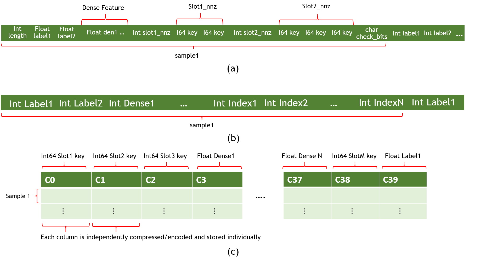

# About HugeCTR Python Interface
 
As a recommendation system domain specific framework, HugeCTR has a set of high level abstracted Python Interface which includes training API and inference API. Users only need to focus on algorithm design, the training and inference jobs can be automatically deployed on the specific hardware topology in the optimized manner. From version 3.1, users can complete the process of training and inference without manually writing JSON configuration files. All supported functionalities have been wrapped into high-level Python APIs. Meanwhile, the low-level training API is maintained for users who want to have precise control of each training iteration and each evaluation step. Still, the high-level training API is friendly to users who are already familiar with other deep learning frameworks like Keras and it is worthwhile to switch to it from low-level training API. Please refer to [HugeCTR Python Interface Notebook](../notebooks/hugectr_criteo.ipynb) to get familiar with the workflow of HugeCTR training and inference. Meanwhile we have a lot of samples for demonstration [here](../../samples).

## Table of Contents
* [High-level Training API](#high-level-training-api)
   * [CreateSolver()](#createsolver-method)
   * [CreateMOS()](#createmos-method)
   * [AsyncParam()](#asyncparam-class)
   * [HybridEmbeddingParam()](#hybridembeddingparam-class)
   * [DataReaderParams()](#datareaderparams-class)
     * [Norm](#norm)
     * [Raw](#raw)
     * [Parquet](#parquet)
   * [CreateOptimizer()](#createoptimizer-method)
   * [Layers](#layers)
     * [Input](#input-layer)
     * [SparseEmbedding](#sparseembedding)
     * [DenseLayer](#denselayer)
   * [Model](#model)<details>
     * [add()](#add-method)
     * [compile()](#compile-method)
     * [fit()](#fit-method)
     * [summary()](#summary-method)
     * [graph_to_json()](#graphtojson-method)
     * [construct_from_json()](#constructfromjson-method)
     * [load_dense_weights()](#loaddenseweights-method)
     * [load_dense_optimizer_states()](#loaddenseoptimizerstates-method)
     * [load_sparse_weights()](#loadsparseweights-method)
     * [load_sparse_optimizer_states()](#loadsparseoptimizerstates-method)
     * [freeze_dense()](#freezedense-method)
     * [freeze_embedding()](#freezeembedding-method)
     * [unfreeze_dense()](#unfreezedense-method)
     * [unfreeze_embedding()](#unfreezeembedding-method)
     * [reset_learning_rate_scheduler()](#resetlearningratescheduler-method)
     * [set_source()](#setsource-method)
     <summary>Details</summary>
* [Low-level Training API](#low-level-training-api)<details>
  * [get_next()](#getnext-method)
  * [set_source()](#setsource-method)
  * [is_eof()](#iseof-method)
  * [update()](#update-method)
  * [get_learning_rate_scheduler()](#getlearningratescheduler-method)
  * [get_model_oversubscriber()](#getmodeloversubscriber-method)
  * [get_data_reader_train()](#getdatareadertrain-method)
  * [get_data_reader_eval()](#getdatareadereval-method)
  * [start_data_reading()](#startdatareading-method)
  * [set_learning_rate()](#setlearningrate-method)
  * [train()](#train-method)
  * [get_current_loss()](#getcurrentloss-method)
  * [eval()](#eval-method)
  * [get_eval_metrics()](#getevalmetrics-method)
  * [save_params_to_files()](#saveparamstofiles-method)
  * [export_predictions()](#exportpredictions-method)
  <summary>Details</summary>
* [Inference API](#inference-api)<details>
  * [InferenceParams class](#inferenceparams-class)
  * [InferenceSession class](#inferencesession)
    * [CreateInferenceSession()](#createinferencesession-method)
    * [predict()](#predict-method)
    * [evaluate()](#evaluate-method)
  <summary>Details</summary>
* [Data Generator API](#data-generator-api)
  * [DataGeneratorParams class](#datageneratorparams-class)
  * [DataGenerator class](#datagenerator)
    * [generate()](#generate-method)

## High-level Training API ##
For HugeCTR high-level training API, the core data structures are `Solver`, `ModelOversubscriberParams`, `DataReaderParams`, `OptParamsPy`, `Input`, `SparseEmbedding`, `DenseLayer` and `Model`. You can create a `Model` instance with `Solver`, `ModelOversubscriberParams`, `DataReaderParams` and `OptParamsPy` instances, and then add instances of `Input`, `SparseEmbedding` or `DenseLayer` to it. After compiling the model with the `Model.compile()` method, you can start the epoch mode or non-epoch mode training by simply calling the `Model.fit()` method. Moreover, the `Model.summary()` method gives you an overview of the model structure. We also provide some other methods, such as saving the model graph to a JSON file, constructing the model graph based on the saved JSON file, loading model weights and optimizer status, etc.

### **Solver** ###
#### **CreateSolver method**
```bash
hugectr.CreateSolver()
```
`CreateSolver` returns an `Solver` object according to the custom argument values，which specify the training resources.

**Arguments**
* `seed`: A random seed to be specified. The default value is 0.

* `lr_policy`: The learning rate policy which suppots only fixed. The default value is `LrPolicy_t.fixed`.

* `lr`: The learning rate, which is also the base learning rate for the learning rate scheduler. The default value is 0.001.

* `warmup_steps`: The warmup steps for the internal learning rate scheduler within Model instance. The default value is 1.

* `decay_start`: The step at which the learning rate decay starts for the internal learning rate scheduler within Model instance. The default value is 0.

* `decay_steps`: The number of steps of the learning rate decay for the internal learning rate scheduler within Model instance. The default value is 1.

* `decay_power`: The power of the learning rate decay for the internal learning rate scheduler within Model instance. The default value is 2.

* `end_lr`: The final learning rate for the internal learning rate scheduler within Model instance. The default value is 0. Please refer to [SGD Optimizer and Learning Rate Scheduling](./hugectr_user_guide.md#sgd-optimizer-and-learning-rate-scheduling) if you want to get detailed information about LearningRateScheduler.

* `max_eval_batches`: Maximum number of batches used in evaluation. It is recommended that the number is equal to or bigger than the actual number of bathces in the evaluation dataset. The default value is 100.

* `batchsize_eval`: Minibatch size used in evaluation. The default value is 2048. **Note that batchsize here is the global batch size across gpus and nodes, not per worker batch size.**

* `batchsize`: Minibatch size used in training. The default value is 2048. **Note that batchsize here is the global batch size across gpus and nodes , not per worker batch size.**

* `vvgpu`: GPU indices used in the training process, which has two levels. For example: [[0,1],[1,2]] indicates that two nodes are used. In the first node, GPUs 0 and 1 are used while GPUs 1 and 2 are used for the second node. It is also possible to specify non-continuous GPU indices such as [0, 2, 4, 7]. The default value is [[0]].

* `repeat_dataset`: Whether to repeat the dataset for training. If the value is `True`, non-epoch mode training will be employed. Otherwise, epoch mode training will be adopted. The default value is `True`.

* `use_mixed_precision`: Whether to enable mixed precision training. The default value is `False`.

* `enable_tf32_compute`: If you want to accelerate FP32 matrix multiplications within the FullyConnectedLayer and InteractionLayer, set this value to `True`. The default value is `False`.

* `scaler`: The scaler to be used when mixed precision training is enabled. Only 128, 256, 512, and 1024 scalers are supported for mixed precision training. The default value is 1.0, which corresponds to no mixed precision training.

* `metrics_spec`: Map of enabled evaluation metrics. You can use either AUC, AverageLoss, HitRate, or any combination of them. For AUC, you can set its threshold, such as {MetricsType.AUC: 0.8025}, so that the training terminates when it reaches that threshold. The default value is {MetricsType.AUC: 1.0}. Multiple metrics can be specified in one job. For example: metrics_spec = {hugectr.MetricsType.HitRate: 0.8, hugectr.MetricsType.AverageLoss:0.0, hugectr.MetricsType.AUC: 1.0})

* `i64_input_key`: If your dataset format is `Norm`, you can choose the data type of each input key. For the `Parquet` format dataset generated by NVTabular, only I64 is allowed. For the `Raw` dataset format, only I32 is allowed. Set this value to `True` when you need to use I64 input key. The default value is `False`.

* `use_algorithm_search`: Whether to use algorithm search for cublasGemmEx within the FullyConnectedLayer. The default value is `True`.

* `use_cuda_graph`: Whether to enable cuda graph for dense network forward and backward propagation. The default value is `True`.

* `device_layout`: The layout of the device map for the resource manager. The supported options include `DeviceLayout.LocalFirst` and `DeviceLayout.NODE_FIRST`. If `DeviceLayout.NODE_FIRST` is employed, all nodes should have same number of devices. This argument is restricted to MLPerf use and the default value is `DeviceLayout.LocalFirst`.

* `use_holistic_cuda_graph`: If this option is enabled, everything inside a training iteration is packed into a CUDA Graph. This option works only if `use_cuda_graph` is turned off and `use_overlapped_pipeline` is turned on. This argument is restricted to MLPerf use and the default value is `False`.

* `use_overlapped_pipeline`: If this option is turned on, the bottom MLP computation will be overlapped with the hybrid embedding computation. This argument is restricted to MLPerf use and the default value is `False`.  

* `all_reduce_algo`: The algorithm to be used for all reduce. The supported options include `AllReduceAlgo.OneShot` and `AllReduceAlgo.NCCL`. This argument is restricted to MLPerf use and the default value is `AllReduceAlgo.OneShot`.

* `grouped_all_reduce`: Whether to use grouped all reduce. This argument is restricted to MLPerf use and the default value is `False`.

* `num_iterations_statistics`: The number of batches that are used in performing the statistics. This argument is restricted to MLPerf use and the default value is 20.

* `is_dlrm`: A global flag to specify whether to apply all the MLPerf optimizations for DLRM sample. The MLPerf specific options will be valid only if this flag is set `True`. The default value is `False`.

Example:
```python
solver = hugectr.CreateSolver(max_eval_batches = 300,
                              batchsize_eval = 16384,
                              batchsize = 16384,
                              lr = 0.001,
                              vvgpu = [[0]],
                              repeat_dataset = True,
                              i64_input_key = True)
```

#### **CreateMOS method**
```bash
hugectr.CreateMOS()
```
`CreateMOS` should **only** be called when using the [Embedding Training Cache](./hugectr_user_guide.md#embedding-training-cache)(Model Oversubscription) feature. It returns a `ModelOversubscriberParams` object that specifies the parameters for initializing a `ModelOversubscriber` instance.

**Arguments**
* `ps_types`: A list specifies each embedding table's parameter server (PS) type. Available PS choices for embeddings are:
  * `hugectr.TrainPSType_t.Staged`
    * The whole embedding table will be loaded into the host memory in the initialization stage.
    * It requires the size of host memory should be large enough to hold the embedding table along with the optimizer states (if any).
    * *`Staged` type offers better loading and dumping bandwidth than the `Cached` PS.*
  * `hugectr.TrainPSType_t.Cached` (Please check [Introduction to the HMEM-Cache](./intro_hmem_cache.md) for more information)
    * A sub-portion of the embedding table will be dynamically cached in the host memory, and it adopts a runtime eviction/insertion mechanism to update the cached table.
    * The size of the cached table is configurable, which can be substantially smaller than the size of the embedding table stored in the SSD or various kinds of filesystems. E.g., embedding table size (1 TB) v.s. cache size (100 GB).
    * The bandwidth of `Cached` PS is mainly affected by the hit rate. If the hit rate is 100 %, its bandwidth tends to the `Staged` PS; Otherwise, if the hit rate is 0 %, the bandwidth equals the random-accessing bandwidth of SSD.

* `sparse_models`: A path list of embedding table(s). If the provided path points to an existing table, this table will be used for incremental training. Otherwise, the newly generated table will be written into this path after training.

* `local_paths`: A path list for storing the temporary embedding table. Its length should be equal to the number of MPI ranks. Each entry in this list should be a path pointing to the local SSD of this node.

  *This entry is only required when there is `hugectr.TrainPSType_t.Cached` in `ps_types`.*

* `hcache_configs`: A path list of the configurations of `Cached` PS. Please check [Configuration](./intro_hmem_cache.md#13-configuration) for more descriptions.
  * If only one configuration is provided, it will be used for all `Cached` PS.
  * Otherwise, you need to provide one configuration for each `Cached` PS. And the ith configuration in `hcache_configs` will be used for the ith occurrence of `Cached` PS in `ps_types`.

  *This entry is only required when there is `hugectr.TrainPSType_t.Cached` in `ps_types`.*

Example:
```python
hc_config = hugectr.CreateHMemCache(2, 0.5, 0)
mos = hugectr.CreateMOS( \
    ps_types = [hugectr.TrainPSType_t.Staged, hugectr.TrainPSType_t.Cached], \
    sparse_models = [output_dir + "/wdl_0_sparse_model", output_dir + "/wdl_1_sparse_model"], \
    local_paths = ["raid/md1/tmp_dir"], hmem_cache_configs = [hc_config])
```

For more examples, please refer to the [HugeCTR Continuous Training](../notebooks/continuous_training.ipynb) notebook.

### **AsyncParam** ###
#### **AsyncParam class**
```bash
hugectr.AsyncParam()
```
`AsyncParam` specifies the parameters related to async raw data reader, which can be used to initialize `DataReaderParams` instance. It is restricted to MLPerf use.

**Arguments**
* `num_threads`: Integer, the number of the data reading threads, should be at least 1 per GPU。 This argument is restricted to MLPerf use and there is NO default value.

* `num_batches_per_thread`: Integer,  the number of the batches each data reader thread works on simultaneously, typically 2-4. This argument is restricted to MLPerf use and there is NO default value.

* `io_block_size`: Integer, the size of individual IO requests, the value 512000 should work in most cases. This argument is restricted to MLPerf use and there is NO default value.

* `io_depth`: Integer, the size of the asynchronous IO queue, the value 4 should work in most cases. This argument is restricted to MLPerf use and there is NO default value.

* `io_alignment`: Integer, the byte alignment of IO requests, the value 512 should work in most cases. This argument is restricted to MLPerf use and there is NO default value.

* `shuffle`: Boolean, if this option is enabled, the order in which the batches are fed into training will be randomized. This argument is restricted to MLPerf use and there is NO default value.

* `aligned_type`: The supported types include `hugectr.Alignment_t.Auto` and `hugectr.Alignment_t.Non`. If `hugectr.Alignment_t.Auto` is chosen,  the dimension of dense input will be padded to an 8-aligned value. This argument is restricted to MLPerf use and there is NO default value.

Example:
```python
async_param = hugectr.AsyncParam(32, 4, 716800, 2, 512, True, hugectr.Alignment_t.Non)
```

### **HybridEmbeddingParam** ###
#### **HybridEmbeddingParam class**
```bash
hugectr.HybridEmbeddingParam()
```
`HybridEmbeddingParam` specifies the parameters related to hybrid embedding, which can be used to initialize `SparseEmbedding` instance. It is restricted to MLPerf use.

**Arguments**
* `max_num_frequent_categories`: Integer, the maximum number of frequent categories in unit of batch size. This argument is restricted to MLPerf use and there is NO default value.

* `max_num_infrequent_samples`: Integer, the maximum number of infrequent samples in unit of batch size. This argument is restricted to MLPerf use and there is NO default value.

* `p_dup_max`: Float, the maximum probability that the category appears more than once within the gpu-batch. This way of determining the number of frequent categories is used in single-node or NVLink connected systems only. This argument is restricted to MLPerf use and there is NO default value.

* `max_all_reduce_bandwidth`: Float, the bandwidth of the all reduce. This argument is restricted to MLPerf use and there is NO default value.

* `max_all_to_all_bandwidth`: Float, the bandwidth of the all-to-all. This argument is restricted to MLPerf use and there is NO default value.

* `efficiency_bandwidth_ratio`: Float, this argument is used in combination with `max_all_reduce_bandwidth` and `max_all_to_all_bandwidth` to determine the optimal threshold for number of frequent categories. This way of determining the frequent categories is used for multi node only. This argument is restricted to MLPerf use and there is NO default value.

* `communication_type`: The type of communication that is being used. The supported types include `CommunicationType.IB_NVLink`, `CommunicationType.IB_NVLink_Hier` and `CommunicationType.NVLink_SingleNode`. This argument is restricted to MLPerf use and there is NO default value.

* `hybrid_embedding_type`: The type of hybrid embedding, which supports only `HybridEmbeddingType.Distributed` for now. This argument is restricted to MLPerf use and there is NO default value.

Example:
```python
hybrid_embedding_param = hugectr.HybridEmbeddingParam(2, -1, 0.01, 1.3e11, 1.9e11, 1.0, 
                                                    hugectr.CommunicationType.IB_NVLink_Hier,
                                                    hugectr.HybridEmbeddingType.Distributed))
```

### **DataReaderParams** ###
#### **DataReaderParams class**
```bash
hugectr.DataReaderParams()
```
`DataReaderParams` specifies the parameters related to the data reader. HugeCTR currently supports three dataset formats, i.e., [Norm](#norm), [Raw](#raw) and [Parquet](#parquet). An `DataReaderParams` instance is required to initialize the `Model` instance.

**Arguments**
* `data_reader_type`: The type of the data reader which should be consistent with the dataset format. The supported types include `hugectr.DataReaderType_t.Norm`, `hugectr.DataReaderType_t.Raw` and `hugectr.DataReaderType_t.Parquet` and `DataReaderType_t.RawAsync`. The type `DataReaderType_t.RawAsync` is valid only if `is_dlrm` is set `True` within `CreateSolver`. There is NO default value and it should be specified by users.

* `source`: List[str] or String, the training dataset source. For Norm or Parquet dataset, it should be the file list of training data, e.g., `source = "file_list.txt"`. For Raw dataset, it should be a single training file, e.g., `source = "train_data.bin"`. When using model oversubscriber, it can be specified with several file lists, e.g., `source = ["file_list.1.txt", "file_list.2.txt"]`. There is NO default value and it should be specified by users.

* `keyset`: List[str] or String, the keyset files. This argument will ONLY be valid when using model oversubscriber and it should be corresponding to the `source`. For example, we can specify `source = ["file_list.1.txt", "file_list.2.txt"]` and `source = ["file_list.1.keyset", "file_list.2.keyset"]`, which have a one-to-one correspondence.

* `eval_source`: String, the evaluation dataset source. For Norm or Parquet dataset, it should be the file list of evaluation data. For Raw dataset, it should be a single evaluation file. There is NO default value and it should be specified by users.

* `check_type`: The data error detection mechanism. The supported types include `hugectr.Check_t.Sum` (CheckSum) and `hugectr.Check_t.Non` (no detection). There is NO default value and it should be specified by users.

* `cache_eval_data`: Integer, the cache size of evaluation data on device, set this parameter greater than zero to restrict the memory that will be used. The default value is 0.

* `num_samples`: Integer, the number of samples in the traning dataset. This is ONLY valid for Raw dataset. The default value is 0.

* `eval_num_samples`: Integer, the number of samples in the evaluation dataset. This is ONLY valid for Raw dataset. The default value is 0.

* `float_label_dense`: Boolean, this is valid only for the Raw dataset format. If its value is set to `True`, the label and dense features for each sample are interpreted as float values. Otherwise, they are read as integer values while the dense features are preprocessed with log(dense[i] + 1.f). The default value is `True`.

* `num_workers`: Integer, the number of data reader workers that concurrently load data. You can empirically decide the best one based on your dataset, training environment. The default value is 12.

* `slot_size_array`: List[int], the cardinality array of input features. It should be consistent with that of the sparse input. We requires this argument for Parquet format data and RawAsync format when you want to add offset to input key. The default value is an empty list.

* `async_param`: AsyncParam, the parameters for async raw data reader. This argument is restricted to MLPerf use.

### Dataset formats
We support the following dataset formats within our `DataReaderParams`.
* [Norm](#norm)
* [Raw](#raw)
* [Parquet](#parquet)

<div align=center></div>
<div align=center>Fig. 1: (a) Norm (b) Raw (c) Parquet Dataset Formats</div>

<br>

#### **Norm** ####
To maximize the data loading performance and minimize the storage, the Norm dataset format consists of a collection of binary data files and an ASCII formatted file list. The model file should specify the file name of the training and testing (evaluation) set, maximum elements (key) in a sample, and the label dimensions as shown in Fig. 1 (a).

##### Data Files #####
A data file is the minimum reading granularity for a reading thread, so at least 10 files in each file list are required to achieve the best performance. A data file consists of a header and actual tabular data.

Header Definition:
```c
typedef struct DataSetHeader_ {
  long long error_check;        // 0: no error check; 1: check_num
  long long number_of_records;  // the number of samples in this data file
  long long label_dim;          // dimension of label
  long long dense_dim;          // dimension of dense feature
  long long slot_num;           // slot_num for each embedding
  long long reserved[3];        // reserved for future use
} DataSetHeader;
```

Data Definition (each sample):
```c
typedef struct Data_ {
  int length;                   // bytes in this sample (optional: only in check_sum mode )
  float label[label_dim];
  float dense[dense_dim];
  Slot slots[slot_num];
  char checkbits;                // checkbit for this sample (optional: only in checksum mode)
} Data;

typedef struct Slot_ {
  int nnz;
  unsigned int*  keys; // changeable to `long long` with `"input_key_type"` in `solver` object of the configuration file.
} Slot;
```

The Data field often has a lot of samples. Each sample starts with the labels formatted as integers and followed by `nnz` (number of nonzero) with the input key using the long long (or unsigned int) format as shown in Fig. 1 (a).

The input keys for categorical are distributed to the slots with no overlap allowed. For example: `slot[0] = {0,10,32,45}, slot[1] = {1,2,5,67}`. If there is any overlap, it will cause an undefined behavior. For example, given `slot[0] = {0,10,32,45}, slot[1] = {1,10,5,67}`, the table looking up the `10` key will produce different results based on how the slots are assigned to the GPUs.

##### File List #####
The first line of a file list should be the number of data files in the dataset with the paths to those files listed below as shown here:
```shell
$ cat simple_sparse_embedding_file_list.txt
10
./simple_sparse_embedding/simple_sparse_embedding0.data
./simple_sparse_embedding/simple_sparse_embedding1.data
./simple_sparse_embedding/simple_sparse_embedding2.data
./simple_sparse_embedding/simple_sparse_embedding3.data
./simple_sparse_embedding/simple_sparse_embedding4.data
./simple_sparse_embedding/simple_sparse_embedding5.data
./simple_sparse_embedding/simple_sparse_embedding6.data
./simple_sparse_embedding/simple_sparse_embedding7.data
./simple_sparse_embedding/simple_sparse_embedding8.data
./simple_sparse_embedding/simple_sparse_embedding9.data
```

Example:
```python
reader = hugectr.DataReaderParams(data_reader_type = hugectr.DataReaderType_t.Norm,
                                  source = ["./wdl_norm/file_list.txt"],
                                  eval_source = "./wdl_norm/file_list_test.txt",
                                  check_type = hugectr.Check_t.Sum)
```

#### **Raw** ####
The Raw dataset format is different from the Norm dataset format in that the training data appears in one binary file using int32. Fig. 1 (b) shows the structure of a Raw dataset sample.

**NOTE**: Only one-hot data is accepted with this format.

The Raw dataset format can be used with embedding type LocalizedSlotSparseEmbeddingOneHot only.

Example:
```python
reader = hugectr.DataReaderParams(data_reader_type = hugectr.DataReaderType_t.Raw,
                                  source = ["./wdl_raw/train_data.bin"],
                                  eval_source = "./wdl_raw/validation_data.bin",
                                  check_type = hugectr.Check_t.Sum)
```


#### **Parquet** ####
Parquet is a column-oriented, open source, and free data format. It is available to any project in the Apache Hadoop ecosystem. To reduce the file size, it supports compression and encoding. Fig. 1 (c) shows an example Parquet dataset. For additional information, see the [parquet documentation](https://parquet.apache.org/documentation/latest/).

Please note the following:
* Nested column types are not currently supported in the Parquet data loader.
* Any missing values in a column are not allowed.
* Like the Norm dataset format, the label and dense feature columns should use the float format.
* The Slot feature columns should use the Int64 format.
* The data columns within the Parquet file can be arranged in any order.
* To obtain the required information from all the rows in each parquet file and column index mapping for each label, dense (numerical), and slot (categorical) feature, a separate `_metadata.json` file is required.

Example:
```python
#_metadata.json
{
"file_stats": [{"file_name": "file1.parquet", "num_rows": 6528076}, {"file_name": "file2.parquet", "num_rows": 6528076}],
"cats": [{"col_name": "C11", "index": 24}, {"col_name": "C24", "index": 37}, {"col_name": "C17", "index": 30}, {"col_name": "C7", "index": 20}, {"col_name": "C6", "index": 19}],
"conts": [{"col_name": "I5", "index": 5}, {"col_name": "I13", "index": 13}, {"col_name": "I2", "index": 2}, {"col_name": "I10", "index": 10}],
"labels": [{"col_name": "label", "index": 0}]
}
```

```python
reader = hugectr.DataReaderParams(data_reader_type = hugectr.DataReaderType_t.Parquet,
                                  source = ["./criteo_data/train/_file_list.txt"],
                                  eval_source = "./criteo_data/val/_file_list.txt",
                                  check_type = hugectr.Check_t.Non,
                                  slot_size_array = [278899, 355877, 203750, 18573, 14082, 7020, 18966, 4, 6382, 1246, 49, 185920, 71354, 67346, 11, 2166, 7340, 60, 4, 934, 15, 204208, 141572, 199066, 60940, 9115, 72, 34])
``` 

We provide an option to add offset for each slot by specifying `slot_size_array`. `slot_size_array` is an array whose length is equal to the number of slots. To avoid duplicate keys after adding offset, we need to ensure that the key range of the i-th slot is between 0 and slot_size_array[i]. We will do the offset in this way: for i-th slot key, we add it with offset slot_size_array[0] + slot_size_array[1] + ... + slot_size_array[i - 1]. In the configuration snippet noted above, for the 0th slot, offset 0 will be added. For the 1st slot, offset 278899 will be added. And for the third slot, offset 634776 will be added.

### **OptParamsPy** ###
#### **CreateOptimizer method**
```bash
hugectr.CreateOptimizer()
```
`CreateOptimizer` returns an `OptParamsPy` object according to the custom argument values，which specify the optimizer type and the corresponding hyperparameters. The `OptParamsPy` object will be used to initialize the `Model` instance and it applies to the weights of dense layers. Sparse embedding layers which do not have a specified optimizer will adopt this optimizer as well. Please **NOTE** that the hyperparameters should be configured meticulously when mixed precision training is employed, e.g., the `epsilon` value for the `Adam` optimizer should be set larger.

The embedding update supports three algorithms specified with `update_type`:
* `Local` (default value): The optimizer will only update the hot columns (embedding vectors which is hit in this iteration of training) of an embedding in each iteration.
* `Global`: The optimizer will update all the columns. The embedding update type takes longer than the other embedding update types.
* `LazyGlobal`: The optimizer will only update the hot columns of an embedding in each iteration while using different semantics from the *local* and *global* updates.

**Arguments**
* `optimizer_type`: The optimizer type to be used. The supported types include `hugectr.Optimizer_t.Adam`, `hugectr.Optimizer_t.MomentumSGD`, `hugectr.Optimizer_t.Nesterov` and `hugectr.Optimizer_t.SGD`, `hugectr.Optimizer_t.Adagrad`. The default value is `hugectr.Optimizer_t.Adam`.

* `update_type`: The update type for the embedding. The supported types include `hugectr.Update_t.Global`, `hugectr.Update_t.Local`, and `hugectr.Update_t.LazyGlobal`(Adam only). The default value is `hugectr.Update_t.Global`.

* `beta1`: The `beta1` value when using Adam optimizer. The default value is 0.9.

* `beta2`: The `beta2` value when using Adam optimizer. The default value is 0.999.

* `epsilon`: The `epsilon` value when using Adam optimizer. This argument should be well configured when mixed precision training is employed. The default value is 1e-7.

* `momentum_factor`: The `momentum_factor` value when using MomentumSGD or Nesterov optimizer. The default value is 0.

* `atomic_update`: Whether to employ atomic update when using SGD optimizer. The default value is True. 

Example:
```python
optimizer = hugectr.CreateOptimizer(optimizer_type = hugectr.Optimizer_t.Adam,
                                    update_type = hugectr.Update_t.Global,
                                    beta1 = 0.9,
                                    beta2 = 0.999,
                                    epsilon = 0.0000001)
```

## Layers ##
There are three major kinds of `layer` in HugeCTR:
* [Input](#input-layer)
* [Sparse Embedding](#sparse-embedding)
* [Dense](#dense-layers)

Please refer to [hugectr_layer_book](./hugectr_layer_book.md#table-of-contents) for detail guides on how to use different layer types.

### Input Layer ###
```bash
hugectr.Input()
```
`Input`specifies the parameters related to the data input. An `Input` instance should be added to the Model instance first so that the following `SparseEmbedding` and `DenseLayer` instances can access the inputs with their specified names. Please refer to [Input Detail](./hugectr_layer_book.md#input-layer) if you want to get detailed information about Input.

**Arguments**
* `label_dim`: Integer, the label dimension. 1 implies it is a binary label. For example, if an item is clicked or not. There is NO default value and it should be specified by users.

* `label_name`: String, the name of the label tensor to be referenced by following layers. There is NO default value and it should be specified by users.

* `dense_dim`: Integer, the number of dense (or continuous) features. If there is no dense feature, set it to 0. There is NO default value and it should be specified by users.

* `dense_name`: Integer, the name of the dense input tensor to be referenced by following layers. There is NO default value and it should be specified by users.

* `data_reader_sparse_param_array`: List[hugectr.DataReaderSparseParam], the list of the sparse parameters for categorical inputs. Each `DataReaderSparseParam` instance should be constructed with  `sparse_name`, `nnz_per_slot`, `is_fixed_length` and `slot_num`. 
  * `sparse_name` is the name of the sparse input tensors to be referenced by following layers. There is NO default value and it should be specified by users. 
  * `nnz_per_slot` is the maximum number of features for each slot for the specified spare input. The `nnz_per_slot` can be an `int` which means average nnz per slot so the maximum number of features per sample should be `nnz_per_slot * slot_num`. Or you can use List[int] to initialize `nnz_per_slot`, then the maximum number of features per sample should be `sum(nnz_per_slot)` and in this case, the length of the array `nnz_per_slot` should be the same with `slot_num`. 
  * `is_fixed_length` is used to identify whether categorical inputs has the same length for each slot among all samples. If different samples have the same number of features for each slot, then user can set `is_fixed_length = True` and HugeCTR can use this information to reduce data transferring time. 
  * `slot_num` specifies the number of slots used for this sparse input in the dataset. **Note:** if multiple `DataReaderSparseParam` are specified there's no overlap between any pair of `DataReaderSparseParam`. e.g. in our [wdl sample](../samples/wdl/wdl.py), we have 27 slots in total; we specified the first slot as "wide_data" and the next 26 slots as "deep_data".

### SparseEmbedding  ###
```bash
hugectr.SparseEmbedding()
```
`SparseEmbedding` specifies the parameters related to the sparse embedding layer. One or several `SparseEmbedding` layers should be added to the Model instance after `Input` and before `DenseLayer`. Please refer to [SparseEmbedding Detail](./hugectr_layer_book.md#sparse-embedding) if you want to get detailed information about SparseEmbedding.

**Arguments**
* `embedding_type`: The embedding type to be used. The supported types include `hugectr.Embedding_t.DistributedSlotSparseEmbeddingHash`, `hugectr.Embedding_t.LocalizedSlotSparseEmbeddingHash`, `hugectr.Embedding_t.LocalizedSlotSparseEmbeddingOneHot` and `hugectr.Embedding_t.HybridSparseEmbedding`. The type `Embedding_t.HybridSparseEmbedding` is valid only if `is_dlrm` is set `True` within `CreateSolver` and `data_reader_type` is specified as `DataReaderType_t.RawAsync` within `DataReaderParams`. There is NO default value and it should be specified by users.

* `workspace_size_per_gpu_in_mb`: Integer, the workspace memory size in megabyte per GPU. This workspace memory must be big enough to hold all the embedding vocabulary used during the training and evaluation. There is NO default value and it should be specified by users. To understand how to set this value, please refer [How to set workspace_size_per_gpu_in_mb and slot_size_array](./QAList.md#24).

* `embedding_vec_size`: Integer, the embedding vector size. There is NO default value and it should be specified by users.

* `combiner`: String, the intra-slot reduction operation, currently `sum` or `mean` are supported. There is NO default value and it should be specified by users.

* `sparse_embedding_name`: String, the name of the sparse embedding tensor to be referenced by following layers. There is NO default value and it should be specified by users.

* `bottom_name`: String, the number of the bottom tensor to be consumed by this sparse embedding layer. Please note that it should be a predefined sparse input name. There is NO default value and it should be specified by users.

* `slot_size_array`: List[int], the cardinality array of input features. It should be consistent with that of the sparse input. This parameter can be used in `LocalizedSlotSparseEmbeddingHash`, `LocalizedSlotSparseEmbeddingOneHot` and `HybridSparseEmbedding`. The meaning of `slot_size_array` is varied based on different embedding type. There is NO default value and it should be specified by users. Please refer [How to set workspace_size_per_gpu_in_mb and slot_size_array](./QAList.md#24).

* `optimizer`: OptParamsPy, the optimizer dedicated to this sparse embedding layer. If the user does not specify the optimizer for the sparse embedding, it will adopt the same optimizer as dense layers. 

* `hybrid_embedding_param`: HybridEmbeddingParam, the parameters for hybrid embedding. This argument is restricted to MLPerf use.


### DenseLayer ###
```bash
hugectr.DenseLayer()
```
`DenseLayer` specifies the parameters related to the dense layer or the loss function. HugeCTR currently supports multiple dense layers and loss functions, Please refer to [DenseLayer Detail](./hugectr_layer_book.md#dense-layers) if you want to get detailed information about dense layers. Please **NOTE** that the final sigmoid function is fused with the loss function to better utilize memory bandwidth.

**Arguments**
* `layer_type`: The layer type to be used. The supported types include `hugectr.Layer_t.Add`, `hugectr.Layer_t.BatchNorm`, `hugectr.Layer_t.Cast`, `hugectr.Layer_t.Concat`, `hugectr.Layer_t.DotProduct`, `hugectr.Layer_t.Dropout`, `hugectr.Layer_t.ELU`, `hugectr.Layer_t.FmOrder2`, `hugectr.Layer_t.FusedInnerProduct`, `hugectr.Layer_t.InnerProduct`, `hugectr.Layer_t.Interaction`, `hugectr.Layer_t.MultiCross`, `hugectr.Layer_t.ReLU`, `hugectr.Layer_t.ReduceSum`, `hugectr.Layer_t.Reshape`, `hugectr.Layer_t.Sigmoid`, `hugectr.Layer_t.Slice`, `hugectr.Layer_t.WeightMultiply`, `hugectr.ElementWiseMultiply`, `hugectr.Layer_t.GRU`, `hugectr.Layer_t.Scale`, `hugectr.Layer_t.FusedReshapeConcat`, `hugectr.Layer_t.FusedReshapeConcatGeneral`, `hugectr.Layer_t.Softmax`, `hugectr.Layer_t.PReLU_Dice`, `hugectr.Layer_t.ReduceMean`, `hugectr.Layer_t.Sub`, `hugectr.Layer_t.Gather`, `hugectr.Layer_t.BinaryCrossEntropyLoss`, `hugectr.Layer_t.CrossEntropyLoss` and `hugectr.Layer_t.MultiCrossEntropyLoss`. There is NO default value and it should be specified by users.

* `bottom_names`: List[str], the list of bottom tensor names to be consumed by this dense layer. Each name in the list should be the predefined tensor name. There is NO default value and it should be specified by users.

* `top_names`: List[str], the list of top tensor names, which specify the output tensors of this dense layer. There is NO default value and it should be specified by users.

* `factor`: Float, exponential average factor such as runningMean = runningMean*(1-factor) + newMean*factor for the `BatchNorm` layer. The default value is 1.

* `eps`: Float, epsilon value used in the batch normalization formula for the `BatchNorm` layer. The default value is 1e-5.

* `gamma_init_type`: Specifies how to initialize the gamma (or scale) array for the `BatchNorm` layer. The supported types include `hugectr.Initializer_t.Default`, `hugectr.Initializer_t.Uniform`, `hugectr.Initializer_t.XavierNorm`, `hugectr.Initializer_t.XavierUniform` and `hugectr.Initializer_t.Zero`. The default value is `hugectr.Initializer_t.Default`.

* `beta_init_type`: Specifies how to initialize the beta (or offset) array for the `BatchNorm` layer. The supported types include `hugectr.Initializer_t.Default`, `hugectr.Initializer_t.Uniform`, `hugectr.Initializer_t.XavierNorm`, `hugectr.Initializer_t.XavierUniform` and `hugectr.Initializer_t.Zero`. The default value is `hugectr.Initializer_t.Default`.

* `dropout_rate`: Float, The dropout rate to be used for the `Dropout` layer. It should be between 0 and 1. Setting it to 1 indicates that there is no dropped element at all. The default value is 0.5.

* `elu_alpha`: Float, the scalar that decides the value where this `ELU` function saturates for negative values. The default value is 1.

* `num_output`: Integer, the number of output elements for the `InnerProduct` or `FusedInnerProduct` layer. The default value is 1.

* `weight_init_type`: Specifies how to initialize the weight array for the `InnerProduct`, `FusedInnerProduct`, `MultiCross` or `WeightMultiply` layer. The supported types include `hugectr.Initializer_t.Default`, `hugectr.Initializer_t.Uniform`, `hugectr.Initializer_t.XavierNorm`, `hugectr.Initializer_t.XavierUniform` and `hugectr.Initializer_t.Zero`. The default value is `hugectr.Initializer_t.Default`.

* `bias_init_type`: Specifies how to initialize the bias array for the `InnerProduct`, `FusedInnerProduct` or `MultiCross` layer. The supported types include `hugectr.Initializer_t.Default`, `hugectr.Initializer_t.Uniform`, `hugectr.Initializer_t.XavierNorm`, `hugectr.Initializer_t.XavierUniform` and `hugectr.Initializer_t.Zero`. The default value is `hugectr.Initializer_t.Default`.

* `num_layers`: Integer, the Number of cross layers for the `MultiCross` layer. It should be set as a positive number if you want to use the cross network. The default value is 0.

* `leading_dim`: Integer, the innermost dimension of the output tensor for the `Reshape` layer. It must be the multiple of the total number of input elements. The default value is 1.

* `selected`: Boolean, whether to use the selected mode for the `Reshape` layer. The default value is False.

* `selected_slots`: List[int], the selected slots for the `Reshape` layer. It will be ignored if `selected` is False. The default value is [].

* `ranges`: List[Tuple[int, int]], used for the `Slice` layer. A list of tuples in which each one represents a range in the input tensor to generate the corresponding output tensor. For example, (2, 8) indicates that 8 elements starting from the second element in the input tensor are used to create an output tensor. The number of tuples corresponds to the number of output tensors. Ranges are allowed to overlap unless it is a reverse or negative range. The default value is [].

* `weight_dims`: List[int], the shape of the weight matrix (slot_dim, vec_dim) where vec_dim corresponds to the latent vector length for the `WeightMultiply` layer. It should be set correctly if you want to employ the weight multiplication. The default value is [].

* `out_dim`: Integer, the output vector size for the `FmOrder2` layer. It should be set as a positive number if your want to use factorization machine. The default value is 0.

* `axis`: Integer, the dimension to reduce for the `ReduceSum` layer. If the input is N-dimensional, 0 <= axis < N. The default value is 1.

* `time_step`: Integer, the secondary dimension of the output tensor of the `Reshape` layer. It has to be used with `leading_dim` to define 3D output tensor for `Reshape` layer. The default value is 0.

* `batchsize`: Integer, the require information of the `GRU` layer. The default value is 1.

* `SeqLength`: Integer, the require information of the `GRU` layer. The default value is 1.

* `vector_size`: Integer, the require information of the `GRU` layer. The default value is 1.

* `indices`: List[int], a list of indices of the `Gather` layer to specific the extract slice of the input tensor. The default value is [].

* `target_weight_vec`: List[float], the target weight vector for the `MultiCrossEntropyLoss` layer. The default value is [].

* `use_regularizer`: Boolean, whether to use the regularizer for the `BinaryCrossEntropyLoss`, `CrossEntropyLoss` or `MultiCrossEntropyLoss` layer. The default value is False.

* `regularizer_type`: The regularizer type for the `BinaryCrossEntropyLoss`, `CrossEntropyLoss` or `MultiCrossEntropyLoss` layer. The supported types include `hugectr.Regularizer_t.L1` and `hugectr.Regularizer_t.L2`. It will be ignored if `use_regularizer` is False. The default value is `hugectr.Regularizer_t.L1`.

* `lambda`: Float, the lambda value of the regularization term for the `BinaryCrossEntropyLoss`, `CrossEntropyLoss` or `MultiCrossEntropyLoss` layer. It will be ignored if `use_regularizer` is False. The default value is 0.

* `pos_type`: The position type of `FusedInnerProduct` layer. The supported types include `FcPosition_t.Head`, `FcPosition_t.Body`, `FcPosition_t.Tail`, `FcPosition_t.Isolated` and `FcPosition_t.Non`. If the type `FcPosition_t.Non` is specified, the general `FusedFullyConnectedLayer` will be used internally. Otherwise, the MLPerf specific `FusedReluBiasFullyConnectedLayer` will be employed and it requires `is_dlrm` to be `True` within `CreateSolver`. The default value is `FcPosition_t.Non`.

* `act_type`: The activation type of `FusedInnerProduct` layer. The supported types include `Activation_t.Relu` and `Activation_t.Non`. This argument is valid only if `is_dlrm` is set `True` within `CreateSolver` and `layer_type` is specified as `hugectr.Layer_t.FusedInnerProduct`. Besides, `Activation_t.Non` can only be used together with `FcPosition_t.Tail`. The default value is `Activation_t.Relu`.

### **Model** ###
#### **Model class**
```bash
hugectr.Model()
```
`Model` groups data input, embeddings and dense network into an object with traning features. The construction of `Model` requires a `Solver` instance , a `DataReaderParams` instance, an `OptParamsPy` instance and a `ModelOversubscriberParams` instance (optional).

**Arguments**
* `solver`: A hugectr.Solver object, the solver configuration for the model.

* `reader_params`: A hugectr.DataReaderParams object, the data reader configuration for the model.

* `opt_params`: A hugectr.OptParamsPy object, the optimizer configuration for the model.

* `mos`: A hugectr.ModelOversubscriberParams object, the model oversubscriber configuration for the model. This argument should **only** be provided when using the model oversubscription feature.
***

#### **add method**
```bash
hugectr.Model.add()
```
The `add` method of Model adds an instance of Input, SparseEmbedding or DenseLayer to the created Model object. Typically, a Model object is comprised of one Input, several SparseEmbedding and a series of DenseLayer instances. Please note that the loss function for HugeCTR model training is taken as a DenseLayer instance.

**Arguments**
* `input` or `sparse_embedding` or `dense_layer`: This method is an overloaded method that can accept `hugectr.Input`, `hugectr.SparseEmbedding` or `hugectr.DenseLayer` as an argument. It allows the users to construct their model flexibly without the JSON configuration file.
***

#### **compile method**
```bash
hugectr.Model.compile()
```
This method takes no extra arguments. It allocates the internal buffer and initializes the model.
***

#### **fit method**
```bash
hugectr.Model.fit()
```
It trains the model for a fixed number of epochs (epoch mode) or iterations (non-epoch mode). You can switch the mode of training through different configurations. To use epoch mode training, `repeat_dataset` within `CreateSolver()` should be set as `False` and `num_epochs` within `Model.fit()` should be set as a positive number. To use non-epoch mode training, `repeat_dataset` within `CreateSolver()` should be set as `True` and `max_iter` within `Model.fit()` should be set as a positive number.

**Arguments**
* `num_epochs`: Integer, the number of epochs for epoch mode training. It will be ignored if `repeat_dataset` is `True`. The default value is 0.

* `max_iter`: Integer, the maximum iteration of non-epoch mode training. It will be ignored if `repeat_dataset` is `False`. The default value is 2000.

* `display`: Integer, the interval of iterations at which the training loss will be displayed. The default value is 200.

* `eval_interval`: Integer, the interval of iterations at which the evaluation will be executed. The default value is 1000.

* `snapshot`: Integer, the interval of iterations at which the snapshot model weights and optimizer states will be saved to files. This argument is invalid when model oversubscriber is being used, which means no model parameters will be saved. The default value is 10000.

* `snapshot_prefix`: String, the prefix of the file names for the saved model weights and optimizer states. This argument is invalid when model oversubscriber is being used, which means no model parameters will be saved. The default value is `''`.
***

#### **summary method**
```bash
hugectr.Model.summary()
```
This method takes no extra arguments and prints a string summary of the model. Users can have an overview of the model structure with this method.
***

#### **graph_to_json method**
```bash
hugectr.Model.graph_to_json()
```
This method saves the model graph to a JSON file, which can be used for continuous training and inference.

**Arguments**
* `graph_config_file`: The JSON file to which the model graph will be saved. There is NO default value and it should be specified by users.
***

#### **construct_from_json method**
```bash
hugectr.Model.construct_from_json()
```
This method constructs the model graph from a saved JSON file, which is useful for continuous training and fine-tune.

**Arguments**
* `graph_config_file`: The saved JSON file from which the model graph will be constructed. There is NO default value and it should be specified by users.

* `include_dense_network`: Boolean, whether to include the dense network when constructing the model graph. If it is `True`, the whole model graph will be constructed, then both saved sparse model weights and dense model weights can be loaded. If it is `False`, only the sparse embedding layers will be constructed and the corresponding sparse model weights can be loaded, which enables users to construct a new dense network on top of that. Please NOTE that the HugeCTR layers are organized by names and you can check the input name, output name and output shape and of the added layers with `Model.summary()`. There is NO default value and it should be specified by users.
***

#### **load_dense_weights method**
```bash
hugectr.Model.load_dense_weights()
```
This method load the dense weights from the saved dense model file.

**Arguments**
* `dense_model_file`: String, the saved dense model file from which the dense weights will be loaded. There is NO default value and it should be specified by users.
***

#### **load_dense_optimizer_states method**
```bash
hugectr.Model.load_dense_optimizer_states()
```
This method load the dense optimizer states from the saved dense optimizer states file.

**Arguments**
* `dense_opt_states_file`: String, the saved dense optimizer states file from which the dense optimizer states will be loaded. There is NO default value and it should be specified by users.
***

#### **load_sparse_weights method**
```bash
hugectr.Model.load_sparse_weights()
```
This method load the sparse weights from the saved sparse embedding files.

**Arguments**
* `sparse_embedding_files`: List[str], the sparse embedding files from which the sparse weights will be loaded. The number of files should equal to that of the sparse embedding layers in the model. There is NO default value and it should be specified by users.
***

#### **load_sparse_optimizer_states method**
```bash
hugectr.Model.load_sparse_optimizer_states()
```
This method load the sparse optimizer states from the saved sparse optimizer states files.

**Arguments**
* `sparse_opt_states_files`: List[str], the sparse optimizer states files from which the sparse optimizer states will be loaded. The number of files should equal to that of the sparse embedding layers in the model. There is NO default value and it should be specified by users.
***

#### **freeze_dense method**
```bash
hugectr.Model.freeze_dense()
```
This method takes no extra arguments and freezes the dense weights of the model. Users can use this method when they want to fine-tune the sparse weights.
***

#### **freeze_embedding method**
```bash
hugectr.Model.freeze_embedding()
```
This method takes no extra arguments and freezes the sparse weights of the model. Users can use this method when they only want to train the dense weights.
***

#### **unfreeze_dense method**
```bash
hugectr.Model.freeze_dense()
```
This method takes no extra arguments and unfreezes the dense weights of the model.
***

#### **unfreeze_embedding method**
```bash
hugectr.Model.freeze_embedding()
```
This method takes no extra arguments and unfreezes the sparse weights of the model.
***

#### **reset_learning_rate_scheduler method**
```bash
hugectr.Model.reset_learning_rate_scheduler()
```
This method resets the learning rate scheduler of the model. Users can use this method when they want to fine-tune the model weights.

**Arguments**
* `base_lr`: The base learning rate for the internal learning rate scheduler within Model instance. There is NO default value and it should be specified by users.

* `warmup_steps`: The warmup steps for the internal learning rate scheduler within Model instance. The default value is 1.

* `decay_start`: The step at which the learning rate decay starts for the internal learning rate scheduler within Model instance. The default value is 0.

* `decay_steps`: The number of steps of the learning rate decay for the internal learning rate scheduler within Model instance. The default value is 1.

* `decay_power`: The power of the learning rate decay for the internal learning rate scheduler within Model instance. The default value is 2.

* `end_lr`: The final learning rate for the internal learning rate scheduler within Model instance. The default value is 0. 
***

#### **set_source method**
```bash
hugectr.Model.set_source()
```
The `set_source` method can set the data source and keyset files under epoch mode training. This overloaded method has two implementations.

Implementation Ⅰ: only valid when `repeat_dataset` is `False` and `use_model_oversubscriber` is `True`.  
**Arguments**
* `source`: List[str], the training dataset source. It can be specified with several file lists, e.g., `source = ["file_list.1.txt", "file_list.2.txt"]`. There is NO default value and it should be specified by users.
* `keyset`: List[str], the keyset files. It should be corresponding to the `source`. For example, we can specify `source = ["file_list.1.txt", "file_list.2.txt"]` and `source = ["file_list.1.keyset", "file_list.2.keyset"]`, which have a one-to-one correspondence. There is NO default value and it should be specified by users.
* `eval_source`: String, the evaluation dataset source. There is NO default value and it should be specified by users.

Implementation Ⅱ: only valid when `repeat_dataset` is `False` and `use_model_oversubscriber` is `False`.  
**Arguments**
* `source`: String, the training dataset source. For Norm or Parquet dataset, it should be the file list of training data. For Raw dataset, it should be a single training file. There is NO default value and it should be specified by users.
* `eval_source`: String, the evaluation dataset source. For Norm or Parquet dataset, it should be the file list of evaluation data. For Raw dataset, it should be a single evaluation file. There is NO default value and it should be specified by users.


## Low-level Training API ##
For HugeCTR low-level training API, the core data structures are basically the same as the high-level training API. On this basis, we expose the internal `LearningRateScheduler`, `DataReader` and `ModelOversubscriber` within the `Model`, and provide some low-level training methods as well.HugeCTR currently supports both epoch mode training and non-epoch mode training for dataset in Norm and Raw formats, and only supports non-epoch mode training for dataset in Parquet format. While introducing the API usage, we will elaborate how to employ these two modes of training.
 
### **LearningRateScheduler** ###
#### **get_next method**
```bash
hugectr.LearningRateScheduler.get_next()
```
This method takes no extra arguments and returns the learning rate to be used for the next iteration.

### **DataReader** ###
#### **set_source method**
```bash
hugectr.DataReader32.set_source()
hugectr.DataReader64.set_source()
```
The `set_source` method of DataReader currently supports the dataset in Norm and Raw formats, and should be used in epoch mode training. When the data reader reaches the end of file for the current training data or evaluation data, this method can be used to re-specify the training data file or evaluation data file.

**Arguments**
* `file_name`: The file name of the new training source or evaluation source. For Norm format dataset, it takes the form of `file_list.txt`. For Raw format dataset, it appears as `data.bin`. The default value is `''`, which means that the data reader will reset to the beginning of the current data file.
***

#### **is_eof method**
```bash
hugectr.DataReader32.is_eof()
hugectr.DataReader64.is_eof()
```
This method takes no extra arguments and returns whether the data reader has reached the end of the current source file.

### **ModelOversubscriber** ###
#### **update method**
```bash
hugectr.ModelOversubscriber.update()
```
The `update` method of ModelOversubscriber currently supports Norm format datasets. Using this method requires that a series of file lists and the corresponding keyset files are generated at the same time when preprocessing the original data to Norm format. This method gives you the ability to load a subset of an embedding table into the GPU in a coarse grained, on-demand manner during the training stage. Please refer to [Model Oversubscription](./hugectr_user_guide.md#model-oversubscription) if you want to get detailed information about ModelOversubscriber.

**Arguments**
* `keyset_file` or `keyset_file_list`: This method is an overloaded method that can accept str or List[str] as an argument. For the model with multiple embedding tables, if the keyset of each embedding table is not separated when generating the keyset files, then pass in the `keyset_file`. If the keyset of each embedding table has been separated when generating keyset files, you need to pass in the `keyset_file_list`, the size of which should equal to the number of embedding tables.

### **Model** ###
#### **get_learning_rate_scheduler method**
```bash
hugectr.Model.get_learning_rate_scheduler()
```
`hugectr.Model.get_learning_rate_scheduler` generates and returns the LearningRateScheduler object of the model instance. When the `SGD` optimizer is adopted for training, the returned object can obtain the dynamically changing learning rate according to the `warmup_steps`, `decay_start` and `decay_steps` configured in the `hugectr.CreateSolver` method.Please refer to [SGD Optimizer and Learning Rate Scheduling
](./hugectr_user_guide.md#sgd-optimizer-and-learning-rate-scheduling) if you want to get detailed information about LearningRateScheduler.
***

#### **get_model_oversubscriber method**
```bash
hugectr.Model.get_model_oversubscriber()
```
This method takes no extra arguments and returns the ModelOversubscriber object.
***

#### **get_data_reader_train method**
```bash
hugectr.Model.get_data_reader_train()
```
This method takes no extra arguments and returns the DataReader object that reads the training data.
***

#### **get_data_reader_eval method**
```bash
hugectr.Model.get_data_reader_eval()
```
This method takes no extra arguments and returns the DataReader object that reads the evaluation data.
***

#### **start_data_reading method**
```bash
hugectr.Model.start_data_reading()
```
This method takes no extra arguments and should be used if and only if it is under the non-epoch mode training. The method starts the `train_data_reader` and `eval_data_reader` before entering the training loop.
***

#### **set_learning_rate method**
```bash
hugectr.Model.set_learning_rate()
```
This method is used together with the `get_next` method of `LearningRateScheduler` and sets the learning rate for the next training iteration.

**Arguments**
* `lr`: Float, the learning rate to be set。
***

#### **train method**
```bash
hugectr.Model.train()
```
This method takes no extra arguments and executes one iteration of the model weights based on one minibatch of training data.
***

#### **get_current_loss method**
```bash
hugectr.Model.get_current_loss()
```
This method takes no extra arguments and returns the loss value for the current iteration.
***

#### **eval method**
```bash
hugectr.Model.eval()
```
This method takes no arguments and calculates the evaluation metrics based on one minibatch of evaluation data.
***

#### **get_eval_metrics method**
```bash
hugectr.Model.get_eval_metrics()
```
This method takes no extra arguments and returns the average evaluation metrics of several minibatches of evaluation data.
***

#### **get_incremental_model method**
```bash
updated_model = hugectr.Model.get_incremental_model()
```
This method is only supported when the model oversubscription with **HMEM-based** parameter server  is utilized. It returns the updated embedding table since the last time calling this method to `updated_model`. Note that `updated_model` only stores the embedding features being touched instead of the whole table.

When training with multi-node, the `updated_model` returned in each node doesn't have common embedding features, and the aggregations of `updated_model` from each node form the complete updated sparse model.

The length of `updated_model` is equal to the number of embedding tables in your model, e.g., `length(updated_model)==2` for the wdl model. Each element in `updated_model` is a pair of NumPy arrays: a 1-D array stores keys in `long long` format, and another 2-D array stores embedding vectors in `float` format, where the leading dimension is the embedding vector size. E.g., `updated_model[0][0]` stores keys, and `updated_model[0][1]` stores the embedding vectors corresponding to keys in `updated_model[0][0]`.
***

#### **save_params_to_files method**
```bash
hugectr.Model.save_params_to_files()
```
This method save the model parameters to files. If model oversubscriber is utilized, this method will save sparse weights, dense weights and dense optimizer states. Otherwise, this method will save sparse weights, sparse optimizer states, dense weights and dense optimizer states.

The stored sparse model can be used for both the later training and inference cases. Each sparse model will be dumped as a separate folder that contains two files (`key`, `emb_vector`) for the DistributedSlotEmbedding or three files (`key`, `slot_id`, `emb_vector`) for the LocalizedSlotEmbedding. Details of these files are:
* `key`: The unique keys appeared in the training data. All keys are stored in `long long` format, and HugeCTR will handle the datatype conversion internally for the case when `i64_input_key = False`.
* `slot_id`: The key distribution info internally used by the LocalizedSlotEmbedding.
* `emb_vector`: The embedding vectors corresponding to keys stored in the `key` file.

Note that the key, slot id, and embedding vector are stored in the sparse model in the same sequence, so both the nth slot id in `slot_id` file and the nth embedding vector in the `emb_vector` file are mapped to the nth key in the `key` file.

**Arguments**
* `prefix`: String, the prefix of the saved files for model weights and optimizer states. There is NO default value and it should be specified by users.

* `iter`: Integer, the current number of iterations, which will be the suffix of the saved files for model weights and optimizer states. The default value is 0.
***

#### **export_predictions method**
```bash
hugectr.Model.export_predictions()
```
If you want to export the predictions for specified data, using [predict() in inference API](#predict-method) is recommended. This method will export the last batch of evaluation prediction and label to file. If the file already exists, the evaluation result will be appended to the end of the file. This method will only export `eval_batch_size` evaluation result each time. So it should be used in the following way:
```
for i in range(train_steps):
  # do train
  ...
  # clean prediction / label result file
  prediction_file_in_current_step = "predictions" + str(i)
  if os.path.exists(prediction_file_in_current_step):
    os.remove(prediction_file_in_current_step)
  label_file_in_current_step = "label" + str(i)
  if os.path.exists(label_file_in_current_step):
    os.remove(label_file_in_current_step)
  # do evaluation and export prediction
  for _ in range(solver.max_eval_batches):
    model.eval()
    model.export_predictions(prediction_file_in_current_step, label_file_in_current_step)
``` 

**Arguments**
* `output_prediction_file_name`: String, the file to which the evaluation prediction results will be writen. The order of the prediction results are the same as that of the labels, but may be different with the order of the samples in the dataset. There is NO default value and it should be specified by users.

* `output_label_file_name`: String, the file to which the evaluation labels will be writen. The order of the labels are the same as that of the prediction results, but may be different with the order of the samples in the dataset. There is NO default value and it should be specified by users.

## Inference API ##
For HugeCTR inference API, the core data structures are `InferenceParams` and `InferenceSession`. Please refer to [Inference Framework](https://gitlab-master.nvidia.com/dl/hugectr/hugectr_inference_backend/-/blob/main/docs/user_guide.md#inference-framework) to get informed of the hierarchy of HugeCTR inference implementation.

Please **NOTE** that Inference API requires a configuration JSON file of the model graph, which can derived from the `Model.graph_to_json()` method.

### **InferenceParams** ###
#### **InferenceParams class**
```bash
hugectr.inference.InferenceParams()
```
`InferenceParams` specifies the parameters related to the inference. An `InferenceParams` instance is required to initialize the `InferenceSession` instance.

**Arguments**
* `model_name`: String, the name of the model to be used for inference. There is NO default value and it should be specified by users.

* `max_batchsize`: Integer, the maximum batchsize for inference. There is NO default value and it should be specified by users.

* `hit_rate_threshold`: Float, the hit rate threshold for updating the GPU embedding cache. If the hit rate of looking up GPU embedding cahce during inference is below this threshold, then the GPU embedding cache will be updated. The threshold should be between 0 and 1. There is NO default value and it should be specified by users.

* `dense_model_file`: String, the dense model file to be loaded for inference. There is NO default value and it should be specified by users.

* `sparse_model_files`: List[str], the sparse model files to be loaded for inference. There is NO default value and it should be specified by users.

* `device_id`: Integer, GPU device index. There is NO default value and it should be specified by users.

* `use_gpu_embedding_cache`: Boolean, whether to employ the features of GPU embedding cache. If the value is `True`, the embedding vector look up will go to GPU embedding cache. Otherwise, it will reach out to the CPU parameter server directly. There is NO default value and it should be specified by users.

* `cache_size_percentage`: Float, the percentage of cached embeddings on GPU relative to all the embedding tables on CPU.  There is NO default value and it should be specified by users.

* `i64_input_key`: Boolean, this value should be set to `True` when you need to use I64 input key. There is NO default value and it should be specified by users.

* `use_mixed_precision`: Boolean, whether to enable mixed precision training. The default value is `False`.

* `scaler`: Float, the scaler to be used when mixed precision training is enabled. Only 128, 256, 512, and 1024 scalers are supported for mixed precision training. The default value is 1.0, which corresponds to no mixed precision training.

* `use_algorithm_search`: Boolean, whether to use algorithm search for cublasGemmEx within the FullyConnectedLayer. The default value is `True`.

* `use_cuda_graph`: Boolean, whether to enable cuda graph for dense network forward propagation. The default value is `True`.

### **InferenceSession** ###
#### **CreateInferenceSession method**
```bash
hugectr.inference.CreateInferenceSession()
```
`CreateInferenceSession` returns an `InferenceSession` instance.

**Arguments**
* `model_config_path`: String, the inference model configuration file (which can be derived from `Model.graph_to_json`). There is NO default value and it should be specified by users.

* `inference_params`: InferenceParams, the `InferenceParams` object. There is NO default value and it should be specified by users.
***
#### **predict method**
```bash
hugectr.inference.InferenceSession.predict()
```
The `predict` method of InferenceSession makes predictions based on the dataset of Norm or Parquet format. It returns the prediction results in the form of 1-D numpy array for the specified number of prediction batches. 

**Arguments**
* `num_batches`: Integer, the number of prediction batches.

* `source`: String, the source of prediction dataset. It should be the file list for Norm or Parquet format data.

* `data_reader_type`: `hugectr.DataReaderType_t`, the data reader type. We support `hugectr.DataReaderType_t.Norm` and `hugectr.DataReaderType_t.Parquet` currently.

* `check_type`: `hugectr.Check_t`, the check type for the data source. We support `hugectr.Check_t.Sum` and `hugectr.Check_t.Non` currently.

* `slot_size_array`: List[int], the cardinality array of input features. It should be consistent with that of the sparse input. We requires this argument for Parquet format data. The default value is an empty list, which is suitable for Norm format data.
***

#### **predict method**
```bash
hugectr.inference.InferenceSession.predict()
```
The `predict` method of InferenceSession makes predictions for the samples in the inference inputs. 

**Arguments**
* `dense_feature`: List[float], the dense features of the samples.

* `embeddingcolumns`: List[int], the embedding keys of the samples.

* `row_ptrs`: List[int], the row pointers that indicate which embedding keys belong to the same slot.

* `i64_input_key`: Boolean, whether to use I64 input key for the inference session.

Taking Deep and Cross Model on Criteo dataset for example, if the inference request includes two samples, then `dense_feature` will be of the length 2\*13, `embeddingcolumns` will be of the length 2\*26, and `row_ptrs` will be like [0, 1, 2, 3, 4, 5, 6, 7, 8, 9, 10, 11, 12, 13, 14, 15, 16, 17, 18, 19, 20, 21, 22, 23, 24, 25, 26, 27, 28, 29, 30, 31, 32, 33, 34, 35, 36, 37, 38, 39, 40, 41, 42, 43, 44, 45, 46, 47, 48, 49, 50, 51, 52].
***

#### **evaluate method**
```bash
hugectr.inference.InferenceSession.evaluate()
```
The `evaluate` method of InferenceSession does evaluations based on the dataset of Norm or Parquet format. It requires that the dataset contains the label field. This method returns the AUC value for the specified evaluation batches.

**Arguments**
* `num_batches`: Integer, the number of evaluation batches.

* `source`: String, the source of evaluation dataset. It should be the file list for Norm or Parquet format data.

* `data_reader_type`: `hugectr.DataReaderType_t`, the data reader type. We support `hugectr.DataReaderType_t.Norm` and `hugectr.DataReaderType_t.Parquet` currently.

* `check_type`: `hugectr.Check_t`, the check type for the data source. We support `hugectr.Check_t.Sum` and `hugectr.Check_t.Non` currently.

* `slot_size_array`: List[int], the cardinality array of input features. It should be consistent with that of the sparse input. We requires this argument for Parquet format data. The default value is an empty list, which is suitable for Norm format data.

## Data Generator API ##
For HugeCTR data generator API, the core data structures are `DataGeneratorParams` and `DataGenerator`. Please refer to [Data Generator](../tools/data_generator) to acknowledge how to write Python scripts to generate synthetic dataset and start training HugeCTR model.

#### **DataGeneratorParams class**
```bash
hugectr.tools.DataGeneratorParams()
```
`DataGeneratorParams` specifies the parameters related to the data generation. An `DataGeneratorParams` instance is required to initialize the `DataGenerator` instance.

**Arguments**
* `format`: The format for synthetic dataset. The supported types include `hugectr.DataReaderType_t.Norm`, `hugectr.DataReaderType_t.Parquet` and `hugectr.DataReaderType_t.Raw`. There is NO default value and it should be specified by users.

* `label_dim`: Integer, the label dimension for synthetic dataset. There is NO default value and it should be specified by users.

* `dense_dim`:  Integer, the number of dense (or continuous) features for synthetic dataset. There is NO default value and it should be specified by users.

* `num_slot`: Integer, the number of sparse feature slots for synthetic dataset. There is NO default value and it should be specified by users.

* `i64_input_key`: Boolean, whether to use I64 for input keys for synthetic dataset. If your dataset format is Norm or Paruqet, you can choose the data type of each input key. For the Raw dataset format, only I32 is allowed. There is NO default value and it should be specified by users.

* `source`: String, the synthetic training dataset source. For Norm or Parquet dataset, it should be the file list of training data, e.g., source = "file_list.txt". For Raw dataset, it should be a single training file, e.g., source = "train_data.bin". There is NO default value and it should be specified by users.

* `eval_source`: String, the synthetic evaluation dataset source. For Norm or Parquet dataset, it should be the file list of evaluation data, e.g., source = "file_list_test.txt". For Raw dataset, it should be a single evaluation file, e.g., source = "test_data.bin". There is NO default value and it should be specified by users.

* `slot_size_array`: List[int], the cardinality array of input features for synthetic dataset. The list length should be equal to `num_slot`. There is NO default value and it should be specified by users.

* `nnz_array`: List[int], the number of non-zero entries in each slot for synthetic dataset. The list length should be equal to `num_slot`. This argument helps to simulate one-hot or multi-hot encodings. The default value is an empty list and one-hot encoding will be employed then. 

* `check_type`: The data error detection mechanism. The supported types include `hugectr.Check_t.Sum` (CheckSum) and `hugectr.Check_t.Non` (no detection). The default value is `hugectr.Check_t.Sum`.

* `dist_type`: The distribution of the sparse input keys for synthetic dataset. The supported types include `hugectr.Distribution_t.PowerLaw` and `hugectr.Distribution_t.Uniform`. The default value is `hugectr.Distribution_t.PowerLaw`.

* `power_law_type`: The specific distribution of power law distribution. The supported types include `hugectr.PowerLaw_t.Long` (alpha=0.9), `hugectr.PowerLaw_t.Medium` (alpha=1.1), `hugectr.PowerLaw_t.Short` (alpha=1.3) and `hugectr.PowerLaw_t.Specific` (requiring a specific alpha value). This argument is only valid when `dist_type` is `hugectr.Distribution_t.PowerLaw`. The default value is `hugectr.PowerLaw_t.Specific`.

* `alpha`: Float, the alpha value for power law distribution. This argument is only valid when `dist_type` is `hugectr.Distribution_t.PowerLaw` and `power_law_type` is `hugectr.PowerLaw_t.Specific`. The alpha value should be greater than zero and not equal to 1.0. The default value is 1.2.

* `num_files`: Integer, the number of training data files that will be generated. This argument is valid when `format` is `hugectr.DataReaderType_t.Norm` or `hugectr.DataReaderType_t.Parquet`. The default value is 128.

* `eval_num_files`: Integer, the number of evaluation data files that will be generated. This argument is valid when `format` is `hugectr.DataReaderType_t.Norm` or `hugectr.DataReaderType_t.Parquet`. The default value is 32.

* `num_samples_per_file`: Integer, the number of samples per generated data file. This argument is valid when `format` is `hugectr.DataReaderType_t.Norm` or `hugectr.DataReaderType_t.Parquet`. The default value is 40960.

* `num_samples`: Integer, the number of samples in the generated single training data file (e.g., train_data.bin). This argument is only valid when `format` is `hugectr.DataReaderType_t.Raw`. The default value is 5242880.

* `eval_num_samples`: Integer, the number of samples in the generated single evaluation data file (e.g., test_data.bin). This argument is only valid when `format` is `hugectr.DataReaderType_t.Raw`. The default value is 1310720.

* `float_label_dense`: Boolean, this is only valid when `format` is `hugectr.DataReaderType_t.Raw`. If its value is set to True, the label and dense features for each sample are interpreted as float values. Otherwise, they are regarded as integer values while the dense features are preprocessed with log(dense[i] + 1.f). The default value is False.

### **DataGenerator** ###
#### **DataGenerator class**
```bash
hugectr.tools.DataGenerator()
```
`DataGenerator` provides an API to generate synthetic Norm, Parquet or Raw dataset. The construction of `DataGenerator` requires a `DataGeneratorParams` instance.

**Arguments**
* `data_generator_params`: The DataGeneratorParams instance which encapsulates the required parameters for data generation. There is NO default value and it should be specified by users.
***

#### **generate method**
```bash
hugectr.tools.DataGenerator.generate()
```
This method takes no extra arguments and starts to generate the synthetic dataset based on the configurations within `data_generator_params`.
