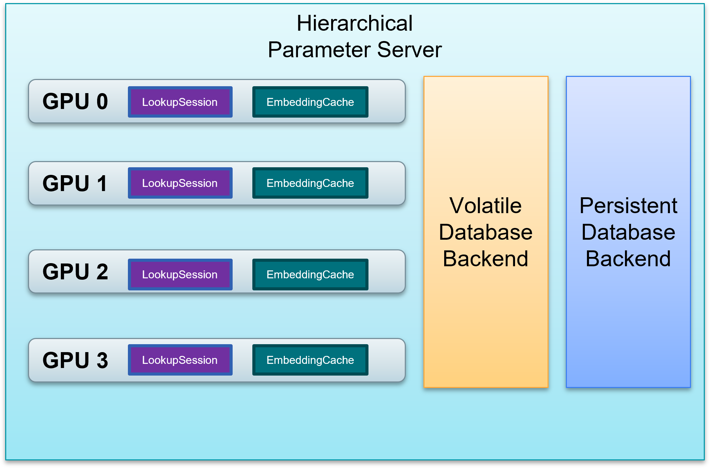
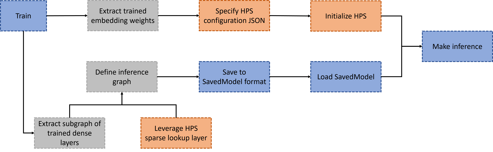

# Hierarchical Parameter Server Plugin for TensorFlow

```{contents}
---
depth: 2
local: true
backlinks: none
---
```

## Introduction to the HPS Plugin for TensorFlow

Hierarchical Parameter Server (HPS) is a distributed inference framework that is dedicated to deploying large embedding tables and realizing the low-latency retrieval of embeddings.
The framework combines a high-performance GPU embedding cache with a hierarchical storage architecture that encompasses different types of database backends.
The plugin is provided as a Python toolkit that you can integrate easily into the TensorFlow (TF) model graph.
Integration with the graph facilitates the TensorFlow model deployment of large embedding tables.

## Benefits of the Plugin for TensorFlow

When you deploy deep learning models with large embedding tables in TensorFlow, you are faced with the following challenges:

* **Large Embedding Tables**: Trained embedding tables of hundreds of gigabytes cannot fit into the GPU memory.

* **Low Latency Requirement**: Online inference requires that the latency of embedding lookup should be low to maintain the quality of experience and the user engagement.

* **Scalability on multiple GPUs**: Dozens of models need to be deployed on multiple GPUs and each model can have several embedding tables.

* **Pre-trained embeddings**: Large embedding tables need to be loaded as pre-trained embeddings for tasks like transfer learning.

The HPS plugin for TensorFlow mitigates these challenges and helps in the following ways:

* Extend the GPU memory by utilizing other memory resources available within the cluster, such as CPU-accessible RAM and non-volatile memory such as HDDs and SDDs, as shown in Fig. 1.

* Use the GPU embedding cache to exploit the long-tail characteristics of the keys. The cache automatically stores the embeddings for hot keys as queries are constantly received, providing the low-latency lookup service.

* Manage the embedding tables of multiple models in a structured manner across the whole memory hierarchy of GPUs, CPUs, and SSDs.

* Make the lookup service subscribable through custom TensorFlow layers, enabling transfer learning with large embedding tables.



<div align=center>Fig. 1: HPS Memory Hierarchy </div>

<br></br>

## Workflow

The workflow of leveraging HPS for deployment of TensorFlow models is illustrated in Fig. 2.



<div align=center>Fig. 2: Workflow of deploying TF models with HPS </div>

<br></br>

The steps in the workflow can be summarized as:

* **Train**: The model graph should be created with native TensorFlow embedding layers (e.g., `tf.nn.embedding_lookup_sparse`) or model parallelism enabled [SOK](https://nvidia-merlin.github.io/HugeCTR/sparse_operation_kit/master/index.html) embedding layers (e,g., `sok.DistributedEmbedding`). There is no restriction on the usage of dense layers or the topology of the model graph as long as the model can be successfully trained with TensorFlow.

* **Dissect the training graph**: The subgraph composided of only dense layers should be extracted from the trained graph, and then saved separately. For native TensorFlow embedding layers, the trained embedding weights should be obtained and converted to the HPS-compatible formats. For [SOK](https://nvidia-merlin.github.io/HugeCTR/sparse_operation_kit/master/index.html) embedding layers, `sok.Saver.dump_to_file` can be utilized to derive the desired formats. Basically, each embedding table should be stored in a directory with two binary files, i.e., `key` (int64) and `emb_vector` (float32). For example, if there are totally 1000 trained keys and the embedding vector size is 16, then the size of `key` file and the `emb_vector` file should be 1000\*8 bytes and 1000\*16\*4 bytes respectively.

* **Create and save the inference graph**: The inference graph should be created with HPS layers (e.g., `hps.SparseLookupLayer`) and the saved subgraph of dense layers. It can be then saved as a whole so as to be deployed in the production environment.

* **Deploy the inference graph with HPS**: The configurations for the models to be deployed should be specified in a JSON file and the HPS should be started via `hps.Init` before any executions. The saved inference graph can be deployed to perform online inference leveraging the benefits of the HPS embedding lookup. Please refer to [HPS Configuration](https://nvidia-merlin.github.io/HugeCTR/master/hugectr_parameter_server.html#configuration) for more information.

## Installation

### Compute Capability

We support the following compute capabilities:

| Compute Capability | GPU                  | SM |
|--------------------|----------------------|-----|
| 7.0                | NVIDIA V100 (Volta)  | 70  |
| 7.5                | NVIDIA T4 (Turing)   | 75  |
| 8.0                | NVIDIA A100 (Ampere) | 80  |

### Installing HPS Using NGC Containers

All NVIDIA Merlin components are available as open source projects. However, a more convenient way to utilize these components is by using our Merlin NGC containers. These containers allow you to package your software application, libraries, dependencies, and runtime compilers in a self-contained environment. When installing HPS using NGC containers, the application environment remains portable, consistent, reproducible, and agnostic to the underlying host system's software configuration.

HPS is included in the Merlin Docker containers that are available from the [NVIDIA container repository](https://catalog.ngc.nvidia.com/containers). To use these Docker containers, you'll first need to install the [NVIDIA Container Toolkit](https://github.com/NVIDIA/nvidia-docker) to provide GPU support for Docker. You can use the NGC links referenced in the table above to obtain more information about how to launch and run these containers.

The following sample command pulls and starts the Merlin TensorFlow container:
```shell
# Run the container in interactive mode
$ docker run --gpus=all --rm -it --cap-add SYS_NICE nvcr.io/nvidia/merlin/merlin-tensorflow:22.12
```
You can check the existence of the HPS Python toolkit after launching this container:
```shell
$ python3 -c "import hierarchical_parameter_server as hps"
```

## Example Notebooks

We provide a collection of examples as [Jupyter Notebooks](../hps_tf/notebooks) that cover the following topics:

* Basic workflow of HPS deployment for TensorFlow models
* Migrating from SOK training to HPS inference
* Leveraging HPS to load pre-trained embeddings
