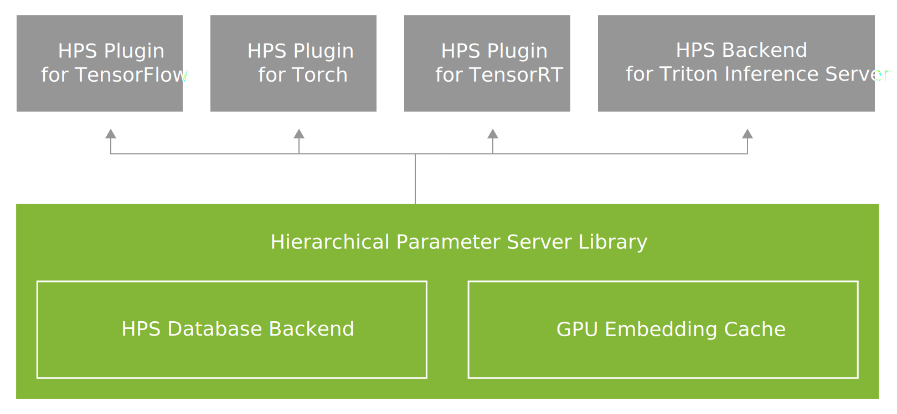

# Hierarchical Parameter Server

The Hierarchical Parameter Server (HPS) library is a native C++ library that provides
caching and hierarchical storage for embeddings.
The library is built from the GPU embedding cache and HPS database backend subcomponents.

HPS offers a flexible deployment and configuration to meet site-specific recommender system needs
and is integrated by other projects that need the ability to work with embeddings that exceed
the capacity of GPU and host memory.
Two projects that include the HPS library are the HPS plugin for TensorFlow and the
HPS backend for Triton Inference Server.

The following figure shows the relationships between the projects that use HPS,
the HPS library, and the subcomponents of the library.

<!--

-->

<figcaption>Fig. 1: HPS Library and subcomponents</figcaption>

[HPS Database Backend](hps_database_backend.md)
:  Provides a three-level storage architecture.
   The first and highest performing level is GPU memory and is followed by CPU memory.
   The third layer can be high-speed local SSDs with or without a distributed database.
   The key benefit of the HPS database backend is serving embedding tables that exceed GPU and CPU memory while providing the highest possible performance.

[HPS plugin for TensorFlow](hps_tf_user_guide.md)
:  Provides high-performance, scalability, and low-latency access to embedding tables for deep learning models that have large embedding tables in TensorFlow.

[HPS plugin for TensorRT](hps_trt_user_guide.md)
:  Provides a unified solution to build and deploy HPS-integrated TensorRT engines for models trained with different frameworks.

[HPS Backend for Triton Inference Server](https://github.com/triton-inference-server/hugectr_backend/tree/main/hps_backend)
:  The backend for Triton Inference Server is an inference deployment framework that integrates HPS for end-to-end inference on Triton.
   Documentation for the backend is available from the `hugectr_backend` repository at the preceding URL.
