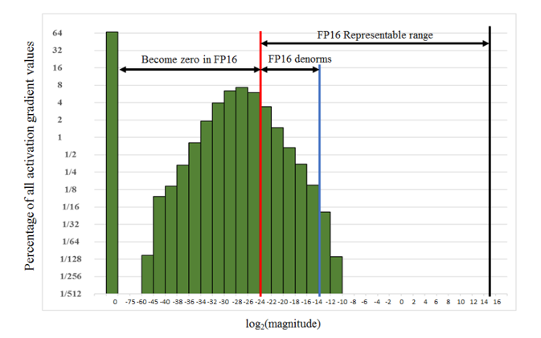

# HugeCTR Core Features

<!-- markdownlint-ignore no-duplicate-heading -->

## Summary of Core Features

In addition to single-node and full-precision training, HugeCTR supports a variety of features that
are described in the following topics.

**NOTE**: Multi-node training and mixed precision training can be used simultaneously.

## Model Parallel Training

HugeCTR natively supports both model parallel and data parallel training, making it possible to train very large models on GPUs. Features and categories of embeddings can be distributed across multiple GPUs and nodes. For example, if you have two nodes with 8xA100 80GB GPUs, you can train models that are as large as 1TB fully on GPU. By using the [embedding training cache](#embedding-training-cache), you can train even larger models on the same nodes.

To achieve the best performance on different embeddings, use various embedding layer implementations. Each of these implementations target different practical training cases such as:

* **LocalizedSlotEmbeddingHash**: The features in the same slot (feature field) will be stored in one GPU, which is why it's referred to as a “localized slot”, and different slots may be stored in different GPUs according to the index number of the slot. LocalizedSlotEmbedding is optimized for instances where each embedding is smaller than the memory size of the GPU. As local reduction for each slot is used in the LocalizedSlotEmbedding with no global reduction between GPUs, the overall data transaction in the LocalizedSlotEmbedding is much less than the DistributedSlotEmbedding.

  **Note**: Make sure that there aren't any duplicated keys in the input dataset.

* **DistributedSlotEmbeddingHash**: All the features, which are located in different feature fields / slots, are distributed to different GPUs according to the index number of the feature regardless of the slot index number. That means the features in the same slot may be stored in different GPUs, which is why it's referred to as a “distributed slot”. Since global reduction is required, the DistributedSlotEmbedding was developed for cases where the embeddings are larger than the memory size of the GPU. DistributedSlotEmbedding has much more memory transactions between GPUs.

  **Note**: Make sure that there aren't any duplicated keys in the input dataset.

* **LocalizedSlotEmbeddingOneHot**: A specialized LocalizedSlotEmbedding that requires a one-hot data input. Each feature field must also be indexed from zero. For example, gender: 0,1; 1,2 wouldn't be considered correctly indexed.

## Multi-Node Training

Multi-node training makes it easy to train an embedding table of arbitrary size. In a multi-node solution, the sparse model, which is referred to as the embedding layer, is distributed across the nodes. Meanwhile, the dense model, such as DNN, is data parallel and contains a copy of the dense model in each GPU (see Fig. 2). With our implementation, HugeCTR leverages NCCL for high speed and scalable inter-node and intra-node communication.

To run with multiple nodes, HugeCTR should be built with OpenMPI. [GPUDirect RDMA](https://docs.nvidia.com/cuda/gpudirect-rdma/index.html) support is recommended for high performance. For more information, refer to our `dcn_2node_8gpu.py` file in the [samples/dcn](https://github.com/NVIDIA-Merlin/HugeCTR/tree/master/samples/dcn) directory on GitHub.

## Mixed Precision Training

Mixed precision training is supported to help improve and reduce the memory throughput footprint. In this mode, TensorCores are used to boost performance for matrix multiplication-based layers, such as `FullyConnectedLayer` and `InteractionLayer`, on Volta, Turing, and Ampere architectures. For the other layers, including embeddings, the data type is changed to FP16 so that both memory bandwidth and capacity are saved. To enable mixed precision mode, specify the mixed_precision option in the configuration file. When [`mixed_precision`](https://arxiv.org/abs/1710.03740) is set, the full FP16 pipeline will be triggered. Loss scaling will be applied to avoid the arithmetic underflow (see Fig. 5). Mixed precision training can be enabled using the configuration file.

Fig. 1: Arithmetic Underflow

  

## SGD Optimizer and Learning Rate Scheduling

Learning rate scheduling allows users to configure its hyperparameters, which include the following:

* `learning_rate`: Base learning rate.
* `warmup_steps`: Number of initial steps used for warm-up.
* `decay_start`: Specifies when the learning rate decay starts.
* `decay_steps`: Decay period (in steps).

Fig. 6 illustrates how these hyperparameters interact with the actual learning rate.

For more information, refer to [Python Interface](../api/python_interface.md).

Fig. 2: Learning Rate Scheduling

  

## Embedding Training Cache

Embedding Training Cache (ETC) gives you the ability to train a large model up to terabytes. It's implemented by loading a subset of an embedding table, which exceeds the aggregated capacity of GPU memory, into the GPU in a coarse-grained, on-demand manner during the training stage.

This feature currently supports both single-node and multi-node training. It supports all embedding types and can be used with [Norm](/api/python_interface.md#norm), [Raw](/api/python_interface.md#raw), and [Parquet](/api/python_interface.md#parquet) dataset formats. We revised our `criteo2hugectr` tool to support the key set extraction for the Criteo dataset.

You can view the [HugeCTR Continuous Training](./notebooks/continuous_training.ipynb) example notebook to learn how to ue this feature with the Criteo dataset.
The Criteo dataset is a common use case, but embedding training cache is not limited to this dataset.

For more information, see the details for [HugeCTR Embedding Training Cache](hugectr_embedding_training_cache).

## HugeCTR to ONNX Converter

The HugeCTR to Open Neural Network Exchange (ONNX) converter (hugectr2onnx) is a Python package that can convert HugeCTR models to ONNX. It can improve the compatibility of HugeCTR with other deep learning frameworks since ONNX serves as an open-source format for AI models.

After training with our HugeCTR Python APIs, you can get the files for dense models, sparse models, and graph configurations, which are required as inputs when using the `hugectr2onnx.converter.convert` API. Each HugeCTR layer will correspond to one or several ONNX operators, and the trained model weights will be loaded as initializers in the ONNX graph. You can convert both dense and sparse models or only dense models.
For more information, refer to the `onnx_converter` directory of the HugeCTR [repository](https://github.com/NVIDIA-Merlin/HugeCTR/tree/master/onnx_converter) on GitHub and the [hugectr2onnx_demo.ipynb](./notebooks/hugectr2onnx_demo.ipynb) sample notebook.

## Hierarchical Parameter Server

HugeCTR Inference Hierarchical Parameter Server implemented a hierarchical storage mechanism between local SSDs and CPU memory, which breaks the convention that the embedding table must be stored in local CPU memory. Distributed Database layer allows utilizing Redis cluster deployments, to store and retrieve embeddings in/from the RAM memory available in your cluster. The Persistent Database layer links HugeCTR with a persistent database. Each node that has such a persistent storage layer configured retains a separate copy of all embeddings in its locally available non-volatile memory. 

Try out our [hugectr_wdl_prediction.ipynb Notebook](../notebooks/hugectr_wdl_prediction.ipynb). For more information, refer to [Distributed Deployment](https://github.com/triton-inference-server/hugectr_backend/blob/main/docs/architecture.md#distributed-deployment-with-hierarchical-hugectr-parameter-server).

For more information, see the details for [Hierarchical Parameter Server](hugectr_parameter_server.md).

## Sparse Operation Kit

The Sparse Operation Kit (SOK) is a Python package that wraps
GPU-accelerated operations that are dedicated for sparse training
or inference cases.
The package is designed to be compatible with common deep learning
frameworks such as TensorFlow.

SOK provides a model-parallelism GPU embedding layer.
In sparse training or inference scenarios, such as click-through-rates,
there are large number of parameters that do not fit into memory on
a single GPU.
Common deep learning frameworks do not support model-parallelism (MP).
As a result, it is difficult to fully utilize all available GPUs in
a cluster to accelerate the whole training process.

For more information, see the Sparse Operation Kit [documentation](https://nvidia-merlin.github.io/HugeCTR/sparse_operation_kit/master/index.html).
