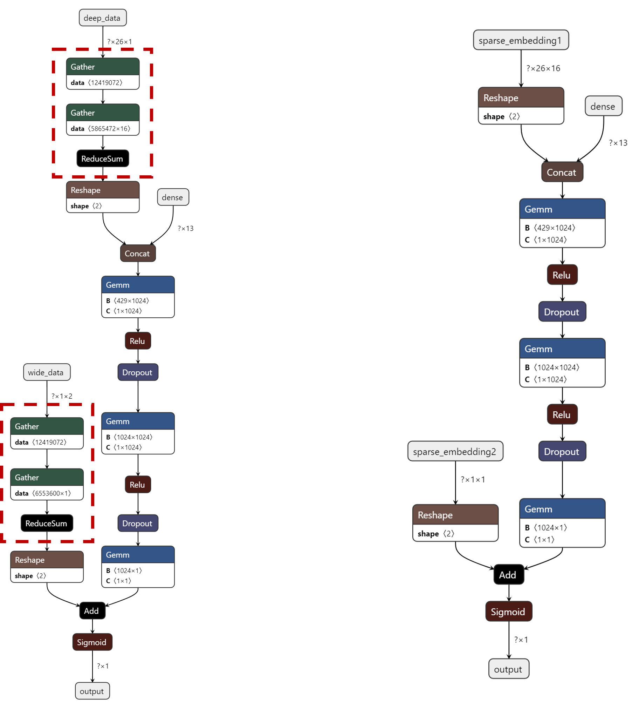

# HugeCTR to ONNX Converter #
hugectr2onnx is a python package that can convert HugeCTR models to ONNX format. It can improve the compatibility of HugeCTR with other deep learning frameworks given that Open Neural Network Exchange (ONNX) serves as an open-source format for AI models.

To use the ONNX converter, you need to prepare HugeCTR models files and graph configuration files which can be obtained with HugeCTR training APIs. Please refer to [HugeCTR Python Interface](../docs/python_interface.md) to get familiar with how to train and save your models. To learn the workflow of training HugeCTR model, converting to ONNX and making inference with ONNX Runtime, please refer to [HugeCTR to ONNX Demo Notebook](../notebooks/hugectr2onnx_demo.ipynb).

## Overview ##
**HugeCTR Model Format**

The trained models with HugeCTR consist of the dense model and the sparse models. There will be one binary dense model file which stores the weights of all the dense layers. The number of the sparse model folders will be equal to the that of embedding table, and there exist binary files for keys and embedding vectors in each folder. All these model files will be saved automatically according to the `snapshot` and `snapshot_prefix` values within the HugeCTR training API `hugectr.Model.fit()`. A graph configuration JSON file is required to load these binary model files correctly, which can be derived with the HugeCTR training API `hugectr.Model.graph_to_json()`. Here is an example of HugeCTR trained models and graph configuration JSON file:

```bash
wdl_model
├── wdl0_sparse_2000.model
│   ├── emb_vector
│   └── key
├── wdl1_sparse_2000.model
│   ├── emb_vector
│   └── key
├── wdl_dense_2000.model
└── wdl.json
```

**ONNX Converter Features**

The HugeCTR to ONNX converter will parse the graph configuration JSON file for each HugeCTR layer and construct an equivalent ONNX graph with ONNX operators. At the same time, the converter will read the HugeCTR model files and upload the weights to the corresponding ONNX node if the HugeCTR layer has some weights. We also provide an option for users to choose whether to convert the sparse models to ONNX or not, given that the sparse embedding model is usually very large and the weight alignment is relatively easily compared to the dense part.

If you choose to convert both dense and sparse models to ONNX, the converted ONNX graph will take dense features and sparse keys as the inputs and expose prediction result as the output. If you only convert the dense model to ONNX, then the converted ONNX graph will require dense features and sparse embedding vectors as the inputs. The following figure depicts the differences of the converted ONNX models in these two cases (the red dotted frames represent lookup and reduction for sparse embedding vectors).

<div align=center></div>
<div align=center>Fig. 1: The ONNX graph of WDL model. Left: converting both dense and sparse models. Right: converting only the dense model. </div>

## Installation ##
There are several ways to install this package.

**Use NGC Container**

In the docker image: `nvcr.io/nvidia/merlin/merlin-training:21.11`, hugectr2onnx is already installed and you can directrly import this package via:
```python
import hugectr2onnx
```
    
**Build from source**

If you want to build this package from the souce code, here are the steps to follow:
```shell
$ git clone https://github.com/NVIDIA/HugeCTR.git
$ cd HugeCTR/onnx_converter
$ python3 setup.py install
```

## API Docs ##
**hugectr2onnx.converter.convert(\*args, \*\*kwargs)**

This function is used to convert the HugeCTR models to ONNX format. It requires graph configuration JSON file and model files from HugeCTR training, and will save the converted ONNX model to the specified path.

***Parameters***

* onnx_model_path (string): the path to store the ONNX model.

* graph_config (string): the graph configuration JSON file of the HugeCTR model.

* dense_model (string): the file of the dense weights for the HugeCTR model.

* convert_embedding (bolean): whether to convert the sparse embeddings for the HugeCTR model (optional).

* sparse_models (List[str]): the files of the sparse embeddings for the HugeCTR model (optional).

* ntp_file (string): the file of the non-trainable parameters for the HugeCTR model (optional).

* graph_name (string): the graph name for the ONNX model (optional)

***Examples***

```python
hugectr2onnx.converter.convert(onnx_model_path = "wdl.onnx",
                            graph_config = "wdl.json",
                            dense_model = "wdl_dense_2000.model",
                            convert_embedding = True,
                            sparse_models = ["wdl0_sparse_2000.model", "wdl1_sparse_2000.model"])
```
