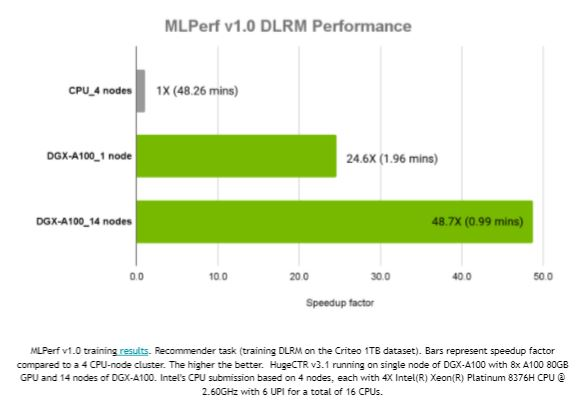
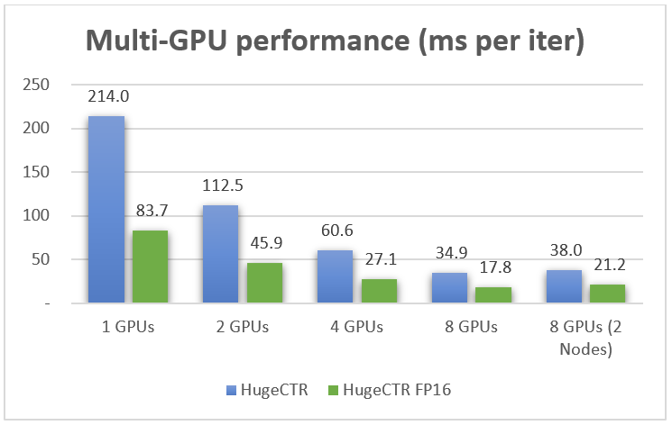

# Performance

We've tested HugeCTR's performance on the following systems:
* [DGX-2 and DGX A100](evaluating-hugectrs-performance-on-the-dgx-2-and-dgx-a100)
* [DGX-1](evaluating-hugectrs-performance-on-the-dgx-1)
* [TensorFlow (TF)](evaluating-hugectrs-performance-on-tensorflow)

## Evaluating HugeCTR's Performance on the DGX-2 and DGX A100
We submitted the DLRM benchmark with HugeCTR version 2.2 to [MLPerf Training v0.7](https://mlperf.org/training-results-0-7) and HugeCTR v3.1 to [MLPerf Training v1.0](https://mlcommons.org/en/news/mlperf-training-v10). We used the [Criteo Terabyte Click Logs dataset](https://labs.criteo.com/2013/12/download-terabyte-click-logs/), which contains 4 billion user and item interactions over 24 days. The target machines were DGX-2 with 16 V100 GPUs and DGX A100 with eight A100 GPUs. For additional information, see [this blog post](https://developer.nvidia.com/blog/optimizing-ai-performance-for-mlperf-v0-7-training/).

Fig. 1: HugeCTR's MLPerf v1.0 Result

## Evaluating HugeCTR's Performance on the DGX-1
We tested the scalability of HugeCTR and compared its performance with TensorFlow running on NVIDIA V100 GPUs that are available in a single DGX-1 system. In summary, we can achieve about 114x speedup over multi-thread TensorFlow CPU with only one V100 and generate almost the same loss curves for both evaluation and training (see Fig. 2 and Fig. 3).

Test environment:
* CPU Server: Dual 20-core Intel(R) Xeon(R) CPU E5-2698 v4 @ 2.20GHz
* TensorFlow version 2.0.0
* V100 16GB: NVIDIA DGX1 servers

Network:
* `Wide Deep Learning`: Nx 1024-unit FC layers with ReLU and dropout, emb_dim: 16; Optimizer: Adam for both Linear and DNN models
* `Deep Cross Network`: Nx 1024-unit FC layers with ReLU and dropout, emb_dim: 16, 6x cross layers; Optimizer: Adam for both Linear and DNN models

Dataset:
The data is provided by [CriteoLabs](http://labs.criteo.com/2014/02/kaggle-display-advertising-challenge-dataset/). The original training set contains 45,840,617 examples. Each example contains a label (0 by default OR 1 if the ad was clicked) and 39 features in which 13 are integer and 26 are categorical.

Preprocessing:
* Common: Preprocessed by using the scripts available in tools/criteo_script.
* HugeCTR: Converted to the HugeCTR data format with criteo2hugectr.
* TF: Converted to the TFRecord format for the efficient training on Tensorflow.

The scalability of HugeCTR and the number of active GPUs have increased simply because of the high efficient data exchange and three-stage processing pipeline. In this pipeline, we overlap the data reading from the file, host to the device data transaction (inter-node and intra-node), and train the GPU. The following chart shows the scalability of HugeCTR with Batch Size=16384 and Layers=7 on DGX1 servers.

Fig. 2: HugeCTR's Multi-GPU Performance

## Evaluating HugeCTR's Performance on TensorFlow
In the TensorFlow test case below, HugeCTR exhibits a speedup up to 114x compared to a CPU server running TensorFlow with only one V100 GPU and almost the same loss curve.

Fig. 3: WDL Performance and Loss Curve Comparison with TensorFlow Version 2.0

  

Fig. 4: DCN performance and Loss Curve Comparison with TensorFlow Version 2.0

